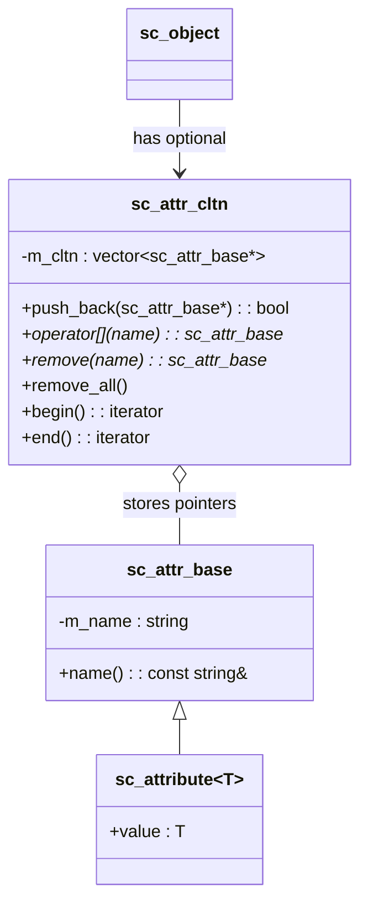

# sc_attribute -- Attribute Class System

## Overview

`sc_attribute` provides a type-safe key-value pair system that allows users to attach additional metadata to any `sc_object` at runtime.

**Everyday analogy:** Imagine you have a student ID card with basic information printed on it (name, student number). Sometimes you need to stick extra labels on the card, such as "lab access granted" or "tuition paid." `sc_attribute` is like those labels that can be dynamically added or removed, each having a name and a value.

## File Roles

- **Header `sc_attribute.h`**: Declares `sc_attr_base`, `sc_attr_cltn`, and the template class `sc_attribute<T>`.
- **Implementation `sc_attribute.cpp`**: Implements the base class and collection class methods.

## Class Hierarchy



## `sc_attr_base` -- Attribute Base Class

The abstract base for all attributes, holding only the name:

```cpp
class sc_attr_base {
public:
    sc_attr_base( const std::string& name_ );
    sc_attr_base( const sc_attr_base& );
    virtual ~sc_attr_base();
    const std::string& name() const;
private:
    std::string m_name;
};
```

- The name is set at construction and cannot be changed afterward
- The assignment operator is disabled
- The destructor is virtual (supporting polymorphic deletion)

## `sc_attribute<T>` -- Typed Attribute

A template class inheriting from `sc_attr_base`, carrying a public value of type `T`:

```cpp
template <class T>
class sc_attribute : public sc_attr_base {
public:
    sc_attribute( const std::string& name_ );
    sc_attribute( const std::string& name_, const T& value_ );
    sc_attribute( const sc_attribute<T>& a );
    virtual ~sc_attribute();

    T value;  // public data member
};
```

**Note:** `value` is a public member and can be accessed directly. This is an intentional design choice that simplifies usage:

```cpp
sc_attribute<int> priority("priority", 5);
obj.add_attribute(priority);
priority.value = 10;  // direct access
```

### Requirements for `T`

`T` must have a default constructor and a copy constructor.

## `sc_attr_cltn` -- Attribute Collection

Stores a vector of pointers to attributes, providing lookup by name, insertion, and removal:

### Key Operations

| Operation | Method | Description |
|-----------|--------|-------------|
| Add | `push_back(attr*)` | Insert an attribute (name must be unique; returns `false` on duplicate) |
| Lookup | `operator[](name)` | Lookup by name; returns pointer or `0` |
| Remove | `remove(name)` | Remove by name; returns pointer or `0` |
| Remove all | `remove_all()` | Clear the collection |
| Size | `size()` | Return the number of attributes |
| Iterate | `begin()` / `end()` | STL-style iterators |

### Uniqueness Check

`push_back()` traverses the entire collection to check whether the name already exists:

```cpp
bool sc_attr_cltn::push_back( sc_attr_base* attribute_ ) {
    if( attribute_ == 0 ) return false;
    for( int i = m_cltn.size() - 1; i >= 0; -- i ) {
        if( attribute_->name() == m_cltn[i]->name() ) {
            return false;  // duplicate name
        }
    }
    m_cltn.push_back( attribute_ );
    return true;
}
```

### Remove Implementation

Uses a "swap to back and pop" technique to avoid shifting a large number of elements:

```cpp
sc_attr_base* sc_attr_cltn::remove( const std::string& name_ ) {
    for( int i = m_cltn.size() - 1; i >= 0; -- i ) {
        if( name_ == m_cltn[i]->name() ) {
            sc_attr_base* attribute = m_cltn[i];
            std::swap( m_cltn[i], m_cltn.back() );
            m_cltn.pop_back();
            return attribute;
        }
    }
    return 0;
}
```

## Integration with `sc_object`

`sc_object` uses the attribute system through the following methods:

```cpp
bool add_attribute( sc_attr_base& );
sc_attr_base* get_attribute( const std::string& name_ );
sc_attr_base* remove_attribute( const std::string& name_ );
void remove_all_attributes();
int num_attributes() const;
sc_attr_cltn& attr_cltn();
```

The attribute collection in `sc_object` uses **lazy initialization**: `m_attr_cltn_p` is initially `NULL` and is dynamically allocated only on first use.

## Design Considerations

### Why is `value` a public member?

This is a pragmatic design choice. The primary use of attributes is to attach simple metadata, and getter/setter encapsulation would only add unnecessary code complexity here.

### Why doesn't the collection own the attribute objects?

`sc_attr_cltn` stores pointers but is not responsible for deleting attribute objects. The lifetime of attributes is managed by the user. `remove_all()` only clears the pointer vector and does not `delete` attribute objects.

### Linear search performance

Lookup by name uses a linear scan. Since the number of attributes is typically small, this is not a performance bottleneck.

## Related Files

- `sc_object.h/cpp` -- Base object class (holds the attribute collection)
