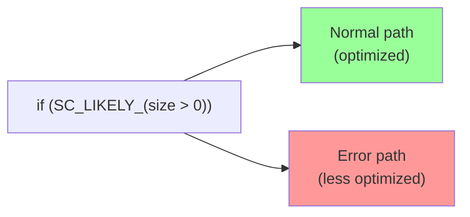

# sc_cmnhdr.h - Common Header (Foundational Definitions)

## Overview

`sc_cmnhdr.h` is the "foundation" header of SystemC, included by almost all other SystemC source files. It handles platform detection, compiler warning suppression, C++ standard version checks, branch prediction macros, and DLL export symbol definitions.

## Why is this file needed?

Imagine you need to build houses all over the world (compile on different operating systems and compilers). Each location has different building codes and material specifications. `sc_cmnhdr.h` is that "unified building code" so that subsequent code does not need to worry about underlying differences.

## Detailed Contents

### 1. Windows Platform Detection

```cpp
#if defined(_WIN32) || defined(_MSC_VER) || defined(__BORLANDC__) || \
    defined(__MINGW32__)
    #if !defined(WIN32) && !defined(WIN64) && !defined(_WIN64)
    #define WIN32
    #endif
    #define _WIN32_WINNT 0x0400
    #define SC_HAS_WINDOWS_H_
#endif
```

Ensures `WIN32` is defined under various Windows compilers and sets the minimum Windows version to NT 4.0 (0x0400).

`SC_HAS_WINDOWS_H_` is a mechanism for lazy inclusion of `windows.h` -- only when needed (when `SC_INCLUDE_WINDOWS_H` is defined) is `#include <windows.h>` actually performed. This is because `windows.h` is a very large header that significantly increases compile time.

### 2. MSVC Warning Suppression

```cpp
#pragma warning(disable: 4231)  // extern template
#pragma warning(disable: 4355)  // 'this' used in initializer list
#pragma warning(disable: 4291)  // operator new warning
#pragma warning(disable: 4800)  // implicit bool conversion
#pragma warning(disable: 4146)  // unary minus on unsigned
#pragma warning(disable: 4521)  // multiple copy constructors
#pragma warning(disable: 4786)  // long identifiers in debug info
```

These are Visual C++ warnings for code that is legal but "suspicious." SystemC's design has determined these cases are safe.

### 3. Branch Prediction Macros

```cpp
#ifndef __GNUC__
#  define SC_LIKELY_(x)    !!(x)
#  define SC_UNLIKELY_(x)  !!(x)
#else
#  define SC_LIKELY_(x)    __builtin_expect(!!(x), 1)
#  define SC_UNLIKELY_(x)  __builtin_expect(!!(x), 0)
#endif
```

Tells the GCC compiler the expected result of a condition, helping the CPU's branch predictor make better decisions:

- `SC_LIKELY_(x)`: x is usually true (e.g., the normal path)
- `SC_UNLIKELY_(x)`: x is usually false (e.g., the error path)



On non-GCC compilers, these macros degrade to a simple boolean conversion `!!(x)`.

### 4. C++ Standard Version Check

```cpp
#define SC_CPLUSPLUS_BASE_ 201703L  // C++17

#if SC_CPLUSPLUS_AUTO_ < SC_CPLUSPLUS_BASE_
#  error **** SystemC requires C++17 ****
#endif
```

SystemC 3.x requires at least C++17. Supported versions:

| Value | Standard |
|-------|----------|
| `201703L` | C++17 (ISO/IEC 14882:2017) |
| `202002L` | C++20 (ISO/IEC 14882:2020) |
| `202302L` | C++23 (ISO/IEC 14882:2023) |

The `SC_CPLUSPLUS` macro automatically detects the C++ standard version used by the compiler and can also be overridden manually (but cannot exceed the version actually supported by the compiler).

The `IEEE_1666_CPLUSPLUS` macro is used in models to query the availability of SystemC features.

### 5. DLL Export Control

```cpp
#if defined(SC_WIN_DLL) && defined(_MSC_VER)
# if defined(SC_BUILD)
#   define SC_API  __declspec(dllexport)
# else
#   define SC_API  __declspec(dllimport)
# endif
#else
# define SC_API /* nothing */
#endif
```

When building a DLL on Windows:
- **When compiling the library** (`SC_BUILD`): `SC_API` = `dllexport` (export symbols)
- **When using the library**: `SC_API` = `dllimport` (import symbols)
- **Other platforms**: `SC_API` is empty (symbols are visible by default)

### 6. Standard Library Includes

```cpp
#include <cassert>
#include <cstdio>
#include <cstdlib>
#include <vector>
```

These are the basic standard libraries needed by almost all SystemC source files.

## Lazy Inclusion of Windows.h

```cpp
// deliberately outside of include guards
#if defined(SC_HAS_WINDOWS_H_) && defined(SC_INCLUDE_WINDOWS_H)
#  undef SC_HAS_WINDOWS_H_
#  include <windows.h>
#endif
```

This code is deliberately placed **outside** the include guard (`#endif // SC_CMNHDR_H`), so that every `#include "sc_cmnhdr.h"` re-checks whether `windows.h` needs to be included. Only when a `.cpp` file first `#define SC_INCLUDE_WINDOWS_H` and then includes `sc_cmnhdr.h` will `windows.h` actually be included.

## Related Files

- `sc_macros.h` - Macro definitions that depend on this file
- `sc_ver.h` - Uses `SC_CPLUSPLUS` and `SC_API`
- `sc_cor_fiber.h` - Uses `SC_INCLUDE_WINDOWS_H` to include `windows.h`
- Almost all SystemC source files - directly or indirectly include this file
