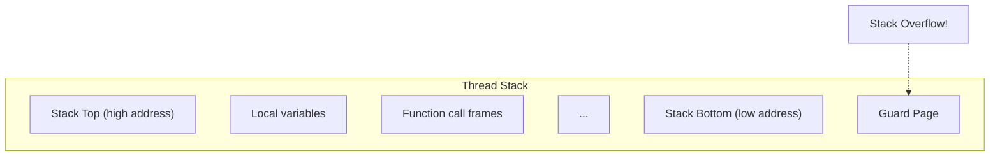

# sc_constants.h - Default Constant Definitions

## Overview

`sc_constants.h` defines the default constant values for the SystemC core. These values may need to be adjusted according to application requirements. Currently this file is very concise, defining only a few constants.

## Why is this file needed?

Just as building a house has a "default ceiling height," SystemC also has some default parameters. For example, each `SC_THREAD` needs a block of memory as an execution stack, and the default size of that stack is defined here. If your simulation has special requirements (such as deep recursion), you can adjust these values.

## Constant Definitions

### `SC_DEFAULT_STACK_SIZE`

```cpp
extern const int SC_DEFAULT_STACK_SIZE;
```

The default stack size for each `SC_THREAD` and `SC_CTHREAD`. The actual value is defined in `sc_thread_process.cpp`.

- Marked as deprecated in IEEE 1666-2005
- Can be overridden by defining `SC_OVERRIDE_DEFAULT_STACK_SIZE`
- Can also be individually adjusted after process creation with `set_stack_size()`

### `SC_MAX_NUM_DELTA_CYCLES`

```cpp
#ifdef DEBUG_SYSTEMC
const int SC_MAX_NUM_DELTA_CYCLES = 10000;
#endif
```

Defined only in debug mode (`DEBUG_SYSTEMC`). Limits the maximum number of delta cycles within a single time step, preventing infinite loops from causing the simulator to hang.

| Parameter | Value | Condition | Description |
|-----------|-------|-----------|-------------|
| `SC_DEFAULT_STACK_SIZE` | Platform-dependent | Always present | Default thread stack size |
| `SC_MAX_NUM_DELTA_CYCLES` | 10000 | `DEBUG_SYSTEMC` only | Maximum delta cycle count |

## Importance of Stack Size



A stack that is too small leads to overflow (stack overflow) and program crashes. A stack that is too large wastes memory. In designs with a large number of `SC_THREAD` processes (for example, a NoC simulation may have thousands of processes), stack size has a significant impact on total memory usage.

## Related Files

- `sc_thread_process.cpp` - Actual definition of `SC_DEFAULT_STACK_SIZE`
- `sc_cor.h` - Uses the `stack_size` parameter when creating coroutines
- `sc_process_b.h` - `set_stack_size()` method
