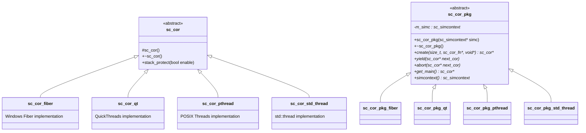

# sc_cor.h - Coroutine Abstract Base Class

## Overview

`sc_cor.h` defines the abstract base classes of the SystemC coroutine system. This file is the foundation of the entire coroutine mechanism; all platform-specific coroutine implementations (Fiber, pthread, QuickThreads, std::thread) must inherit from these abstract classes.

## Why is this file needed?

The SystemC simulator needs to execute multiple "processes" simultaneously (e.g., behaviors of multiple hardware modules), but in reality only one CPU thread is running. Coroutines are like a group of chefs sharing one kitchen: each chef (process) takes turns using the kitchen (CPU), pausing at a certain step and letting the next chef continue. This file defines the interface for the "turn-taking rules."

## Core Concepts

### What is a Coroutine?

Imagine you are reading a novel with many characters. Instead of reading all of one character's story at once, you read a few paragraphs of character A, switch to character B for a few paragraphs, then switch to character C. Each time you switch, you remember where you left off for each character. A coroutine works the same way:

- **Regular function**: Runs from start to finish, cannot pause
- **Coroutine**: Can pause midway and later resume from where it paused

### Design Pattern: Strategy Pattern

This file uses the classic Strategy Pattern. `sc_cor` and `sc_cor_pkg` define the interface, and concrete implementations are provided by subclasses. This allows SystemC to use the most suitable coroutine implementation on different operating systems.

## Class Details

### `sc_cor_fn`

```cpp
typedef void (sc_cor_fn)( void* );
```

The type definition for a coroutine function. When a coroutine is created, an entry function must be specified -- like assigning each chef the dish they will prepare.

### `sc_cor` - Coroutine Abstract Base Class

| Member | Description |
|--------|-------------|
| `sc_cor()` | Constructor (`protected`, only subclasses can create instances) |
| `~sc_cor()` | Virtual destructor |
| `stack_protect(bool enable)` | Enable/disable stack protection (like installing a guardrail to prevent memory overflow) |

This class is very concise because it is merely a "tag" marking something as a coroutine. The actual data (stack pointers, thread objects, etc.) is defined by subclasses.

### `sc_cor_pkg` - Coroutine Package Abstract Base Class

This is the "factory" and "manager" for coroutines. It is responsible for creating, switching, and managing coroutines.

| Method | Description | Everyday Analogy |
|--------|-------------|------------------|
| `create(stack_size, fn, arg)` | Create a new coroutine | Hire a new chef and assign their workstation space |
| `yield(next_cor)` | Yield execution to the next coroutine | Current chef pauses, next chef takes over |
| `abort(next_cor)` | Terminate the current coroutine and switch | Chef resigns, immediately replaced |
| `get_main()` | Get the main coroutine | Find the head chef |
| `simcontext()` | Get the simulation context | Check the overall restaurant operation status |

## Class Relationship Diagram



## Design Considerations

### Why is copying disabled?

```cpp
sc_cor( const sc_cor& );
sc_cor& operator = ( const sc_cor& );
```

A coroutine owns its own execution stack. Copying a coroutine would be like trying to duplicate a chef who is in the middle of cooking -- you cannot copy the steps in their mind and the food they are currently cutting. Therefore, disabling copying is a sound design choice.

### RTL Background

In hardware description languages (such as Verilog/VHDL), all `always` blocks execute "truly in parallel." But a software simulator has only one CPU, so it must use coroutines to simulate this parallelism. Each `SC_THREAD` or `SC_METHOD` corresponds to a coroutine.

## Related Files

- `sc_cor_fiber.h` / `.cpp` - Windows Fiber implementation
- `sc_cor_pthread.h` / `.cpp` - POSIX Thread implementation
- `sc_cor_qt.h` / `.cpp` - QuickThreads implementation
- `sc_cor_std_thread.h` / `.cpp` - C++ std::thread implementation
- `sc_simcontext.h` - Simulation context (holds an `sc_cor_pkg` instance)
