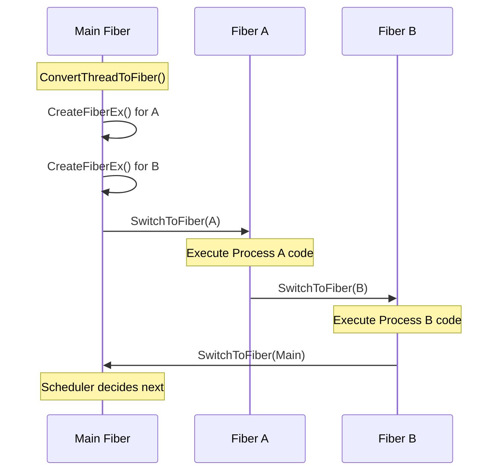

# sc_cor_fiber.h / .cpp - Windows Fiber Coroutine Implementation

## Overview

`sc_cor_fiber` is the SystemC coroutine implementation for the Windows platform, using the Windows API's **Fiber** mechanism. This implementation is compiled only under Windows environments (`_WIN32`, `WIN32`, `WIN64`).

## Why is this file needed?

The Windows operating system does not support QuickThreads (Unix-only) or the native POSIX Threads approach, so the Windows-provided Fiber API is used to implement coroutines. A Fiber is a lightweight "user-mode" thread provided by Windows, where the program controls the switching itself without operating system intervention.

## Core Concepts

### What is a Windows Fiber?

Imagine you have a game console (CPU) and can insert different game cartridges (Fibers). Each cartridge has its own save file (stack and register state). You can pull out the current cartridge at any time, insert another one, and continue playing from the last save.

- **Thread**: The operating system decides when to switch who plays (preemptive)
- **Fiber**: The program itself decides when to switch who plays (cooperative)

SystemC needs exactly cooperative scheduling -- processes only pause when they explicitly call `wait()`.

## Class Details

### `sc_cor_fiber` - Coroutine Class

| Member | Type | Description |
|--------|------|-------------|
| `m_stack_size` | `std::size_t` | Stack size |
| `m_fiber` | `void*` | Windows Fiber handle |
| `m_pkg` | `sc_cor_pkg_fiber*` | Pointer to the package that created this coroutine |
| `m_eh` | `SjLj_Function_Context` | GCC SJLJ exception handling context (GCC only) |

### `sc_cor_pkg_fiber` - Coroutine Package Class

#### Construction Flow

```
ConvertThreadToFiber(0)  -->  Convert the main thread to a Fiber
                              (so the main thread can also participate in Fiber switching)
```

If the main thread is already a Fiber (someone else converted it first), it simply uses `GetCurrentFiber()` to obtain it.

#### Method Details

| Method | Implementation Details |
|--------|----------------------|
| `create()` | Calls `CreateFiberEx()` to create a new Fiber; initial stack size is `stack_size/2`, maximum is `stack_size` |
| `yield()` | Calls `SwitchToFiber()` to switch to the target Fiber |
| `abort()` | Same as `yield()`, but with the semantics of abandoning the current coroutine |
| `get_main()` | Returns `&m_main_cor` (the main coroutine) |

#### Destruction Flow

```
If m_fiber is not empty:
    Get the current Fiber
    If it is not the current Fiber and not the main coroutine:
        DeleteFiber(m_fiber)  -- Delete the Fiber
```

Note that you cannot delete a currently executing Fiber, nor can you delete the main Fiber (which was converted from a Thread).

## Fiber Switching Flow



## GCC SJLJ Exception Handling

When compiling with GCC on Windows using the SJLJ (SetJmp/LongJmp) exception handling method, switching Fibers requires synchronizing the exception handling context. Otherwise, when Fiber B throws an exception, it might jump to Fiber A's catch block -- like reading character B's story and suddenly character A appears.

```cpp
_Unwind_SjLj_Register(&curr_cor->m_eh);
_Unwind_SjLj_Unregister(&new_cor->m_eh);
```

## Platform Conditional Compilation

```
#if defined(_WIN32) || defined(WIN32) || defined(WIN64)
    // entire file content
#endif
```

This ensures the implementation is compiled only on Windows.

## Related Files

- `sc_cor.h` - Abstract base class definition
- `sc_cor_qt.h` - QuickThreads alternative for Unix/Linux
- `sc_cor_pthread.h` - POSIX Threads alternative
- `sc_cor_std_thread.h` - C++ standard thread alternative
- `sc_simcontext.h` - Simulation context, manages the coroutine package
