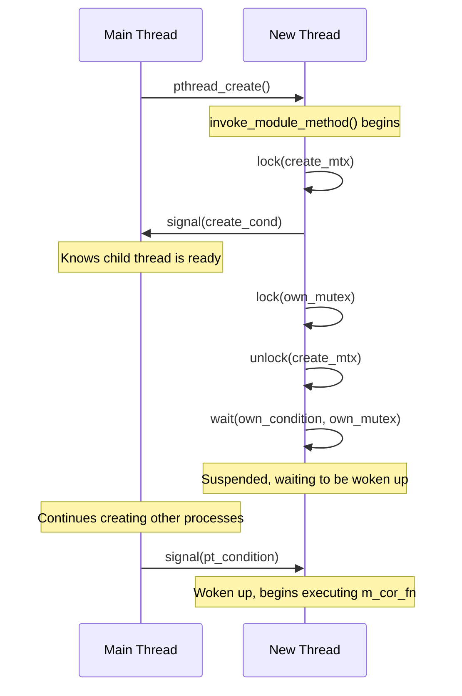
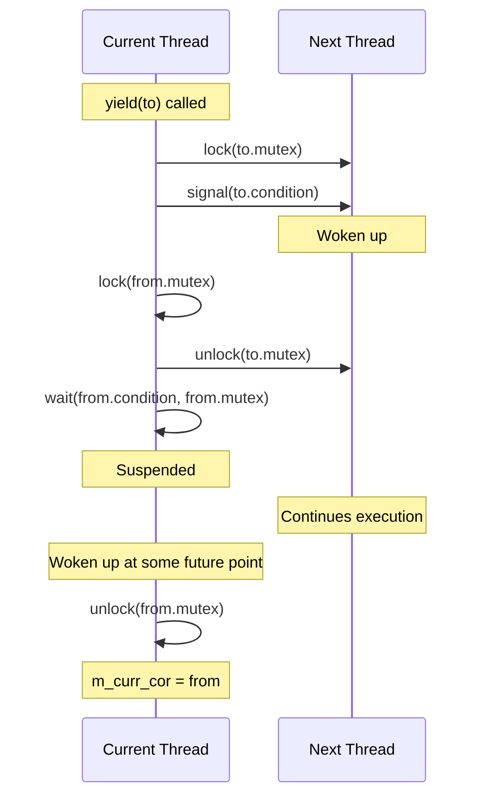
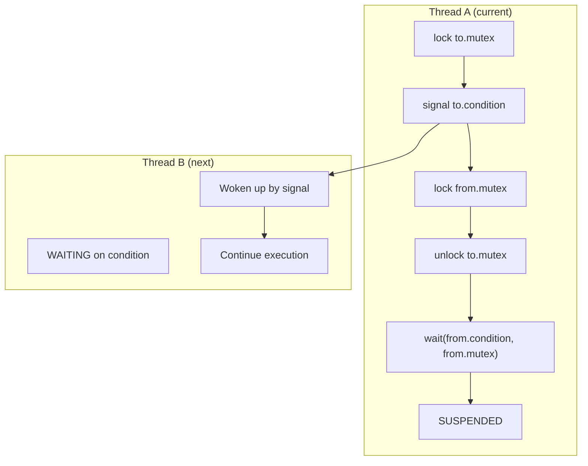

# sc_cor_pthread.h / .cpp - POSIX Threads Coroutine Implementation

## Overview

`sc_cor_pthread` uses POSIX Threads (pthreads) to implement the SystemC coroutine mechanism. This implementation is used on platforms where `SC_USE_PTHREADS` is defined and is not Windows. Although pthreads is inherently a preemptive multithreading mechanism, it is cleverly converted into cooperative coroutines here using mutexes and condition variables.

## Why is this file needed?

QuickThreads (the default coroutine implementation) directly manipulates CPU registers and the stack. While its performance is excellent, it may not be supported or stable on certain platforms. pthreads is part of the POSIX standard and is supported on virtually all Unix-like systems, making it a reliable fallback option.

## Core Concepts

### Simulating Coroutines with pthreads

Imagine you have a group of students (threads), but the classroom has only one chair (CPU execution right). Each student has their own homework (process logic), but only one student can sit down and do homework at a time. The rules are:

1. Only the student sitting in the chair can do homework
2. When a student reaches a certain step, they must stand up voluntarily (unlock + signal)
3. Then they call the next student to sit down (wait)

This is the core idea of implementing cooperative scheduling with "mutex + condition variable."

## Class Details

### `sc_cor_pthread` - Coroutine Class

| Member | Type | Description |
|--------|------|-------------|
| `m_cor_fn` | `sc_cor_fn*` | Coroutine entry function |
| `m_cor_fn_arg` | `void*` | Entry function argument |
| `m_mutex` | `pthread_mutex_t` | Mutex for suspending this thread |
| `m_pkg_p` | `sc_cor_pkg_pthread*` | Owning coroutine package |
| `m_pt_condition` | `pthread_cond_t` | Condition variable for wake-up |
| `m_thread` | `pthread_t` | Underlying POSIX thread |

#### `invoke_module_method()` - Thread Startup Callback

This is the function actually executed by `pthread_create()`. Its flow is critical:



### `sc_cor_pkg_pthread` - Coroutine Package Class

| Member | Description |
|--------|-------------|
| `m_main_cor` | Main coroutine (represents the simulator's main thread) |
| `m_curr_cor` | Currently executing coroutine |
| `m_create_mtx` | Synchronization mutex for thread creation |
| `m_create_cond` | Synchronization condition variable for thread creation |

#### `create()` - Create a New Coroutine

```
1. Create an sc_cor_pthread object
2. Set pthread attributes (detached, stack_size)
3. Lock m_create_mtx
4. Call pthread_create() (child thread starts running)
5. Wait on m_create_cond (child thread ready signal)
6. Child thread is now suspended in invoke_module_method
7. Unlock m_create_mtx, return
```

#### `yield()` - Yield Execution



Key point: After `yield()` is called, the `from_p` thread blocks on `pthread_cond_wait()` until another thread signals it.

#### `abort()` - Terminate and Switch

Unlike `yield()`, `abort()` only wakes the target thread without waiting to be woken itself. This is because the coroutine calling `abort()` is about to be destroyed.

## Thread Synchronization Diagram



## Design Considerations

### Why use DETACHED mode?

```cpp
pthread_attr_setdetachstate( &attr, PTHREAD_CREATE_DETACHED );
```

Because SystemC coroutines do not need to be `pthread_join()`ed. Their lifecycle is managed by the SystemC scheduler, and no other thread needs to wait for them to finish.

### Performance Cost

The pthreads approach is much slower than QuickThreads because:
- Each switch requires multiple lock/unlock/signal/wait system calls
- Each coroutine is a real OS thread, consuming more memory
- Condition variable wake-ups may involve the OS scheduler

Therefore, pthreads is typically used only when QuickThreads is unavailable.

## Platform Conditional Compilation

```cpp
#if defined(SC_USE_PTHREADS)         // header
#if !defined(_WIN32) && !defined(WIN32) && defined(SC_USE_PTHREADS)  // source
```

`SC_USE_PTHREADS` must be explicitly defined to enable this implementation, and it excludes the Windows platform.

## Related Files

- `sc_cor.h` - Abstract base class
- `sc_cor_qt.h` - QuickThreads implementation (default, better performance)
- `sc_cor_fiber.h` - Windows Fiber implementation
- `sc_cor_std_thread.h` - C++ std::thread implementation (modern alternative)
- `sc_simcontext.h` - Simulation context
