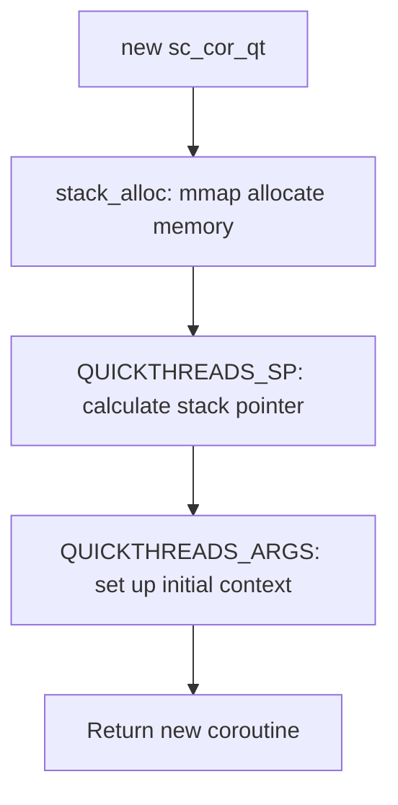
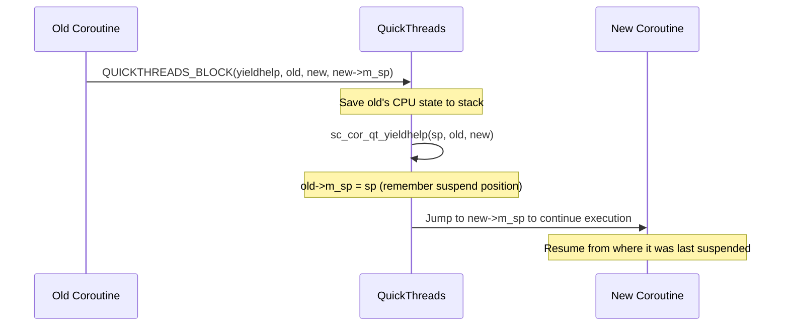

# sc_cor_qt.h / .cpp - QuickThreads Coroutine Implementation

## Overview

`sc_cor_qt` is the **default** coroutine implementation on non-Windows platforms for SystemC, using the QuickThreads library. QuickThreads is a very lightweight user-space thread switching library that directly manipulates CPU registers and stack pointers to achieve extremely fast context switches.

## Why is this file needed?

Among all coroutine implementations, QuickThreads has the best performance. It does not require operating system intervention (unlike pthreads), nor does it need platform-specific APIs (unlike Windows Fiber). Instead, it directly uses assembly language to manipulate the CPU for context switching. This is like switching TV channels directly, rather than turning the TV off and on again.

## Activation Condition

```cpp
#if !defined(_WIN32) && !defined(WIN32) && !defined(WIN64) \
    && !defined(SC_USE_PTHREADS) && !defined(SC_USE_STD_THREADS)
```

In other words: when not on Windows, not specified to use pthreads, and not specified to use std::threads, QuickThreads is used.

## Core Concepts

### How QuickThreads Works

Imagine you have many envelopes (coroutines), each containing a bookmark (stack pointer `m_sp`). When you want to switch to a coroutine:

1. Put the current bookmark back into its envelope (save stack pointer)
2. Take out the bookmark from the target envelope (load stack pointer)
3. The CPU immediately continues execution from the new bookmark's position

The entire process requires only a few CPU instructions, far faster than the mutex/condition operations of pthreads.

## Class Details

### `sc_cor_qt` - Coroutine Class

| Member | Type | Description |
|--------|------|-------------|
| `m_stack_size` | `std::size_t` | Stack size |
| `m_stack` | `void*` | Stack memory start address |
| `m_sp` | `qt_t*` | Stack pointer (QuickThreads format) |
| `m_fake_stack` | `void*` | Fake stack used by AddressSanitizer |
| `m_pkg` | `sc_cor_pkg_qt*` | Owning coroutine package |

#### `stack_protect()` - Stack Protection

Uses the `mprotect()` system call to set up a "red zone" at the end of the stack:

```
Stack direction (GROW_DOWN):
+------------------+ High address
|                  |
|   Normal stack   |  PROT_READ | PROT_WRITE
|   space          |
+------------------+
|   Red Zone       |  PROT_NONE (no read/write)
|   (1 page)       |  <- access triggers SIGSEGV
+------------------+ Low address
```

This is like installing a guardrail at the edge of a cliff -- if the program's stack usage exceeds the allocated space, an error signal is immediately generated instead of silently overwriting other memory.

#### Destructor

```cpp
sc_cor_qt::~sc_cor_qt()
{
    if (this == m_pkg->get_main()) return;  // don't delete main stack
    if (m_stack) ::munmap(m_stack, m_stack_size);
    // cleanup fake stack for Asan
}
```

The main coroutine's stack is the main thread's stack and cannot be `munmap`'d. Other coroutines' stacks are allocated with `mmap` and need to be manually freed.

### `sc_cor_pkg_qt` - Coroutine Package Class

#### Memory Allocation: `stack_alloc()`

Uses `mmap` to allocate aligned stack memory:

```cpp
*buf = ::mmap(NULL, *stack_size,
              PROT_READ | PROT_WRITE,
              MAP_PRIVATE | MAP_ANON, -1, 0);
```

- `MAP_PRIVATE`: Private mapping, not shared with other processes
- `MAP_ANON`: Anonymous mapping, not backed by a file
- Stack size is rounded up to a multiple of the page size

#### `create()` - Create a New Coroutine



`QUICKTHREADS_SP` and `QUICKTHREADS_ARGS` are QuickThreads library macros responsible for setting up the initial call frame on the new stack.

#### `yield()` - Switch Coroutines



#### `abort()` - Terminate and Switch

Similar to `yield()`, but uses `QUICKTHREADS_ABORT`. The difference is that abort does not expect to return, so there is no need to fully save the old coroutine's state.

### Wrapper Function: `sc_cor_qt_wrapper()`

```cpp
extern "C" void sc_cor_qt_wrapper(void* arg, void* cor, qt_userf_t* fn)
```

This is the entry point when a new coroutine is executed for the first time. It:
1. Sets `m_curr_cor` to the new coroutine
2. Calls the user's coroutine function `fn(arg)`

## AddressSanitizer (Asan) Support

The code includes support for Asan, a memory error detection tool developed by Google. Because coroutine switching involves non-standard stack operations, Asan needs to be informed of the stack switches:

```cpp
static void sanitizer_start_switch_fiber_weak(...)  // weak reference
static void sanitizer_finish_switch_fiber_weak(...)
```

Using the `__weakref__` attribute, if Asan is not linked, these function pointers are `nullptr` and do not affect normal execution.

## Performance Comparison

| Implementation | Switching Method | Switching Cost | Memory Overhead |
|----------------|-----------------|----------------|-----------------|
| **QuickThreads** | Direct stack pointer manipulation | Very low (a few CPU instructions) | Low (only stack space needed) |
| pthreads | mutex + condition | High (multiple system calls) | High (each is an OS thread) |
| Fiber | Windows API calls | Medium | Medium |
| std::thread | mutex + condition | High | High |

## Related Files

- `sc_cor.h` - Abstract base class
- `sysc/packages/qt/qt.h` - QuickThreads library header
- `sc_cor_pthread.h` - pthreads alternative
- `sc_cor_fiber.h` - Windows Fiber alternative
- `sc_simcontext.h` - Simulation context
