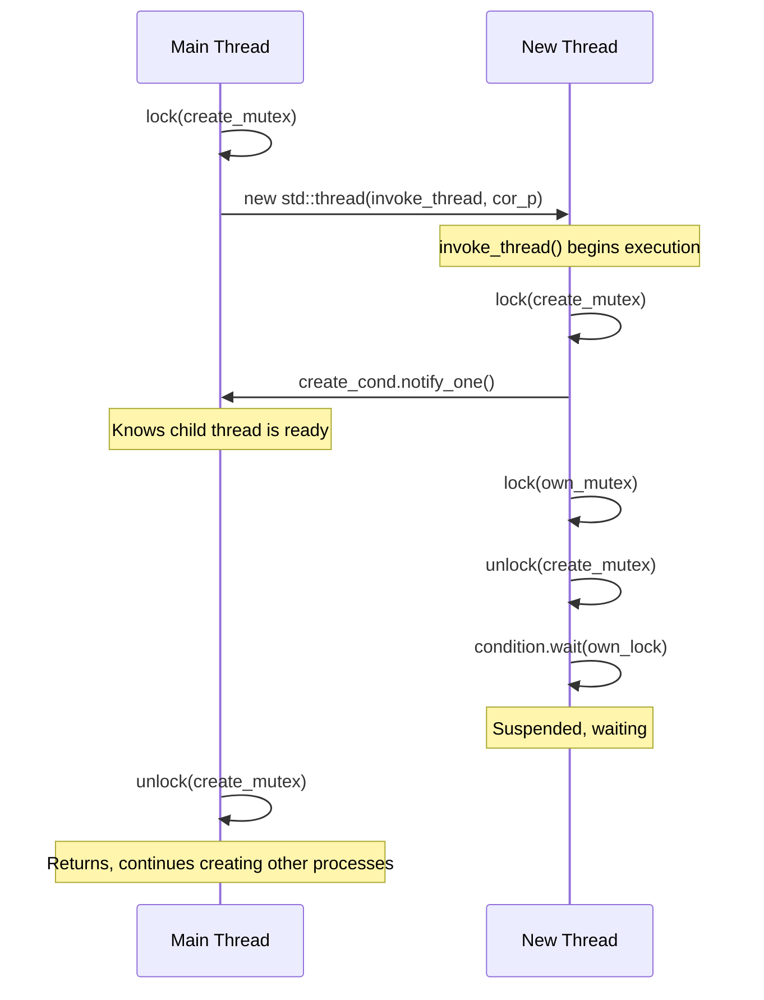
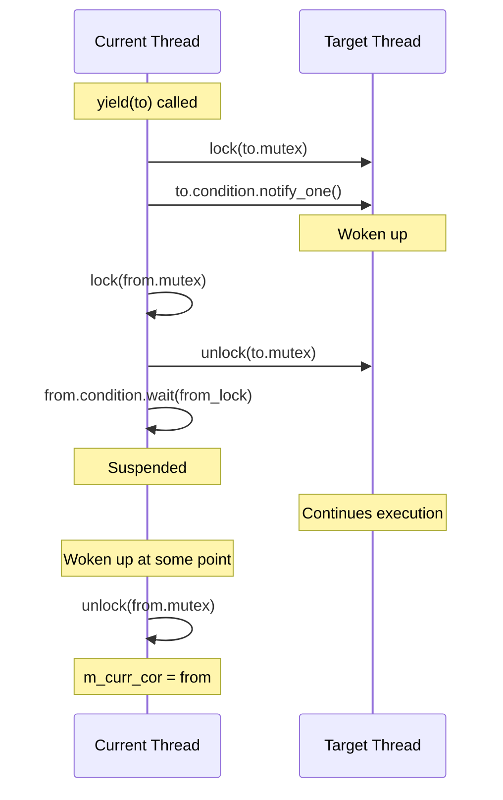

# sc_cor_std_thread.h / .cpp - C++ Standard Thread Coroutine Implementation

## Overview

`sc_cor_std_thread` uses the C++ standard library's `std::thread`, `std::mutex`, and `std::condition_variable` to implement the SystemC coroutine mechanism. This is the most recently added implementation (2025) and requires defining `SC_USE_STD_THREADS` to be enabled.

## Why is this file needed?

As the C++ standard evolves, `std::thread` has become the standard way for cross-platform multithreaded programming. Compared to pthreads (limited to POSIX systems), `std::thread` works on any compiler supporting C++11 or later, including Windows. This implementation provides a more modern, more portable alternative.

## Comparison with the pthread Version

This implementation is almost a "modern C++ translation" of `sc_cor_pthread` in design. The core logic is identical, but C++ standard library synchronization primitives replace the POSIX API:

| POSIX API | C++ Standard | Purpose |
|-----------|-------------|---------|
| `pthread_t` | `std::thread` | Thread object |
| `pthread_mutex_t` | `std::mutex` | Mutex |
| `pthread_cond_t` | `std::condition_variable` | Condition variable |
| `pthread_mutex_lock/unlock` | `std::unique_lock` | RAII lock management |
| `pthread_cond_wait` | `condition.wait(lock)` | Wait on condition |
| `pthread_cond_signal` | `condition.notify_one()` | Notify one waiter |

## Class Details

### `sc_cor_std_thread` - Coroutine Class

| Member | Type | Description |
|--------|------|-------------|
| `m_cor_fn` | `sc_cor_fn*` | Coroutine entry function |
| `m_cor_fn_arg` | `void*` | Entry function argument |
| `m_condition` | `std::condition_variable` | Condition variable for wake-up |
| `m_mutex` | `std::mutex` | Mutex for this thread |
| `m_pkg_p` | `sc_cor_pkg_std_thread*` | Owning coroutine package |
| `m_thread_p` | `std::thread*` | Underlying C++ thread object |

### `sc_cor_pkg_std_thread` - Coroutine Package Class

| Member | Description |
|--------|-------------|
| `m_main_cor` | Main coroutine |
| `m_curr_cor` | Currently executing coroutine |
| `m_create_cond` | Condition variable for thread creation synchronization |
| `m_create_mutex` | Mutex for thread creation synchronization |

## Coroutine Lifecycle

### Creation Flow



### Switching Flow (`yield`)



### Termination Flow (`abort`)

```cpp
void sc_cor_pkg_std_thread::abort(sc_cor* next_cor_p) {
    std::unique_lock<std::mutex> to_lock(n_p->m_mutex);
    n_p->m_condition.notify_one();
    // unique_lock automatically unlocks when leaving scope
}
```

`abort()` is simpler than `yield()` -- it only needs to wake the target thread without suspending itself (because it is about to be destroyed).

## Notes

### Stack Size is Ignored

```cpp
// Notes:
//   (1) The stack information is currently ignored as the std::thread
//       package supplies an 8 MB stack by default.
```

`std::thread` does not allow easy control of stack size like pthreads, so the `stack_size` parameter is currently ignored. Each `std::thread` has a default stack space of 8 MB.

### Detach in the Destructor

```cpp
sc_cor_std_thread::~sc_cor_std_thread() {
    m_thread_p->detach();
    delete m_thread_p;
}
```

Before deleting a `std::thread` object, you must `detach()` (or `join()`), otherwise the program will terminate. `detach()` is chosen here because the SystemC scheduler manages coroutine lifecycles on its own.

## RAII-style Lock Management

Compared to the pthread version, the std::thread version uses RAII (Resource Acquisition Is Initialization) style `std::unique_lock`:

```cpp
// pthread version: manual management
pthread_mutex_lock(&to_p->m_mutex);
pthread_cond_signal(&to_p->m_pt_condition);
pthread_mutex_lock(&from_p->m_mutex);
pthread_mutex_unlock(&to_p->m_mutex);
// if an exception is thrown in between, unlock may be missed

// std::thread version: RAII automatic management
std::unique_lock<std::mutex> to_lock(to_p->m_mutex, std::defer_lock);
to_lock.lock();
to_p->m_condition.notify_one();
// to_lock automatically unlocks when leaving scope
```

`std::defer_lock` means the lock object is created but not immediately locked; `lock()` is called manually later to control the timing.

## Platform Conditions

```cpp
#if defined(SC_USE_STD_THREADS)                    // header
#if !defined(_WIN32) && !defined(WIN32) && defined(SC_USE_STD_THREADS)  // source
```

Currently the `.cpp` excludes Windows, but the `.h` does not. This suggests future expansion to the Windows platform may be planned.

## Related Files

- `sc_cor.h` - Abstract base class
- `sc_cor_pthread.h` - POSIX Threads version (very similar design)
- `sc_cor_qt.h` - QuickThreads version (default, best performance)
- `sc_cor_fiber.h` - Windows Fiber version
- `sc_simcontext.h` - Simulation context
