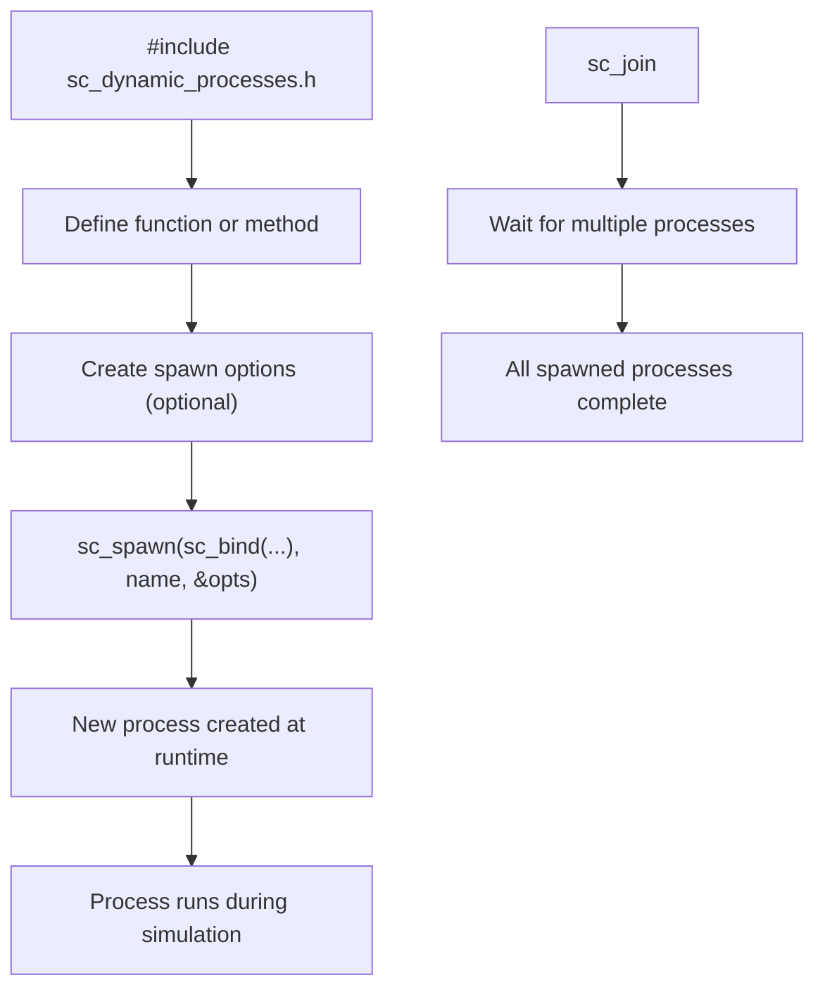

# sc_dynamic_processes.h - Dynamic Process Package Definition

## Overview

`sc_dynamic_processes.h` is the unified header needed to use SystemC dynamic processes (processes created at runtime). It imports `sc_spawn`, `sc_join`, exception handling, and other features, while providing SystemC-namespaced wrappers for `sc_bind`, `sc_ref`, and `sc_cref` around their std counterparts.

## Why is this file needed?

In traditional SystemC, all processes (`SC_METHOD`, `SC_THREAD`, `SC_CTHREAD`) must be statically defined during the elaboration phase (module construction). But sometimes you need to dynamically create new processes during simulation -- for example, spawning a processing task when a new packet arrives.

This is like a restaurant arranging its permanent staff before opening (elaboration), but during business hours (simulation running) it may need to call in delivery drivers (dynamic processes) on demand. `sc_dynamic_processes.h` provides all the tools needed to call those delivery drivers.

## Imported Headers

| Header | Provided Features |
|--------|------------------|
| `sc_except.h` | `sc_unwind_exception` and other exception handling |
| `sc_spawn.h` | `sc_spawn()` function and `sc_spawn_options` |
| `sc_join.h` | `sc_join` class for waiting on multiple processes to complete |

## `sc_bind` / `sc_ref` / `sc_cref`

These are SystemC wrappers around `std::bind`, `std::ref`, and `std::cref`. They reside in the SystemC namespace for convenient use with `sc_spawn`.

### `sc_bind`

```cpp
template<typename F, typename... Args>
auto sc_bind(F&& f, Args&&... args)
 -> decltype(std::bind(std::forward<F>(f), std::forward<Args>(args)...))
```

Binds a function and its arguments together, producing a callable object. Commonly used with `sc_spawn()`:

```cpp
// spawn a thread that calls obj.method(42)
sc_spawn(sc_bind(&MyClass::method, &obj, 42));
```

### `sc_ref` / `sc_cref`

```cpp
template<typename T>
auto sc_ref(T&& v) noexcept { return std::ref(std::forward<T>(v)); }

template<typename T>
void sc_ref(const T&&) = delete;  // prevent binding to temporaries
```

Passes by reference rather than by copy, for use in `sc_bind`:

```cpp
int result;
sc_spawn(sc_bind(&compute, sc_ref(result)));
// result will be modified by the spawned process
```

Note: `sc_ref(const T&&)` is deleted (`= delete`) to prevent binding to temporaries (dangling reference).

## Placeholder Namespace

```cpp
namespace sc_unnamed {
    using namespace std::placeholders;
}
```

Imports `_1`, `_2`, etc. placeholders into the `sc_unnamed` namespace for partial binding:

```cpp
using namespace sc_unnamed;
sc_spawn(sc_bind(&MyClass::method, &obj, _1), "name", &opts);
```

## Dynamic Process Usage Flow



## Global using Declarations

```cpp
using sc_core::sc_bind;
using sc_core::sc_ref;
using sc_core::sc_cref;
```

These functions are promoted to the global namespace so users do not need to write `sc_core::sc_bind`.

## Related Files

- `sc_spawn.h` - Definition of `sc_spawn()` and `sc_spawn_options`
- `sc_join.h` - `sc_join` class
- `sc_except.h` - Exception handling mechanism
- `sc_process_b.h` - Process base class
- `sc_simcontext.h` - Process creation and management
