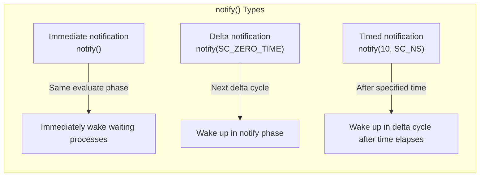
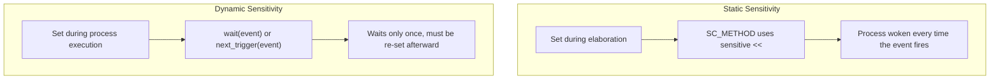
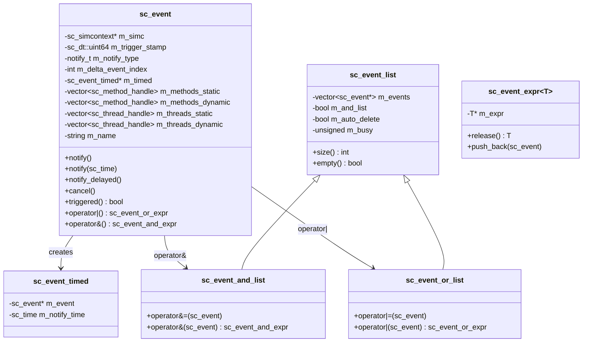
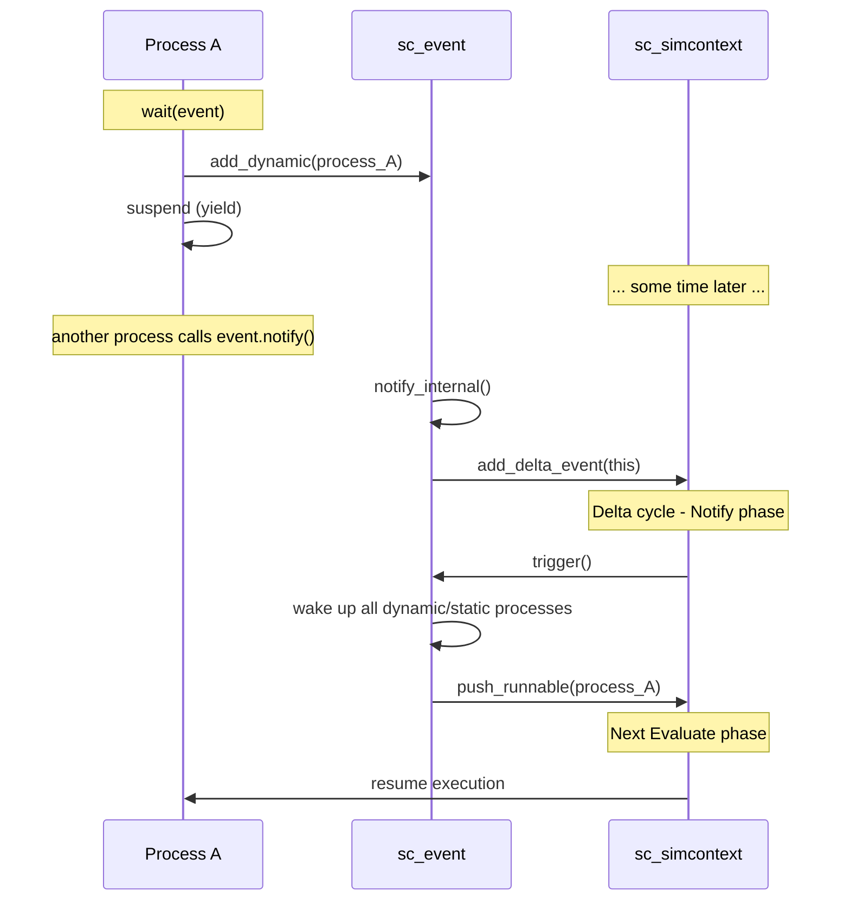

# sc_event -- Notification Signals in SystemC Simulation

## Overview

`sc_event` is the core mechanism for inter-process synchronization in SystemC. In hardware simulation, processes need a way to "wait for something to happen" and then "be woken up." `sc_event` is the abstraction of that "something" -- it can be triggered (notify) and can be waited on (wait).

This file also defines event lists (`sc_event_list`, `sc_event_and_list`, `sc_event_or_list`) and event expressions (`sc_event_expr`), allowing users to combine multiple events for waiting.

**Source file locations:**
- Header: `ref/systemc/src/sysc/kernel/sc_event.h`
- Implementation: `ref/systemc/src/sysc/kernel/sc_event.cpp`

---

## Everyday Analogy

Think of `sc_event` as a **phone notification system**:

| Phone Notification | sc_event |
|-------------------|---------|
| You are waiting for an important message | `wait(my_event)` |
| The message arrives and the phone rings | `my_event.notify()` |
| Set an alarm to ring in 10 minutes | `my_event.notify(10, SC_NS)` |
| "Notify me when either A or B arrives" | `wait(event_a \| event_b)` |
| "Notify me only when both A and B arrive" | `wait(event_a & event_b)` |
| Cancel the alarm | `my_event.cancel()` |
| Check if a notification just fired | `my_event.triggered()` |
| A notification that will never fire | `sc_event::none()` |

---

## Core Concepts

### Three Types of Notification



1. **Immediate notification** `notify()`: Triggers immediately during the current evaluate phase. Processes waiting on this event will be executed in the current evaluate phase.
2. **Delta notification** `notify(SC_ZERO_TIME)`: Triggers in the notify phase of the next delta cycle.
3. **Timed notification** `notify(10, SC_NS)`: Triggers after the specified time.

### Static Sensitivity vs Dynamic Sensitivity



---

## Class Architecture



---

## sc_event Class Details

### Construction and Naming

```cpp
sc_event();                       // unnamed event
explicit sc_event(const char* name);  // named event
```

Named events are registered in the object hierarchy and can be found via `sc_find_event()`. Anonymous events are not.

### Notification Methods

#### notify() -- Immediate/Delayed/Timed Notification

```cpp
void notify();                      // immediate
void notify(const sc_time&);        // timed (or delta if SC_ZERO_TIME)
void notify(double, sc_time_unit);  // convenience overload
```

**Internal implementation `notify_internal()`**:

```cpp
void sc_event::notify_internal(const sc_time& t) {
    if (t == SC_ZERO_TIME) {
        // Delta notification: add to delta events list
        m_delta_event_index = m_simc->add_delta_event(this);
        m_notify_type = DELTA;
    } else {
        // Timed notification: add to timed events priority queue
        sc_event_timed* et = new sc_event_timed(this, m_simc->time_stamp() + t);
        m_simc->add_timed_event(et);
        m_timed = et;
        m_notify_type = TIMED;
    }
}
```

#### notify_delayed() -- Guaranteed Delayed Notification

```cpp
void notify_delayed();                      // next delta
void notify_delayed(const sc_time&);        // at least specified time
void notify_delayed(double, sc_time_unit);  // convenience overload
```

Difference between `notify_delayed()` and `notify()`:
- `notify()` will override or ignore if there is an earlier pending notification
- `notify_delayed()` will report an error if there is any pending notification

#### cancel()

Cancels the currently pending notification (delta or timed); does not affect immediate notifications.

### Trigger Query

```cpp
bool triggered() const;
```

Returns whether this event was triggered in the **current delta cycle**. Internally implemented by comparing `m_trigger_stamp` with the simulator's `change_stamp`.

### Static Empty Event

```cpp
static const sc_event& none();
```

Returns an event that will never be triggered. Used in situations where an event reference is needed but you don't actually want to wait for anything.

### Sensitivity Management

```cpp
// internal methods for registering process sensitivity
void add_static(sc_method_handle) const;
void add_static(sc_thread_handle) const;
void add_dynamic(sc_method_handle) const;
void add_dynamic(sc_thread_handle) const;
```

Each event maintains four lists, recording the statically and dynamically sensitive method and thread processes respectively.

---

## Event Expression System

### sc_event_expr -- Expression Template

```cpp
template<typename T>
class sc_event_expr {
    mutable T* m_expr;
public:
    void push_back(const sc_event& e) const;
    T const& release() const;
    operator T const&() const;
};
```

This is a lightweight wrapper using **move semantics**. When you write `event_a | event_b | event_c`, each `|` operator creates an `sc_event_expr`, continuously accumulating events into the list. It is finally consumed in `wait()`.

### sc_event_list -- Event List Base Class

```cpp
class sc_event_list {
    std::vector<const sc_event*> m_events;  // events in the list
    bool m_and_list;                         // AND or OR list?
    bool m_auto_delete;                      // auto-delete when done?
    mutable unsigned m_busy;                 // reference count
};
```

**`m_busy` count**: When the event list is being used by a process (waiting), `m_busy > 0`, and modification of the list is not allowed.

**`m_auto_delete`**: Temporary lists created by expressions are automatically deleted after use.

### sc_event_and_list -- AND Combination

```cpp
wait(event_a & event_b & event_c);  // wait until ALL events triggered
```

All events must be triggered before the process is woken.

### sc_event_or_list -- OR Combination

```cpp
wait(event_a | event_b | event_c);  // wait until ANY event triggered
```

The process is woken when any one event is triggered.

---

## sc_event_timed -- Timed Notification Wrapper

```cpp
class sc_event_timed {
    sc_event* m_event;       // which event
    sc_time   m_notify_time; // absolute notify time
};
```

When an event needs a timed notification, an `sc_event_timed` object is created and added to the simulator's timed event priority queue. It uses custom memory management (`allocate()`/`deallocate()`) to improve performance.

Comparison function for timed events:

```cpp
int sc_notify_time_compare(const void* p1, const void* p2) {
    // earlier time = higher priority (returns 1)
    if (t1 < t2) return 1;
    else if (t1 > t2) return -1;
    else return 0;
}
```

---

## Complete Event Triggering Flow



---

## Design Rationale

### Why can't events be copied?

```cpp
private:
    sc_event(const sc_event&);              // disabled
    sc_event& operator=(const sc_event&);   // disabled
```

An event represents a unique synchronization point. If it could be copied, there would be a confusing situation where "two events point to the same set of waiters." This is similar to how a mutex in C++ cannot be copied.

### Immediate Notification Semantics

`notify()` without arguments is an immediate notification. This means that during the same evaluate phase, if processes are waiting on this event, they are immediately placed on the runnable queue. This models the instantaneous propagation behavior of "combinational logic" in hardware.

### notify vs notify_delayed

`notify()` follows the "closest notification wins" rule:
- Immediate notification > delta notification > timed notification
- A new notification that is earlier than the existing one cancels the existing one

`notify_delayed()` is stricter: it reports an error if there is already a pending notification. This is suitable for situations where notification semantics must be guaranteed not to be accidentally overridden.

### RTL Background

In Verilog, the concept of events is implicit:

```verilog
always @(posedge clk)  // equivalent to: sensitive to clock's posedge event
    q <= d;

@(negedge reset);      // equivalent to: wait(reset_negedge_event)
```

SystemC makes these implicit concepts explicit as `sc_event` objects, providing greater flexibility but also requiring more explicit code.

---

## Usage Examples

```cpp
// declare an event
sc_event data_ready;

// SC_THREAD process
void producer() {
    while (true) {
        // produce data
        data_ready.notify();  // immediate notification
        wait(10, SC_NS);
    }
}

// SC_METHOD process, static sensitivity
void consumer() {
    // process data
    // (will be called again when data_ready fires)
}
// in constructor: sensitive << data_ready;

// OR/AND combinations
void complex_waiter() {
    wait(event_a | event_b);   // wake on either
    wait(event_a & event_b);   // wake when both triggered
}
```

---

## Related Files

| File | Description |
|------|-------------|
| `sc_simcontext.h/cpp` | Manages delta events and timed events queues |
| `sc_time.h/cpp` | Timed notifications require `sc_time` |
| `sc_process.h` | Process base class, contains sensitivity lists |
| `sc_method_process.h/cpp` | SC_METHOD trigger logic |
| `sc_thread_process.h/cpp` | SC_THREAD wait/wake-up logic |
| `sc_wait.h` | `wait()` and `next_trigger()` functions |
| `sc_clock.h/cpp` | Clock uses events to notify posedge/negedge |
| `sc_signal.h` | Signal value changes trigger events |
| `sc_kernel_ids.h` | Defines event-related error IDs |
