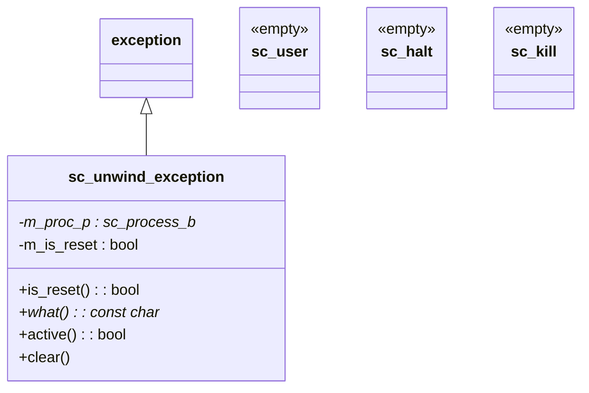

# sc_except -- SystemC Exception Handling Classes

## Overview

`sc_except` defines the exception classes used by the SystemC core to implement process kill and reset mechanisms. These exception classes are not meant to be thrown by users directly; they are internal tools used by the SystemC core to control process execution flow.

**Everyday analogy:** Imagine a factory production line. Normally, workers follow the standard procedure. But sometimes you need:
- **Maintenance shutdown** (`sc_halt`): Pause the production line
- **Emergency shutdown** (`sc_kill`): Stop the production line immediately
- **Restart the production line** (`sc_unwind_exception` with reset): Clear the current work-in-progress and start from scratch

These "exceptions" are not errors but intentional control commands. SystemC uses the C++ exception mechanism to achieve this "interrupt current work, unwind the stack, return to the starting point" effect.

## File Roles

- **Header `sc_except.h`**: Declares the `sc_user`, `sc_halt`, `sc_kill`, and `sc_unwind_exception` classes.
- **Implementation `sc_except.cpp`**: Implements `sc_unwind_exception` methods and the global exception handling function `sc_handle_exception()`.

## Class Overview



## Simple Exception Classes

### `sc_user`

```cpp
class sc_user { /* EMPTY */ };
```

An empty marker class for user-defined exception scenarios.

### `sc_halt`

```cpp
class sc_halt { /* EMPTY */ };
```

Used to halt process execution. When an `SC_CTHREAD` calls `halt()`, the core throws this exception to stop the process.

### `sc_kill`

```cpp
class sc_kill { /* EMPTY */ };
```

Used to terminate a process. This is an internal marker class.

All three classes are **intentionally empty**. Their purpose is not to carry data but to serve as "type tags" in the C++ exception mechanism, allowing `catch` blocks to distinguish different control flow scenarios by type.

## `sc_unwind_exception` -- Stack Unwinding Exception

This is the most important exception class, inheriting from `std::exception`, used to implement process kill and reset operations.

### Members

| Member | Description |
|--------|-------------|
| `m_proc_p` | Target process pointer (`mutable`, supporting move semantics) |
| `m_is_reset` | `true` for reset, `false` for kill |

### Key Methods

#### Constructor

```cpp
sc_unwind_exception::sc_unwind_exception(
    sc_process_b* proc_p, bool is_reset)
  : m_proc_p(proc_p), m_is_reset(is_reset)
{
    sc_assert( m_proc_p );
    m_proc_p->start_unwinding();
}
```

Immediately marks the process as "unwinding" upon construction.

#### Copy Constructor (Move Semantics)

```cpp
sc_unwind_exception::sc_unwind_exception(
    const sc_unwind_exception& that)
  : std::exception(that)
  , m_proc_p(that.m_proc_p)
  , m_is_reset(that.m_is_reset)
{
    that.m_proc_p = 0;  // move to new instance
}
```

Although declared as a copy constructor, it actually implements move semantics -- transferring `m_proc_p` from the old instance to the new one. This is because C++ exceptions may be copied during propagation, but only one instance should hold the process pointer.

#### `what()`

```cpp
const char* sc_unwind_exception::what() const noexcept {
    return ( m_is_reset ) ? "RESET" : "KILL";
}
```

Returns `"RESET"` or `"KILL"` for debugging purposes.

#### `is_reset()`

```cpp
virtual bool is_reset() const { return m_is_reset; }
```

Allows user code in a `catch` block to determine whether it is a reset or a kill.

#### `active()` and `clear()`

```cpp
bool sc_unwind_exception::active() const {
    return m_proc_p && m_proc_p->is_unwinding();
}

void sc_unwind_exception::clear() const {
    sc_assert( m_proc_p );
    m_proc_p->clear_unwinding();
}
```

These two methods are for internal core use, to query and clear the process unwinding state.

#### Destructor

```cpp
sc_unwind_exception::~sc_unwind_exception() noexcept {
    if( active() ) {
        SC_REPORT_FATAL( SC_ID_RETHROW_UNWINDING_, m_proc_p->name() );
        sc_abort();
    }
}
```

**Critical safety check:** If the exception is destroyed while the process is still in the unwinding state, it means user code caught the exception but did not re-throw it. This is a fatal error because stack unwinding must complete fully; intercepting it midway would leave the system in an inconsistent state.

## Unwinding Flow

```mermaid
sequenceDiagram
    participant Kernel as SystemC Kernel
    participant Thread as SC_THREAD
    participant UE as sc_unwind_exception

    Kernel->>UE: throw sc_unwind_exception(proc, is_reset)
    UE->>Thread: start_unwinding()
    Note over Thread: Stack unwinding begins...
    Thread-->>Thread: Local objects destroyed

    alt User catches and re-throws
        Thread->>Thread: catch(sc_unwind_exception& e)
        Thread->>Thread: cleanup...
        Thread->>Thread: throw; (re-throw)
    else User catches and swallows (BUG!)
        Thread->>UE: ~sc_unwind_exception()
        UE->>UE: FATAL ERROR! active() == true
    end

    Kernel->>UE: catch & clear()
    UE->>Thread: clear_unwinding()
```

## `sc_handle_exception()` -- Global Exception Handler

```cpp
sc_report* sc_handle_exception() {
    try {
        try { throw; }  // re-throw current exception
        catch( sc_report & ) { throw; }
        catch( sc_unwind_exception const & ) {
            SC_REPORT_ERROR(..., "unhandled kill/reset");
        }
        catch( std::exception const & x ) {
            SC_REPORT_ERROR(..., x.what());
        }
        catch( char const * x ) {
            SC_REPORT_ERROR(..., x);
        }
        catch( ... ) {
            SC_REPORT_ERROR(..., "UNKNOWN EXCEPTION");
        }
    }
    catch( sc_report & rpt ) {
        sc_report* rpt_p = new sc_report;
        rpt_p->swap( rpt );
        return rpt_p;
    }
    return 0;
}
```

This function converts any uncaught exception into an `sc_report` object. It uses a "double try-catch" technique:

1. The outer layer re-throws the current exception
2. The inner layer categorizes by type, converting all non-`sc_report` exceptions to `SC_REPORT_ERROR`
3. The outermost layer catches (now guaranteed to be `sc_report`), dynamically allocates, and returns it

## Design Considerations

### Why use exceptions instead of flags for reset/kill?

The C++ exception mechanism automatically handles stack unwinding, ensuring all local variable destructors are called. If only flags were used, the process function would need to manually check flags and clean up resources, which is error-prone.

### Why is swallowing `sc_unwind_exception` not allowed?

Stack unwinding must complete all the way to the kernel control point. If user code catches the unwinding exception but does not re-throw, the process enters an inconsistent state -- the kernel thinks the process is unwinding, but the process continues executing normally.

### Why does the copy constructor implement move semantics?

In pre-C++11 code (SystemC has a long history), exception objects during propagation can only be copied. By zeroing the pointer in the original instance inside the copy constructor, ownership transfer is achieved.

## Related Files

- `sc_process.h` -- Process base class (`start_unwinding`/`clear_unwinding`/`is_unwinding`)
- `sc_thread_process.h` -- Thread process (main scenario for exception throwing and catching)
- `sc_method_process.h` -- Method process
- `sc_simcontext.h` -- Simulation context (calls `sc_handle_exception`)
- `sc_report.h` -- Report system
