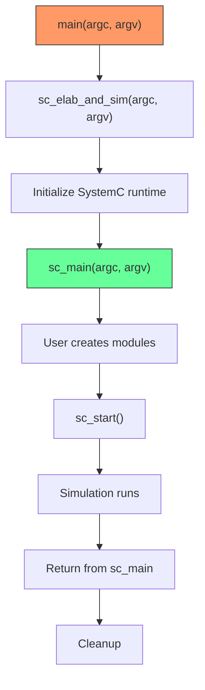

# sc_externs.h - Global Function Declarations

## Overview

`sc_externs.h` declares the global entry points and command-line argument access functions for SystemC programs. The most important is `sc_main()`, which is the starting point of every SystemC program.

## Why is this file needed?

Every C/C++ program has a `main()` function as its entry point. SystemC hides `main()` -- it handles initialization inside the SystemC library, then calls the user-defined `sc_main()`. This file declares the interfaces for these global functions.

This is like attending an event: the organizer (SystemC library) handles venue setup and check-in (initialization), then hands you the microphone (calls `sc_main()`) for your presentation.

## Function Declarations

### `sc_main()`

```cpp
extern "C" int sc_main(int argc, char* argv[]);
```

The function that users must define -- the true entry point of a SystemC program.

- `extern "C"` uses C naming conventions to avoid C++ name mangling
- Parameters are the same as `main()`: `argc` is the argument count, `argv` is the argument array
- Returns 0 for success, non-zero for error

### `sc_elab_and_sim()`

```cpp
extern "C" int sc_elab_and_sim(int argc, char* argv[]);
```

The core startup function of SystemC, responsible for:
1. Initializing the simulation environment
2. Calling `sc_main()`
3. Cleaning up resources

### `sc_argc()` / `sc_argv()`

```cpp
extern "C" int sc_argc();
extern "C" const char* const* sc_argv();
```

A way to access command-line arguments outside of `sc_main()`. For example, you might need to read command-line arguments in a module constructor.

## Program Startup Flow



Note: The actual `main()` is defined inside the SystemC library (typically in `sc_main_main.cpp`). Users do not need to and should not define `main()`.

## Purpose of `extern "C"`

`extern "C"` is used because:
1. **Cross-language compatibility**: Ensures the function name is not modified by the C++ compiler
2. **Linking reliability**: C++ name mangling may differ between compilers, but C rules are unified
3. **The SystemC library's `main()` needs to be able to find the user's `sc_main()`**

## Related Files

- `sc_main.cpp` / `sc_main_main.cpp` - Implementation of `main()` and `sc_elab_and_sim()`
- `sc_simcontext.h` - Simulation context initialization
- `sc_ver.h` - Version check performed at startup
