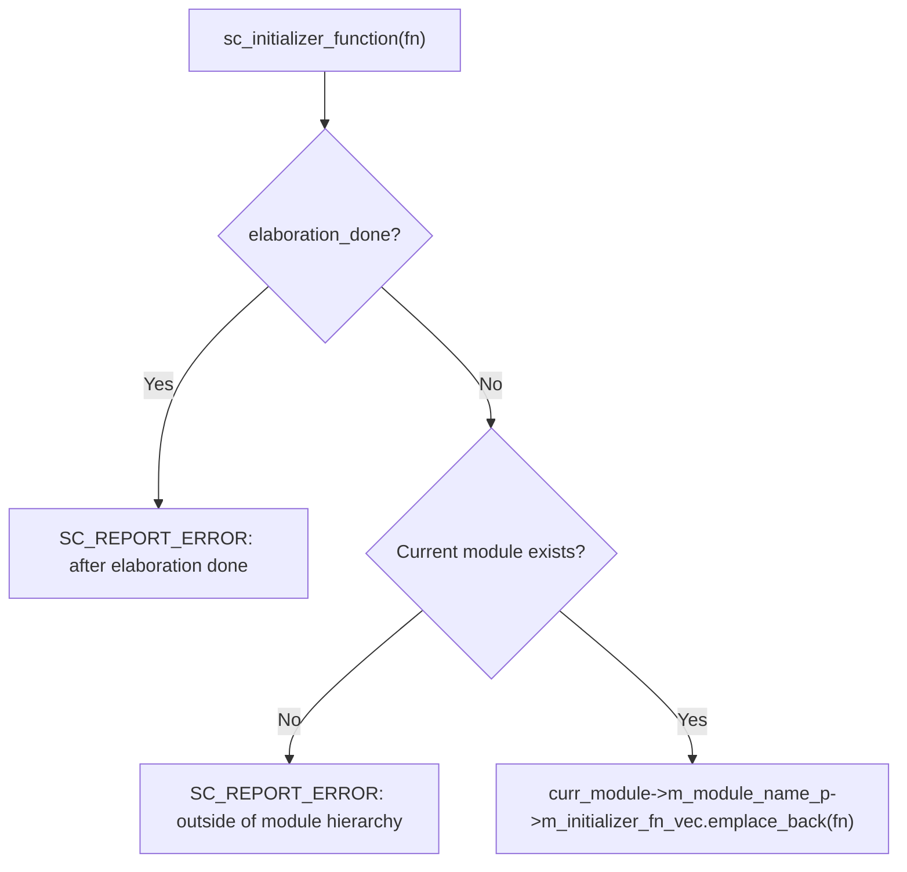

# sc_initializer_function.h - Module Initializer Function Helper

## Overview

`sc_initializer_function.h` provides a set of macros and helper classes that allow SystemC modules to directly initialize complex objects (such as process sensitivity settings) within the class definition. This is a modern C++ style improvement that reduces the need for writing large amounts of initialization code in the constructor.

## Why is this file needed?

The traditional SystemC module writing style requires registering all processes and setting sensitivity in the constructor (`SC_CTOR`):

```cpp
SC_MODULE(MyModule) {
    void my_thread();
    SC_CTOR(MyModule) {
        SC_THREAD(my_thread);
        sensitive << clk.pos();
    }
};
```

When a module is large, the constructor becomes very long. `sc_initializer_function` allows you to place initialization logic next to the process declaration, like putting work instructions at each employee's desk rather than piling all instructions at the company entrance.

## Core Macros

### `SC_INIT(object_name)`

Binds an initialization function next to the object declaration:

```cpp
SC_MODULE(MyModule) {
    SC_INIT(my_thread) {
        SC_THREAD(my_thread);
        sensitive << clk.pos();
    }
    void my_thread();
};
```

After expansion, this is equivalent to creating an `sc_initializer_function` object and an initialization function.

### `SC_NAMED_WITH_INIT(object_name, ...)`

Combines naming and initialization:

```cpp
SC_MODULE(MyModule) {
    SC_NAMED_WITH_INIT(my_signal, 0) {
        // initialization code
    }
};
```

### `SC_THREAD_IMP(thread_name, ...)`

Simplifies `SC_THREAD` declaration and implementation:

```cpp
SC_MODULE(MyModule) {
    SC_THREAD_IMP(my_thread,
        sensitive << clk.pos();
    ) {
        // thread body
        while (true) {
            wait();
            // ...
        }
    }
};
```

This macro merges `SC_THREAD` registration, sensitivity setting, and function definition together.

### `SC_CTHREAD_IMP(thread_name, edge, ...)`

Similar to `SC_THREAD_IMP`, but for clock-driven threads.

### `SC_METHOD_IMP(method_name, ...)`

Similar to `SC_THREAD_IMP`, but for `SC_METHOD`.

## Class Details

### `sc_initializer_function`

```cpp
class sc_initializer_function {
public:
    template<class F>
    explicit sc_initializer_function(F&& fn);
};
```

The constructor of this class accepts a lambda or callable object and adds it to the current module's initializer function queue. During the elaboration phase, these functions are called in order.

#### Construction Flow



Key restrictions:
1. **Can only be used during elaboration**: Cannot register after simulation starts
2. **Must be within the module hierarchy**: Cannot be used at global scope

### `sc_initializer_function_name_fwd()`

```cpp
template <class F>
inline const char* sc_initializer_function_name_fwd(const char* name, F&& fn)
{
    sc_initializer_function(std::move(fn));
    return name;
}
```

This is a helper function for the `SC_NAMED_WITH_INIT` macro. It does two things:
1. Creates an `sc_initializer_function` object to register the initialization function
2. Passes the name string back for use as the object's constructor argument

## Macro Expansion Example

`SC_INIT(my_thread) { ... }` expands to:

```cpp
sc_core::sc_initializer_function my_thread_initialization_fn_lambda {
    [this]() {
        my_thread_initialization_fn();
    }
};
void my_thread_initialization_fn() {
    // user code: SC_THREAD(my_thread); etc.
}
```

## Design Considerations

### Why use Lambdas?

Using lambdas allows capturing the `this` pointer so that the initialization function can access module members. `std::move` is used to avoid unnecessary copies.

### Comparison with the Traditional Approach

| Feature | Traditional `SC_CTOR` | `SC_INIT` / `SC_THREAD_IMP` |
|---------|----------------------|---------------------------|
| Initialization location | Centralized in constructor | Distributed next to each process |
| Readability | Hard to read for large modules | Clearer code organization |
| Maintainability | Adding a process requires changes in two places | Adding a process requires changes in one place only |

## Related Files

- `sc_macros.h` - Provides `SC_CONCAT_HELPER_`, `SC_STRINGIFY_HELPER_`, and other macros
- `sc_module.h` - `sc_module` class, provides the `m_module_name_p` member
- `sc_simcontext.h` - Provides `hierarchy_curr()` and `elaboration_done()`
