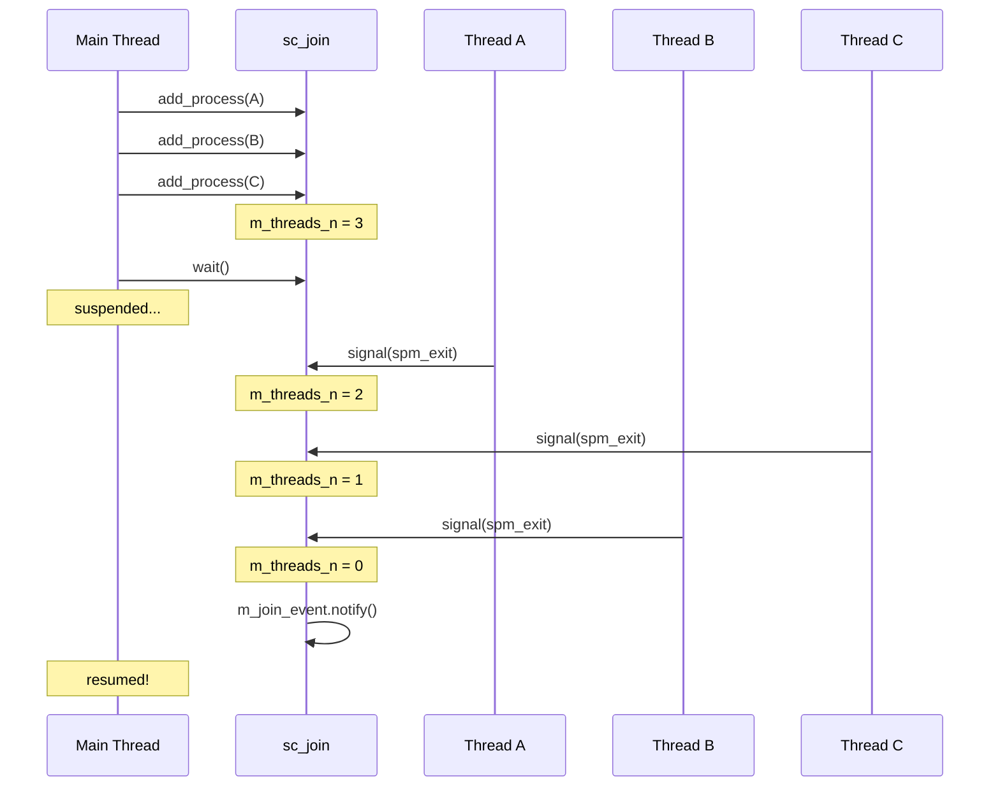
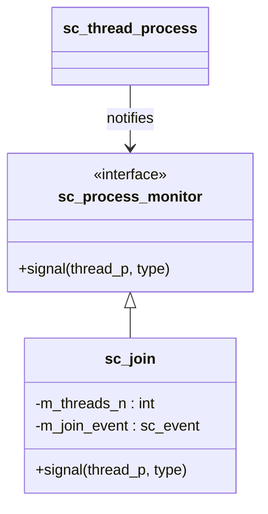

# sc_join -- Process Synchronization Join

## Overview

`sc_join` provides a synchronization mechanism for waiting until multiple thread processes have all completed. It implements the "join" part of the "fork-join" pattern.

**Everyday analogy:** Imagine you ordered three dishes at a restaurant. Each dish is prepared by a different chef simultaneously. You don't want the dishes served one at a time -- you want all three to arrive at the table together. `sc_join` is like the waiter responsible for counting "how many dishes are still not ready" -- when the counter reaches zero, you are notified that it's time to eat.

## File Roles

- **Header `sc_join.h`**: Declares the `sc_join` class and the `SC_FORK`/`SC_JOIN`/`SC_CJOIN` macros.
- **Implementation `sc_join.cpp`**: Implements the constructor, process addition, and signal callback.

## Class Definition

```cpp
class sc_join : public sc_process_monitor {
    friend class sc_process_b;
    friend class sc_process_handle;

public:
    sc_join();
    void add_process( sc_process_handle process_h );
    int process_count();
    virtual void signal(sc_thread_handle thread_p, int type);
    void wait();
    void wait_clocked();

protected:
    void add_process( sc_process_b* process_p );

protected:
    sc_event m_join_event;   // event notified when all threads complete
    int      m_threads_n;    // number of threads still running
};
```

### Member Details

| Member | Description |
|--------|-------------|
| `m_join_event` | Event triggered when all monitored threads have finished |
| `m_threads_n` | Counter of threads not yet completed |

## Operation Flow



## Key Methods

### `add_process(sc_process_handle)`

Adds a process to the monitoring list:

```cpp
void sc_join::add_process( sc_process_handle process_h ) {
    sc_thread_handle thread_p = process_h.operator sc_thread_handle();
    if ( thread_p ) {
        m_threads_n++;
        thread_p->add_monitor( this );
    } else {
        SC_REPORT_ERROR( SC_ID_JOIN_ON_METHOD_HANDLE_, 0 );
    }
}
```

**Important restriction:** Only thread processes (`SC_THREAD`/`SC_CTHREAD`) can be added, not method processes (`SC_METHOD`). This is because `SC_METHOD` has no concept of "completing" -- they are triggered repeatedly.

### `add_process(sc_process_b*)`

Internal version that directly operates on the process base pointer:

```cpp
void sc_join::add_process( sc_process_b* process_p ) {
    sc_thread_handle handle = dynamic_cast<sc_thread_handle>(process_p);
    sc_assert( handle != 0 );
    m_threads_n++;
    handle->add_monitor( this );
}
```

### `signal()`

Called when a monitored thread sends a signal (Observer Pattern):

```cpp
void sc_join::signal(sc_thread_handle thread_p, int type) {
    switch ( type ) {
      case sc_process_monitor::spm_exit:
        thread_p->remove_monitor(this);
        if ( --m_threads_n == 0 )
            m_join_event.notify();
        break;
    }
}
```

Only handles the `spm_exit` signal type. When the counter reaches zero, it triggers `m_join_event`.

### `wait()` and `wait_clocked()`

```cpp
inline void sc_join::wait() {
    ::sc_core::wait(m_join_event);
}

inline void sc_join::wait_clocked() {
    do { ::sc_core::wait(); } while (m_threads_n != 0);
}
```

- **`wait()`**: Directly waits on the join event; suitable for threads without a sensitivity list.
- **`wait_clocked()`**: Used in threads with a sensitivity list; repeatedly waits on clock edges until all threads complete.

## Convenience Macros

### `SC_FORK` / `SC_JOIN`

```cpp
SC_FORK
    sc_spawn(...),
    sc_spawn(...),
    sc_spawn(...)
SC_JOIN
```

Expands to:

```cpp
{
    sc_process_handle forkees[] = {
        sc_spawn(...),
        sc_spawn(...),
        sc_spawn(...)
    };
    sc_join join;
    for (unsigned int i = 0;
         i < sizeof(forkees)/sizeof(sc_process_handle); i++)
        join.add_process(forkees[i]);
    join.wait();
}
```

### `SC_CJOIN`

Similar to `SC_JOIN`, but uses `wait_clocked()` instead of `wait()`, suitable for scenarios with a sensitivity list.

## Design Pattern

`sc_join` uses the **Observer Pattern**:



`sc_join` inherits from `sc_process_monitor`, acting as an observer for threads. Threads call all observers' `signal()` method when they terminate.

## Conceptual Usage Example

```
// Conceptual usage (not actual SystemC code):
SC_FORK
    sc_spawn(task_a),    // Start task A
    sc_spawn(task_b),    // Start task B
    sc_spawn(task_c)     // Start task C
SC_JOIN
// All three tasks have completed here
```

## Design Considerations

### Why is `SC_METHOD` not supported?

`SC_METHOD` is an event-driven callback function with no lifecycle concept of start and end. It does not "complete"; it simply executes again the next time an event triggers it. Therefore, "waiting for a METHOD to complete" is meaningless.

### Why does `m_join_event` use kernel_event?

`m_join_event` is constructed with the `sc_event::kernel_event` tag and the name `"join_event"`, indicating it is an event for internal core use and will not appear in the user-visible event hierarchy.

## Related Files

- `sc_process.h` -- Process base class and `sc_process_monitor`
- `sc_process_handle.h` -- Process handle
- `sc_thread_process.h` -- Thread process (provides `add_monitor`/`remove_monitor`)
- `sc_wait.h` -- `wait()` function
