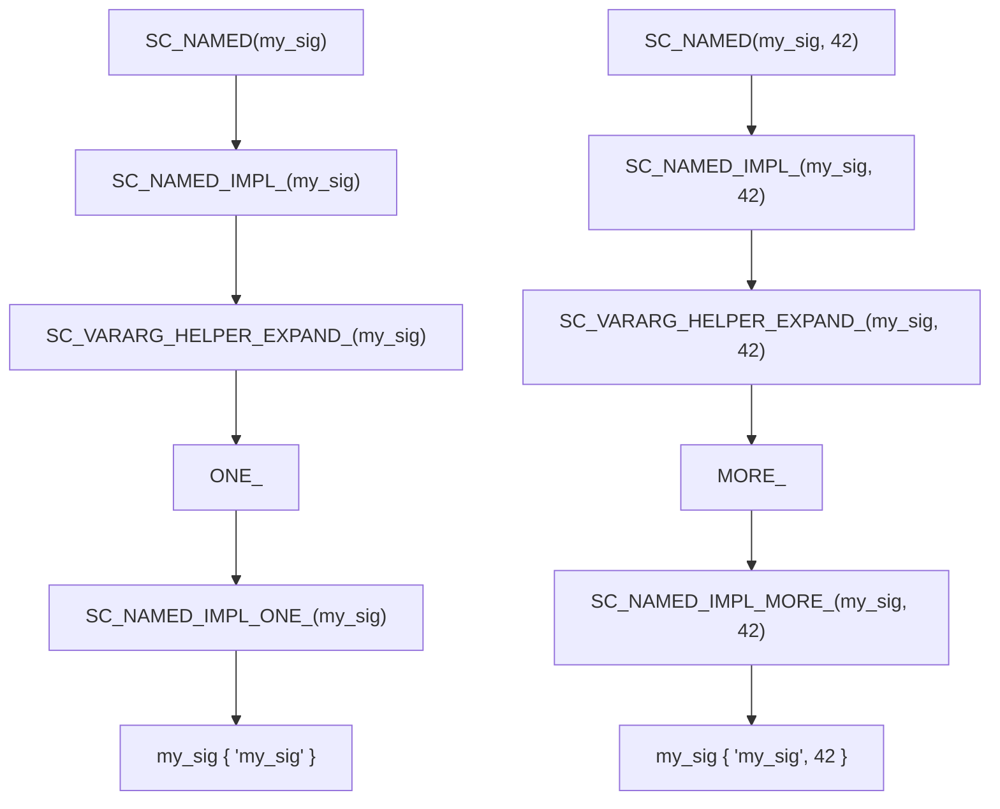

# sc_macros.h - Common Macros and Helper Functions

## Overview

`sc_macros.h` defines the common macros and template helper functions used throughout SystemC. It contains two main parts: math function templates in the `sc_dt` namespace, and preprocessor macro utilities.

## Why is this file needed?

This file provides "basic tools," like screwdrivers and pliers in a toolbox -- they are not the final product themselves, but almost all other code uses them.

## Math Function Templates (`sc_dt` Namespace)

### `sc_min(a, b)`

Returns the smaller of two values.

### `sc_max(a, b)`

Returns the larger of two values.

### `sc_abs(a)`

Returns the absolute value. The implementation is somewhat special -- rather than simply `a >= 0 ? a : -a`, it first creates a zero value `z` and then compares. This is to support all SystemC arithmetic data types (such as `sc_int`, `sc_fixed`, etc.), as these types may not support direct comparison with the integer 0.

## Preprocessor Macros

### Token Stringification

```cpp
#define SC_STRINGIFY_HELPER_(Arg)                  // "Arg"
#define SC_STRINGIFY_HELPER_DEFERRED_(Arg)          // delay expansion
#define SC_STRINGIFY_HELPER_MORE_DEFERRED_(Arg) #Arg // actual stringify
```

The reason for three layers of macros: to ensure `Arg` is fully expanded before stringification. For example:

```cpp
#define VERSION 3
SC_STRINGIFY_HELPER_(VERSION)   // -> "3" (not "VERSION")
```

### Token Concatenation

```cpp
#define SC_CONCAT_HELPER_(a, b)           // a##b (with expansion)
#define SC_CONCAT_UNDERSCORE_(a, b)       // a_b
```

Similarly uses multi-layer deferred expansion to ensure macro arguments are expanded first.

### Token Expansion

```cpp
#define SC_EXPAND_HELPER_(x) x
```

Forces expansion of macro arguments; used in some special macro combination scenarios.

## Debug Helper Macros

### `SC_WAIT()`

```cpp
#define SC_WAIT()                                       \
    ::sc_core::sc_set_location( __FILE__, __LINE__ );   \
    ::sc_core::wait();                                  \
    ::sc_core::sc_set_location( NULL, 0 )
```

Wraps the `wait()` call, recording the file name and line number before waiting. This way, when the simulator hangs, you can identify which `wait()` call caused it.

### `SC_WAITN(n)`

Similar to `SC_WAIT()`, but waits for `n` clock cycles.

### `SC_WAIT_UNTIL(expr)`

```cpp
#define SC_WAIT_UNTIL(expr)  do { SC_WAIT(); } while( !(expr) )
```

Repeatedly waits until the condition is satisfied.

## `SC_NAMED` Macro System

### `SC_NAMED(...)`

Automatically sets the instance name of a SystemC object to match the variable name:

```cpp
// Without SC_NAMED:
sc_signal<int> my_signal {"my_signal"};

// With SC_NAMED:
SC_NAMED(my_signal);  // expands to: my_signal {"my_signal"}
SC_NAMED(my_signal, 42);  // expands to: my_signal {"my_signal", 42}
```

### Variadic Macro Implementation

`SC_NAMED` uses an elaborate set of macros to detect argument count:



`SC_VARARG_HELPER_EXPAND_SEQ_` leverages the C preprocessor's argument shifting property: when there is only 1 argument it selects `ONE_`, and with multiple arguments it selects `MORE_`.

## Related Files

- `sc_cmnhdr.h` - Included by this file, provides basic definitions
- `sc_initializer_function.h` - Uses `SC_CONCAT_HELPER_` and `SC_STRINGIFY_HELPER_`
- `sc_ver.h` - Uses `SC_CONCAT_UNDERSCORE_` and `SC_STRINGIFY_HELPER_`
- `sc_module.h` - `SC_NAMED` macro used for object naming within modules
