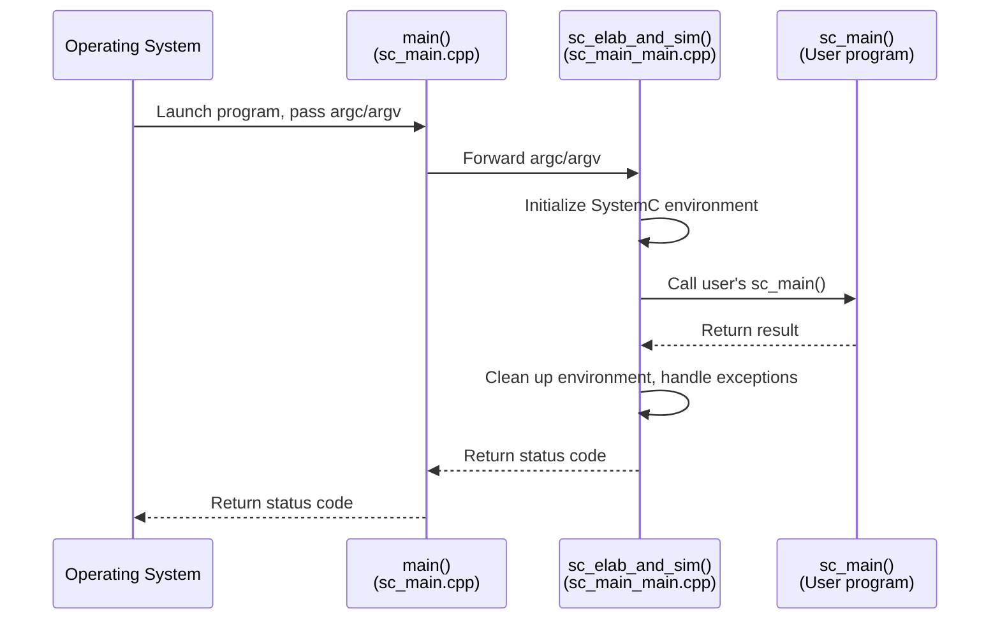

# sc_main.cpp -- The Starting Line of a SystemC Program

## Overview

`sc_main.cpp` is the true entry point of a SystemC program. It defines the C++ `main()` function, serving as the bridge between the operating system and the SystemC world. This file is extremely short and does only one thing: hand control to `sc_elab_and_sim()`.

**Source file location:** `ref/systemc/src/sysc/kernel/sc_main.cpp`

---

## Everyday Analogy

Imagine dining at a fine restaurant:

| Restaurant Flow | sc_main.cpp |
|----------------|-------------|
| Restaurant front door | `main()` function |
| Receptionist at the door | `sc_elab_and_sim()` |
| Receptionist seats you, takes your order, serves food | elaboration + simulation |
| Your own dining experience | User-defined `sc_main()` |

You (the operating system) walk through the front door (`main()`), the receptionist (`sc_elab_and_sim()`) arranges everything, and your dining experience (`sc_main()`) is up to you.

---

## Complete Source Code Analysis

The core of the entire file is:

```cpp
#include "sysc/kernel/sc_cmnhdr.h"
#include "sysc/kernel/sc_externs.h"

int
main( int argc, char* argv[] )
{
    return sc_core::sc_elab_and_sim( argc, argv );
}
```

### Line-by-Line Explanation

1. **`#include "sc_cmnhdr.h"`** -- Include the SystemC common header (platform compatibility, export macros, etc.)
2. **`#include "sc_externs.h"`** -- Include the declaration of `sc_elab_and_sim()`
3. **`main()`** -- Standard C++ program entry point, receives command-line arguments
4. **`sc_core::sc_elab_and_sim()`** -- Completely hands control to the SystemC framework

---

## Program Startup Flow



---

## Design Rationale

### Why split into two files?

`main()` and `sc_elab_and_sim()` are in separate files for several important reasons:

1. **Linking flexibility**: Some users may want to define their own `main()` (e.g., in embedded systems or test frameworks). Placing `main()` in a separate compilation unit allows users to provide their own `main.cpp` as a replacement.

2. **Platform portability**: Some platforms (such as Windows GUI applications) do not use the standard `main()` but use `WinMain()` instead. Separation makes adaptation easier.

3. **Separation of concerns**: `main()` is only responsible for "starting up"; all real logic is in `sc_elab_and_sim()`.

### The user's sc_main()

Users do not need to (and should not) write their own `main()`. The SystemC convention is for users to define `sc_main()`:

```cpp
// example: user code
int sc_main(int argc, char* argv[]) {
    // build your modules here
    MyModule top("top");
    sc_start(100, SC_NS);
    return 0;
}
```

The SystemC framework calls it automatically.

---

## Related Files

| File | Description |
|------|-------------|
| `sc_main_main.cpp` | Implementation of `sc_elab_and_sim()`, the actual initialization and cleanup logic |
| `sc_externs.h` | Declares `sc_elab_and_sim()` and `sc_main()` |
| `sc_simcontext.h/cpp` | Simulation engine core |
