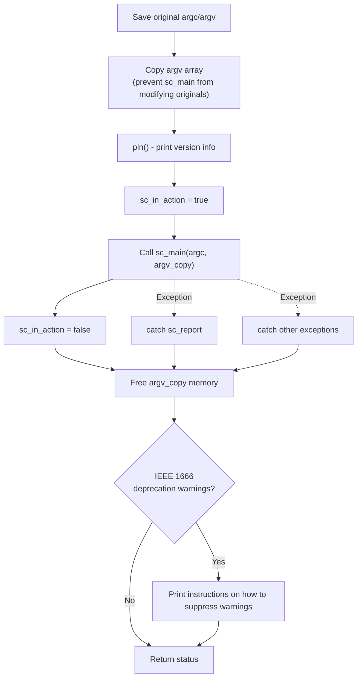

# sc_main_main.cpp -- The Actual SystemC Simulation Launcher

## Overview

`sc_main_main.cpp` implements the `sc_elab_and_sim()` function, which is the critical bridge between `main()` and the user's `sc_main()` in the SystemC framework. It is responsible for:
1. Saving the original command-line arguments
2. Creating argument copies to prevent modification
3. Calling the user's `sc_main()`
4. Catching and handling all exceptions
5. Outputting deprecation warning messages

**Source file location:** `ref/systemc/src/sysc/kernel/sc_main_main.cpp`

---

## Everyday Analogy

Think of `sc_elab_and_sim()` as a **professional event director**:

| Event Director's Work | sc_elab_and_sim() |
|-----------------------|-------------------|
| Record the original guest list | Save `argc_orig` / `argv_orig` |
| Make a copy of the list for the staff | Copy `argv` as `argv_copy` |
| Let the host take the stage (your show) | Call `sc_main()` |
| Handle emergencies (someone falls, power outage) | `try-catch` exception handling |
| Clean up the venue after the event | Free memory, print warnings |
| Report whether the event was successful | Return `status` |

---

## Key Function Analysis

### sc_elab_and_sim()

```cpp
int sc_elab_and_sim( int argc, char* argv[] )
```

This is the "true entry point" of the entire SystemC program. Here is its complete flow:



### Exception Handling Mechanism

```cpp
try {
    status = sc_main( argc, &argv_call[0] );
}
catch( const sc_report& x ) {
    // Handle SystemC-specific report exceptions
    sc_report_handler::get_handler()( x, sc_report_handler::get_catch_actions() );
}
catch( ... ) {
    // Handle all other exceptions
    sc_report* err_p = sc_handle_exception();
    if( err_p )
        sc_report_handler::get_handler()( *err_p, sc_report_handler::get_catch_actions() );
    delete err_p;
}
```

Three layers of protection:
1. **Normal return**: `sc_main()` finishes normally, returning the user-specified status code
2. **sc_report exception**: Exceptions generated by SystemC's own report system
3. **Other exceptions**: C++ standard exceptions or other unexpected exceptions

### sc_argc() / sc_argv()

```cpp
int sc_argc()           { return argc_orig; }
const char* const* sc_argv() { return argv_orig; }
```

Allow users to access command-line arguments outside of `sc_main()`. Note that these return the **original** argv, not the copy.

### sc_in_action

```cpp
bool sc_in_action = false;
```

A global flag indicating whether `sc_main()` is currently executing. Some internal SystemC logic changes behavior based on this flag.

---

## argv Copy Design Considerations

Why copy `argv`?

```cpp
std::vector<char*> argv_copy(argc + 1, static_cast<char*>(NULL));
for ( int i = 0; i < argc; ++i ) {
    std::size_t size = std::strlen(argv[i]) + 1;
    argv_copy[i] = new char[size];
    std::copy(argv[i], argv[i] + size, argv_copy[i]);
}
```

**Reason**: The user's `sc_main()` may modify the string pointers in `argv`. To ensure `sc_argv()` can always return the original command-line arguments, an untouched copy must be preserved.

**Technique**: `argv_call` is a pointer array copied from `argv_copy`, passed to `sc_main()` for use. Even if `sc_main()` modifies pointers in `argv_call`, `argv_copy` still holds the originally allocated memory and can be correctly freed.

---

## Deprecation Warning Handling

If IEEE 1666 deprecation warnings are triggered during simulation, a friendly prompt is printed at the end:

```
You can turn off warnings about
IEEE 1666 deprecated features by placing this method call
as the first statement in your sc_main() function:
  sc_core::sc_report_handler::set_actions(
    "IEEE_Std_1666/deprecated",
    sc_core::SC_DO_NOTHING );
```

This is a user-friendly design: rather than constantly interrupting during simulation, it provides a consolidated notification at the end.

---

## Design Rationale

### Why not do all this in sc_main.cpp?

**Separation of concerns**:
- `sc_main.cpp`: Only responsible for providing the `main()` function (can be replaced)
- `sc_main_main.cpp`: Responsible for SystemC framework initialization logic (should not be replaced)

This design allows users to replace the `main()` implementation (e.g., in a GUI framework) while always preserving SystemC's initialization logic.

### Why isn't simcontext deleted here?

There is a section in the source code commented out with `#if 0`:

```cpp
#if 0
    delete sc_get_curr_simcontext();
#endif
```

The comment explains: "After `sc_main_main` returns, there are still threads trying to call `sc_simcontext::remove_process()`." This is a known cleanup order issue. The current solution is to not actively delete the simcontext and let the operating system reclaim it when the program exits.

---

## Related Files

| File | Description |
|------|-------------|
| `sc_main.cpp` | Defines the `main()` function |
| `sc_externs.h` | Declares `sc_elab_and_sim()`, `sc_main()`, `sc_argc()`, `sc_argv()` |
| `sc_simcontext.h/cpp` | Simulation context, implicitly used in `sc_main()` |
| `sc_ver.h` | Version information (`pln()` function) |
| `sc_report.h` | Report/exception handling system |
