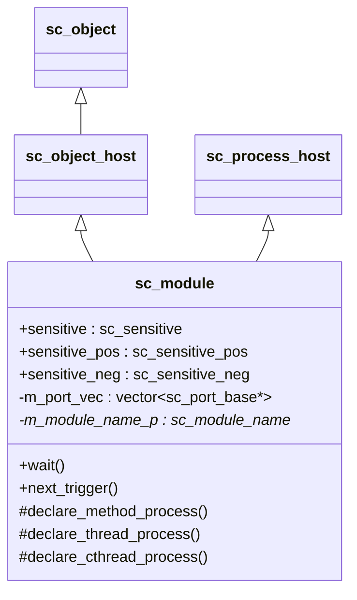
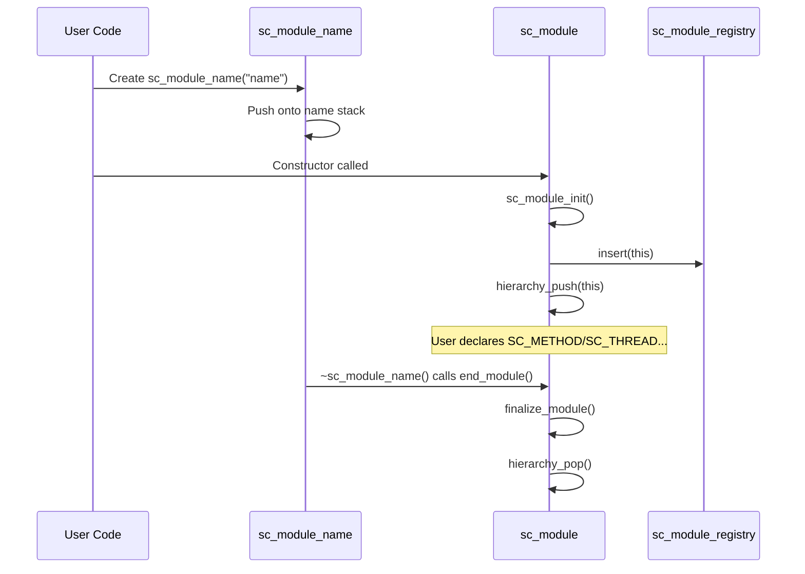
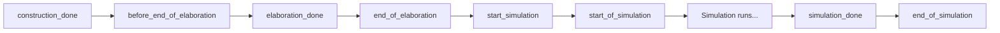

# sc_module -- Base Class for All Hierarchical Modules and Channels

## Overview

`sc_module` is the base class for all hardware modules in SystemC. In the real hardware world, a circuit board has many chips, and each chip contains many functional blocks; `sc_module` is the C++ class used to describe these "functional blocks."

**Everyday analogy:** Imagine you are assembling a computer. The motherboard is the top-level module, with a CPU module, memory module, and graphics card module plugged into it. Each module has its own "pins" (ports), connected to each other through the motherboard's "traces" (signals). `sc_module` is the blueprint for each such module.

## File Roles

- **Header `sc_module.h`**: Declares the `sc_module` class, `sc_bind_proxy` struct, and a series of convenience macros (`SC_MODULE`, `SC_CTOR`, `SC_METHOD`, `SC_THREAD`, `SC_CTHREAD`).
- **Implementation `sc_module.cpp`**: Implements construction, destruction, process declaration, port binding, lifecycle callback logic, and more.

## Key Concepts

### Inheritance Structure



`sc_module` inherits from both `sc_object_host` (providing object hierarchy management) and `sc_process_host` (providing process hosting capability).

### Module Lifecycle



### Construction Mechanism

`sc_module` has an elegant construction protocol:

1. The user creates an `sc_module_name` object (usually done automatically via the `SC_CTOR` macro).
2. The `sc_module_name` constructor pushes the name onto the module name stack.
3. The `sc_module` constructor takes the name from the top of the stack.
4. When `sc_module_name` is destroyed, it automatically calls `end_module()` to complete module construction.

This design means users do not need to manually call `end_module()`.

## Important Classes and Structs

### `sc_bind_proxy`

A struct that temporarily stores interface or port pointers, used for positional binding.

```cpp
struct sc_bind_proxy {
    sc_interface* iface;
    sc_port_base* port;
};
```

### `sc_module` Key Members

| Member | Description |
|--------|-------------|
| `sensitive` | Sensitivity list object for registering which signals a process is sensitive to |
| `sensitive_pos` | Positive edge sensitivity list |
| `sensitive_neg` | Negative edge sensitivity list |
| `m_port_vec` | List of all ports for this module |
| `m_module_name_p` | Pointer to the corresponding `sc_module_name` object |
| `m_end_module_called` | Flag indicating whether `end_module()` has been called |

### Process Declaration Methods

| Method | Corresponding Macro | Description |
|--------|---------------------|-------------|
| `declare_method_process()` | `SC_METHOD` | Declare a combinational logic process (no own thread; executes once per trigger) |
| `declare_thread_process()` | `SC_THREAD` | Declare a sequential logic process (has own thread; can call `wait()`) |
| `declare_cthread_process()` | `SC_CTHREAD` | Declare a clock-driven thread process |

**Analogies:**
- `SC_METHOD` is like a doorbell -- each press triggers one action, then it's done.
- `SC_THREAD` is like a continuously running worker -- can do some work then pause and wait (`wait()`), then continue when woken up.
- `SC_CTHREAD` is like a factory assembly line worker -- only acts on a specific edge of each clock cycle.

### `wait()` and `next_trigger()` Method Family

`sc_module` provides numerous `wait()` overloads (for `SC_THREAD`/`SC_CTHREAD`) and `next_trigger()` overloads (for `SC_METHOD`), supporting:

- Parameterless wait (static sensitivity)
- Wait for a specific event
- Wait for OR/AND combinations of events
- Wait for a time duration
- Wait for a combination of time and events

### Reset Signal Methods

| Method | Description |
|--------|-------------|
| `reset_signal_is()` | Set synchronous reset signal |
| `async_reset_signal_is()` | Set asynchronous reset signal |

**Analogy:** Synchronous reset is like a microwave timer that stops when the timer runs out; asynchronous reset is like directly unplugging the microwave.

### Lifecycle Callbacks



These virtual methods allow users to insert custom logic at different stages of simulation.

### Port Binding

Three binding styles are supported:

1. **Explicit binding** (recommended): `module.port.bind(signal)`
2. **Positional binding** (deprecated): `module(sig1, sig2, sig3)`
3. **Streaming binding** (deprecated): `module << sig1 << sig2`

Positional binding via `operator()` supports up to 64 ports.

## Convenience Macros

| Macro | Expansion | Purpose |
|-------|-----------|---------|
| `SC_MODULE(name)` | `struct name : ::sc_core::sc_module` | Quick module definition |
| `SC_CTOR(name)` | `name(::sc_core::sc_module_name)` | Quick constructor definition |
| `SC_HAS_PROCESS(name)` | `static_assert(...)` | Legacy style, deprecated |
| `SC_METHOD(func)` | Calls `declare_method_process` | Register a method process |
| `SC_THREAD(func)` | Calls `declare_thread_process` | Register a thread process |
| `SC_CTHREAD(func, edge)` | Calls `declare_cthread_process` | Register a clocked thread process |

## Type Aliases

```cpp
typedef sc_module sc_channel;
typedef sc_module sc_behavior;
```

This indicates that in SystemC, channels and behaviors are essentially modules.

## Design Considerations

### Why is the `sc_module_name` mechanism needed?

Early SystemC required users to manually pass the name and call `end_module()`, which was easy to forget. The current design leverages C++ object construction/destruction semantics, allowing the lifecycle of `sc_module_name` to automatically drive the module initialization and finalization flow.

### Why does `operator()` support up to 64 arguments?

C++ did not have variadic templates (at the time of SystemC's original design), so numerous default parameters were used to simulate them. Modern SystemC recommends using explicit `port.bind()` calls.

## RTL Background

In hardware description languages (such as Verilog/VHDL), `module` is the most fundamental design unit. Each module can contain:
- Input/output ports (corresponding to SystemC's `sc_in`/`sc_out`)
- Internal signals (corresponding to SystemC's `sc_signal`)
- Submodule instances (corresponding to SystemC submodule objects)
- Behavioral descriptions (corresponding to SystemC's `SC_METHOD`/`SC_THREAD`)

SystemC's `sc_module` unifies these concepts into the C++ object model.

## Related Files

- `sc_module_name.h/cpp` -- Module name management
- `sc_module_registry.h/cpp` -- Module registry
- `sc_object.h/cpp` -- Base object class
- `sc_sensitive.h` -- Sensitivity list
- `sc_process.h` -- Process base class
- `sc_reset.h/cpp` -- Reset signal support
