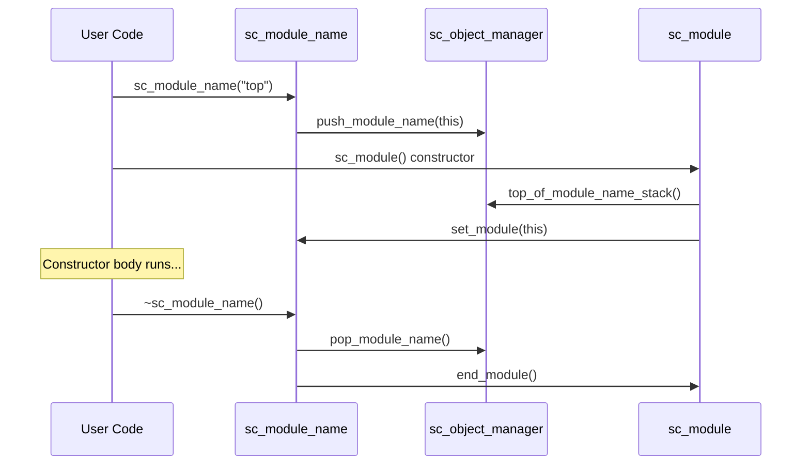

# sc_module_name -- Helper Object for Module Name and Hierarchy Management

## Overview

`sc_module_name` is a helper class for managing SystemC module names and the construction process. It is more than a simple name string wrapper -- it is an integral part of the module construction protocol, controlling the start and completion of module initialization.

**Analogy:** Imagine going to a government office where you first take a number ticket (constructing `sc_module_name`), then handle your business at the counter (constructing `sc_module`), and when done the ticket is automatically collected triggering the closing procedure (`~sc_module_name` calling `end_module()`). The ticket itself serves as both your "identification" and "process controller."

## File Roles

- **Header `sc_module_name.h`**: Declares the `sc_module_name` class and its inline methods.
- **Implementation `sc_module_name.cpp`**: Implements constructors, destructor, and initializer function execution logic.

## Key Concepts

### Name Stack Mechanism



An `sc_module_name` object pushes itself onto the global module name stack upon construction; the `sc_module` constructor retrieves the name from the top of the stack. When the `sc_module_name` is destructed, it automatically calls the module's `end_module()` method.

### Class Definition

```cpp
class sc_module_name {
    friend class sc_module;
    friend class sc_object_manager;
    friend class sc_initializer_function;

public:
    sc_module_name( const char* );
    sc_module_name( const sc_module_name& );
    ~sc_module_name() noexcept(false);
    operator const char*() const;

private:
    const char*     m_name;             // module name string
    sc_module*      m_module_p;         // associated module
    sc_module_name* m_next;             // linked list for stack
    sc_simcontext*  m_simc;             // simulation context
    bool            m_pushed;           // whether pushed onto stack
    std::vector<std::function<void()>> m_initializer_fn_vec;  // initializer functions
};
```

### Member Descriptions

| Member | Description |
|--------|-------------|
| `m_name` | C string pointer to the module name |
| `m_module_p` | Pointer to the module associated with this name |
| `m_next` | Pointer forming a linked list (used to implement the name stack) |
| `m_simc` | Simulation context pointer |
| `m_pushed` | Whether this was pushed onto the stack (copy-constructed ones are not pushed) |
| `m_initializer_fn_vec` | Vector of initializer functions (executed when module construction completes) |

## Construction Behavior

### Primary Constructor

```cpp
sc_module_name::sc_module_name( const char* name_ )
  : m_name(name_), m_module_p(0), m_next(0),
    m_simc(sc_get_curr_simcontext()), m_pushed(true)
{
    m_simc->get_object_manager()->push_module_name(this);
}
```

Immediately pushes itself onto the `sc_object_manager`'s module name stack upon construction.

### Copy Constructor

```cpp
sc_module_name::sc_module_name( const sc_module_name& name_ )
  : m_name(name_.m_name), m_module_p(0), m_next(0),
    m_simc(name_.m_simc), m_pushed(false)
{}
```

The copy constructor does not push onto the stack (`m_pushed = false`), so destruction will not trigger `end_module()`.

### Destructor

```cpp
sc_module_name::~sc_module_name() noexcept(false)
{
    if( m_pushed ) {
        sc_module_name* smn = m_simc->get_object_manager()->pop_module_name();
        if( this != smn ) {
            SC_REPORT_ERROR( SC_ID_SC_MODULE_NAME_USE_, 0 );
        }
        if ( m_module_p )
            m_module_p->end_module();
    }
}
```

The destructor is marked `noexcept(false)` -- this is unusual, because it needs to propagate exceptions when initializer functions throw.

### `clear_module()` and `set_module()`

```cpp
inline void sc_module_name::clear_module( sc_module* module_p ) {
    sc_assert( m_module_p == module_p );
    m_module_p = module_p = 0;
    m_initializer_fn_vec.clear();
}

inline void sc_module_name::set_module( sc_module* module_p ) {
    m_module_p = module_p;
}
```

`clear_module()` is called when a module is destructed, preventing the scenario where the module has already been deleted but `sc_module_name` still tries to call `end_module()`. This fixes a memory error that occurred when a dynamically allocated module threw an exception in its constructor.

### Initializer Functions

```cpp
void sc_module_name::execute_initializers() {
    for (auto& initializer_fn : m_initializer_fn_vec)
        initializer_fn();
    m_initializer_fn_vec.clear();
}
```

Initializer functions are executed in `end_module()`, allowing users to perform additional initialization logic when module construction completes.

## Design Considerations

### Why Does the Destructor Throw Exceptions?

General C++ best practice forbids destructors from throwing exceptions, but `sc_module_name` is a special case. It needs to propagate exceptions when `end_module()`'s initializer functions throw. Therefore the destructor is marked `noexcept(false)`.

### Why Use a Linked List Instead of `std::stack`?

The linked list formed by `m_next` pointers implements the module name stack. This design works because `sc_module_name` objects themselves live on the call stack, and leveraging their own lifetimes to manage stack ordering is more natural than maintaining a separate container.

### Exception Safety with Dynamically Allocated Modules

The source code revision history documents an important bug fix: when a dynamically allocated `sc_module` throws an exception in its constructor, the exception handler deletes the module's memory first, then stack unwinding causes `~sc_module_name()` to try accessing the already-deleted module. The solution is to call `clear_module()` in `~sc_module` to clear the module pointer in `sc_module_name`.

## Related Files

- `sc_module.h/cpp` -- Module base class (uses `sc_module_name` for construction)
- `sc_object_manager.h/cpp` -- Manages the module name stack
- `sc_simcontext.h` -- Simulation context
