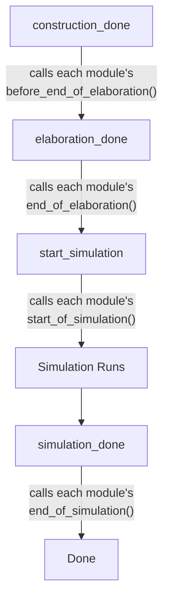

# sc_module_registry -- Module Registry

## Overview

`sc_module_registry` is an internal SystemC module registry responsible for tracking all created modules and invoking each module's corresponding callback methods at various simulation phases (construction, elaboration, simulation start, simulation end).

**Analogy:** Imagine a school's student roster. Each student (module) is registered on the roster upon enrollment and removed upon graduation. The school (simulation engine) notifies each student one by one to attend the opening ceremony or graduation ceremony at the beginning and end of each semester.

## File Roles

- **Header `sc_module_registry.h`**: Declares the `sc_module_registry` class (internal use only).
- **Implementation `sc_module_registry.cpp`**: Implements module insertion, removal, and phase callbacks.

## Class Definition

```cpp
class sc_module_registry {
    friend class sc_simcontext;

public:
    void insert( sc_module& );
    void remove( sc_module& );
    int size() const;

private:
    explicit sc_module_registry( sc_simcontext& simc_ );
    ~sc_module_registry();

    bool construction_done();
    void elaboration_done();
    void start_simulation();
    void simulation_done();

private:
    int                     m_construction_done;
    std::vector<sc_module*> m_module_vec;
    sc_simcontext*          m_simc;
};
```

## Member Descriptions

| Member | Description |
|--------|-------------|
| `m_module_vec` | Vector storing pointers to all registered modules |
| `m_construction_done` | Index of how many modules have completed the construction callback |
| `m_simc` | The simulation context this registry belongs to |

## Key Methods

### `insert()`

Called during module construction (in `sc_module_init()`). Has two safety checks:
- Insertion is not allowed while simulation is running
- Insertion is not allowed after elaboration is done

```cpp
void sc_module_registry::insert( sc_module& module_ ) {
    if( sc_is_running() ) {
        SC_REPORT_ERROR( SC_ID_INSERT_MODULE_, "simulation running" );
        return;
    }
    if( m_simc->elaboration_done() ) {
        SC_REPORT_ERROR( SC_ID_INSERT_MODULE_, "elaboration done" );
        return;
    }
    m_module_vec.push_back( &module_ );
}
```

### `remove()`

Called when a module is destructed. Uses the "swap with last element" trick to avoid large-scale element shifting:

```cpp
void sc_module_registry::remove( sc_module& module_ ) {
    // ... find index i ...
    m_module_vec[i] = m_module_vec.back();
    m_module_vec.pop_back();
}
```

### Phase Callbacks



#### `construction_done()`

Special design: uses the `m_construction_done` counter to track progress, allowing new modules to be created during `before_end_of_elaboration()`. If new modules are added, it returns `false` indicating it needs to be called again.

```cpp
bool sc_module_registry::construction_done() {
    if( size() == m_construction_done )
        return true;  // nothing new
    for( ; m_construction_done < size(); ++m_construction_done ) {
        m_module_vec[m_construction_done]->construction_done();
    }
    return false;
}
```

#### `elaboration_done()`

Checks that each module properly called `end_module()`, and invokes the `end_of_elaboration()` callback.

#### `start_simulation()` / `simulation_done()`

Simply iterates through all modules and calls the corresponding callback method.

## Design Considerations

### Why Is It a Friend of `sc_simcontext`?

Only the simulation context can construct and operate the registry, ensuring centralized control of module lifecycle management.

### Why Does `construction_done()` Return `bool`?

During elaboration, the `before_end_of_elaboration()` callback may create new modules. The return value lets `sc_simcontext` know whether it needs to call again, repeating until all modules have completed construction.

## Related Files

- `sc_module.h/cpp` -- The module class managed by this registry
- `sc_simcontext.h` -- The simulation context that owns this registry
