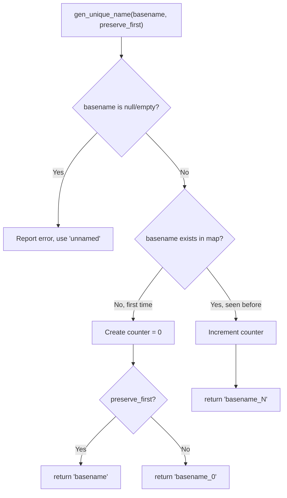
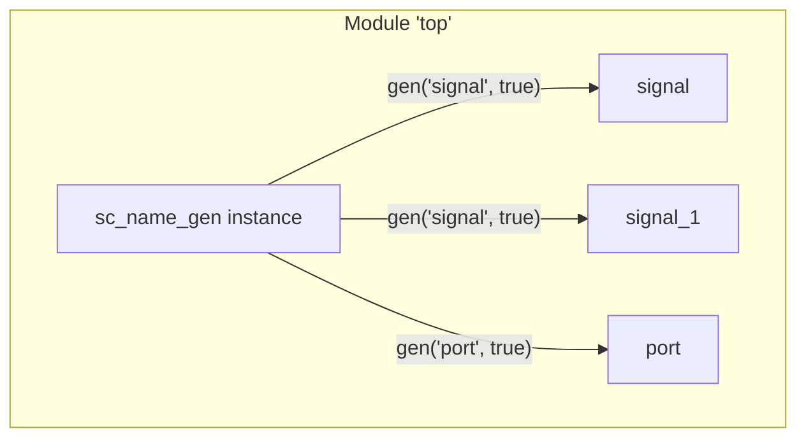

# sc_name_gen -- Unique Name Generator

## Overview

`sc_name_gen` is a helper class in SystemC for generating unique names. When objects are not explicitly named, or when multiple objects share the same base name, it automatically appends incrementing numeric suffixes to ensure name uniqueness.

**Analogy:** Imagine a school with three students all named "John." The teacher would call them "John_0", "John_1", and "John_2". `sc_name_gen` is the "naming manager" responsible for this task.

## File Roles

- **Header `sc_name_gen.h`**: Declares the `sc_name_gen` class.
- **Implementation `sc_name_gen.cpp`**: Implements the unique name generation logic.

## Class Definition

```cpp
class sc_name_gen {
public:
    sc_name_gen();
    ~sc_name_gen();
    const char* gen_unique_name( const char* basename_,
                                 bool preserve_first = false );
private:
    sc_strhash<int*> m_unique_name_map;  // basename -> counter
    std::string      m_unique_name;      // buffer for generated name
};
```

### Member Descriptions

| Member | Description |
|--------|-------------|
| `m_unique_name_map` | Hash table mapping base names to counter pointers |
| `m_unique_name` | Buffer holding the most recently generated name string |

## Core Method: `gen_unique_name()`



### Operation Logic

```cpp
const char* sc_name_gen::gen_unique_name(
    const char* basename_, bool preserve_first)
{
    if( basename_ == 0 || *basename_ == 0 ) {
        SC_REPORT_ERROR( SC_ID_GEN_UNIQUE_NAME_, 0 );
        basename_ = "unnamed";
    }
    int* c = m_unique_name_map[basename_];
    if( c == 0 ) {
        // First time seeing this basename
        c = new int( 0 );
        m_unique_name_map.insert( const_cast<char*>(basename_), c );
        if (preserve_first) {
            m_unique_name = basename_;   // "signal"
        } else {
            // "signal_0"
            std::stringstream sstr;
            sstr << basename_ << "_" << *c;
            sstr.str().swap( m_unique_name );
        }
    } else {
        // Seen before, increment counter
        // "signal_1", "signal_2", ...
        std::stringstream sstr;
        sstr << basename_ << "_" << ++ (*c);
        sstr.str().swap( m_unique_name );
    }
    return m_unique_name.c_str();
}
```

### `preserve_first` Parameter

| `preserve_first` | 1st call | 2nd call | 3rd call |
|:-:|:-:|:-:|:-:|
| `true` | `"signal"` | `"signal_1"` | `"signal_2"` |
| `false` | `"signal_0"` | `"signal_1"` | `"signal_2"` |

`preserve_first = true` keeps the original name for the first object; only subsequent duplicate names get suffixes.

## Usage Scenarios

`sc_name_gen` is used in two places:

1. **In `sc_object_host`**: Each module/process has an `sc_name_gen` instance that generates unique names for its child objects.
2. **Global name generation**: The `sc_gen_unique_name()` function generates names for top-level objects that have no parent.



## Memory Management

The destructor must clean up dynamically allocated counters in the hash table:

```cpp
sc_name_gen::~sc_name_gen() {
    sc_strhash<int*>::iterator it( m_unique_name_map );
    for( ; ! it.empty(); it ++ ) {
        delete it.contents();  // delete each int* counter
    }
    m_unique_name_map.erase();
}
```

## Design Considerations

### Why Use `sc_strhash` Instead of `std::unordered_map`?

`sc_strhash` is SystemC's own string hash table implementation, which historically predates C++ standard containers. It provides efficient lookup using C strings as keys.

### Thread Safety

Although source code comments mention "MT-Safe" (multi-thread safe), the actual implementation does not use locks or atomic operations. This is not a problem in SystemC's single-threaded simulation environment.

### Return Value Lifetime

The pointer returned by `gen_unique_name()` points to the `m_unique_name` internal buffer. Each call overwrites the previous result, so callers must use or copy the returned string before the next call.

## Related Files

- `sc_object.h/cpp` -- `sc_object_host` uses `sc_name_gen` to generate child object names
- `sc_object_manager.h/cpp` -- Global object manager
- `sc_utils/sc_hash.h` -- `sc_strhash` hash table implementation
