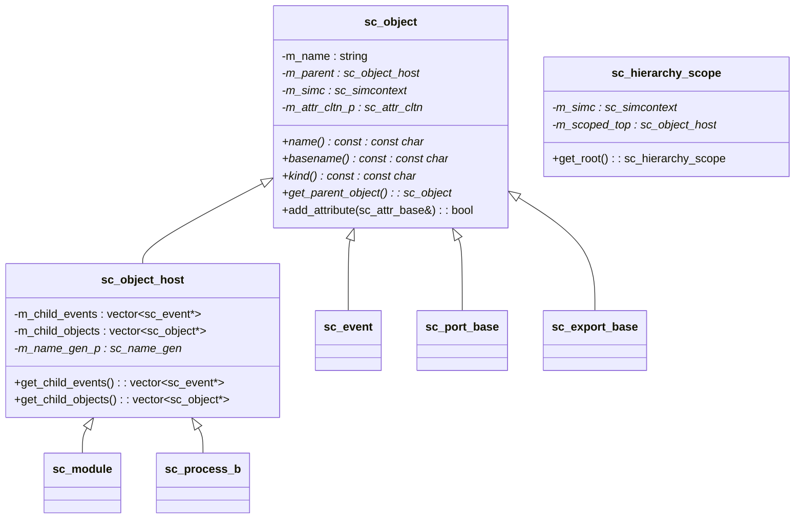
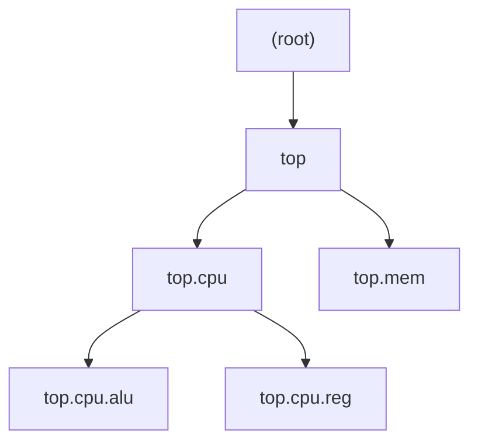
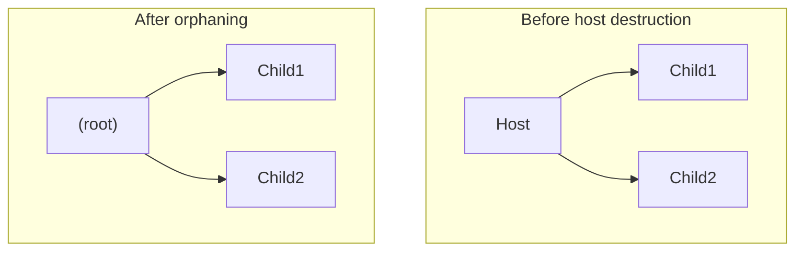

# sc_object -- Abstract Base Class for All SystemC Simulation Objects

## Overview

`sc_object` is the root base class for all simulation objects in SystemC. Every module, process, signal, and port in SystemC is internally an `sc_object`. It provides a unified naming system, hierarchical structure, attribute management, and debug output functionality.

**Analogy:** Imagine a large company's organizational chart. Every department and employee has a unique "full name" (e.g., "Engineering.Software.John"), can be found by the company's HR system, and can have attached tags (such as skill certifications). `sc_object` is the foundation of this "HR system" -- it ensures everything has a name, knows its superior, and can be managed by the system.

## File Roles

- **`sc_object.h`**: Declares the `sc_object`, `sc_object_host`, and `sc_hierarchy_scope` classes.
- **`sc_object_int.h`**: Internal inline function definitions (`sc_object_host` constructor, `sc_hierarchy_scope` constructor).
- **`sc_object.cpp`**: Implements object initialization, hierarchy management, attribute operations, and other core logic.

## Class Hierarchy



## `sc_object` Class

### Naming System

Every `sc_object` has a hierarchical full name separated by `.` (e.g., `top.cpu.alu`):

- **`name()`**: Returns the complete hierarchical name (e.g., `"top.cpu.alu"`)
- **`basename()`**: Returns the last segment of the name (e.g., `"alu"`)



### Object Initialization (`sc_object_init`)

This is the core object creation flow:

1. Get the current simulation context (`sc_simcontext`)
2. Find the current parent object (top of the hierarchy stack)
3. Create the hierarchical name via `sc_object_manager`
4. Insert the object into the global instance table
5. Add the object to the parent's child object list

```cpp
void sc_object::sc_object_init(const char* nm) {
    m_simc = sc_get_curr_simcontext();
    m_attr_cltn_p = 0;
    sc_object_manager* object_manager = m_simc->get_object_manager();
    m_parent = m_simc->active_object();
    m_name = object_manager->create_name(nm);
    object_manager->insert_object(m_name, this);
    if ( m_parent )
        m_parent->add_child_object( this );
    else
        m_simc->add_child_object( this );
}
```

### Name Validation

The constructor checks for illegal characters in names (hierarchy separator `.` and whitespace characters), replacing them with underscores `_`:

```cpp
static bool object_name_illegal_char(char ch) {
    return (ch == SC_HIERARCHY_CHAR) || std::isspace(ch);
}
```

### Attribute Management

`sc_object` supports dynamically attaching attributes (key-value pairs). The attribute collection uses a **lazy initialization** strategy -- it only allocates an `sc_attr_cltn` object on first use, saving 100 bytes of memory.

| Method | Description |
|--------|-------------|
| `add_attribute()` | Add an attribute (name must be unique) |
| `get_attribute()` | Look up an attribute by name |
| `remove_attribute()` | Remove an attribute by name |
| `remove_all_attributes()` | Remove all attributes |
| `num_attributes()` | Return the number of attributes |
| `attr_cltn()` | Return the attribute collection |

### `detach()` Method

Detaches the object from the hierarchy:
1. Removes it from the `sc_object_manager`'s instance table
2. Removes it from the parent's child object list

## `sc_object_host` Class

`sc_object_host` is an `sc_object` that can "contain child objects." Only modules and processes need this capability.

### Main Features

- **Manages child object and child event lists**
- **Provides a unique name generator** (via `sc_name_gen`)
- **Orphaning** (`orphan_child_events/objects`): When an `sc_object_host` is destroyed, its children are not deleted but instead transferred to the simulation root level



## `sc_hierarchy_scope` Class

An RAII (Resource Acquisition Is Initialization) hierarchy scope manager. Pushes the specified hierarchy scope on construction and automatically restores it on destruction.

```cpp
// Usage:
{
    sc_hierarchy_scope scope( get_hierarchy_scope() );
    // ... within this scope, objects created belong to current module
} // automatically restored when scope ends
```

### Special Behavior

- If the target scope is already the current scope, it does nothing (sets `m_simc = NULL`)
- Supports move semantics (`sc_hierarchy_scope(sc_hierarchy_scope&&)`)
- On destruction, checks whether the scope was corrupted (`SC_UNLIKELY_` path); if so, reports a fatal error

### Inline Constructor in `sc_object_int.h`

```cpp
inline
sc_hierarchy_scope::sc_hierarchy_scope( kernel_tag, sc_object* obj )
  : m_simc( (obj) ? obj->simcontext() : sc_get_curr_simcontext() )
  , m_scoped_top()
{
    if( obj == m_simc->hierarchy_curr() ) {
        m_simc = NULL;  // scope already matches, do nothing
        return;
    }
    // ... push new scope
}
```

## Global Constants and Settings

| Name | Description |
|------|-------------|
| `SC_HIERARCHY_CHAR` (`'.'`) | Hierarchy name separator |
| `sc_enable_name_checking` | Whether to enable name legality checking |

## Design Considerations

### Why Is the Attribute Collection Lazily Initialized?

Most `sc_object` instances do not use the attribute feature. Lazy initialization (only allocating `new sc_attr_cltn` on first access) saves memory for every ordinary object.

### Why Are Child Object/Event Lists in `sc_object_host` Rather Than `sc_object`?

Only modules and processes can serve as "containers" for other objects. Extracting child management into `sc_object_host` means simple objects (such as signals and ports) do not need to bear this overhead.

### Why Does `operator=` Do Nothing?

```cpp
inline sc_object& sc_object::operator=( sc_object const & ) {
    return *this;  // deliberately do nothing
}
```

Assignment should not change an object's name or hierarchical position. These properties are determined at construction time and should not change afterwards.

## Related Files

- `sc_object_manager.h/cpp` -- Global object management and naming
- `sc_name_gen.h/cpp` -- Unique name generator
- `sc_attribute.h/cpp` -- Attribute system
- `sc_module.h/cpp` -- Module (inherits from `sc_object_host`)
- `sc_simcontext.h` -- Simulation context
