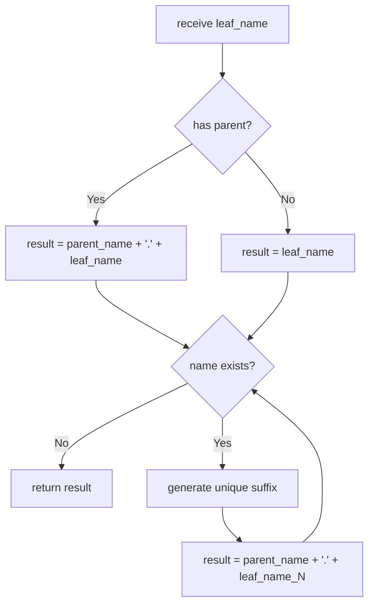
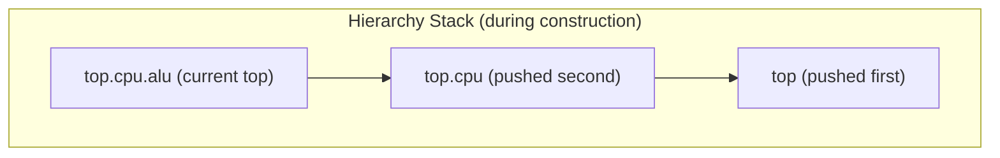

# sc_object_manager -- Object Manager (Naming and Hierarchy Management)

## Overview

`sc_object_manager` is a core internal SystemC manager responsible for three major tasks:
1. **Global instance table**: Maintains a lookup table of all named objects and events
2. **Hierarchy stack**: Manages hierarchical relationships during object construction
3. **Module name stack**: Manages the construction/destruction order of `sc_module_name`

**Analogy:** Imagine a large library's catalog system. Each book (object) has a unique identifier (hierarchical name), registered on a catalog card (instance table). The librarian (`sc_object_manager`) is responsible for arranging shelf positions (hierarchy stack), handling new book registration and old book removal, and ensuring no two books share the same identifier.

## File Roles

- **Header `sc_object_manager.h`**: Declares the `sc_object_manager` class and its data structures.
- **Implementation `sc_object_manager.cpp`**: Implements name creation, object lookup, hierarchy management, and other logic.

## Data Structures

### Instance Table

```cpp
enum sc_name_origin {
    SC_NAME_NONE,      // entry has been removed
    SC_NAME_OBJECT,    // entry is an sc_object
    SC_NAME_EVENT,     // entry is an sc_event
    SC_NAME_EXTERNAL   // entry is an external name reservation
};

struct table_entry {
    void*          m_element_p;    // pointer to sc_object or sc_event
    sc_name_origin m_name_origin;  // type of entry
};

typedef std::map<std::string, table_entry> instance_table_t;
```

Uses `std::map` with name strings as keys, supporting fast lookup by name. The `void*` pointer is cast to `sc_object*` or `sc_event*` depending on the value of `m_name_origin`.

### Internal Members

| Member | Description |
|--------|-------------|
| `m_instance_table` | Global instance table (name -> object/event mapping) |
| `m_object_stack` | Object hierarchy stack (`vector<sc_object_host*>`) |
| `m_module_name_stack` | `sc_module_name` linked list stack |
| `m_object_it` | Object iterator (for traversal) |
| `m_event_it` | Event iterator (for traversal) |
| `m_object_walk_ok` | Flag indicating whether object traversal is valid |
| `m_event_walk_ok` | Flag indicating whether event traversal is valid |

## Key Methods

### Name Creation (`create_name`)



The name creation process:
1. Get the currently active object as the parent
2. Concatenate parent object name + `'.'` + leaf name
3. If the name already exists, generate a unique suffix via `sc_gen_unique_name()`
4. If there is a conflict, issue an `SC_ID_INSTANCE_EXISTS_` warning

### Object/Event Lookup

```cpp
sc_object* find_object(const char* name);
sc_event*  find_event(const char* name);
```

Both look up by name in `m_instance_table` and check `m_name_origin` to ensure the correct type.

### Object Traversal

Provides a `first_object()` / `next_object()` iterator pattern, skipping non-object entries:

```cpp
sc_object* first_object();  // reset iterator, return first object
sc_object* next_object();   // advance iterator, return next object
```

### Hierarchy Stack Management



| Method | Description |
|--------|-------------|
| `hierarchy_push(obj)` | Push an object onto the hierarchy stack |
| `hierarchy_pop()` | Pop the top object from the stack |
| `hierarchy_curr()` | Get the current top object of the stack |
| `hierarchy_size()` | Get the stack size |

### Module Name Stack Management

`sc_module_name` objects form a singly linked list, with `m_module_name_stack` pointing to the top:

```cpp
void push_module_name(sc_module_name* mod_name_p) {
    mod_name_p->m_next = m_module_name_stack;
    m_module_name_stack = mod_name_p;
}

sc_module_name* pop_module_name() {
    sc_module_name* mod_name = m_module_name_stack;
    m_module_name_stack = m_module_name_stack->m_next;
    mod_name->m_next = 0;
    return mod_name;
}
```

### Insertion and Removal

| Method | Description |
|--------|-------------|
| `insert_object()` | Insert an object into the instance table |
| `insert_event()` | Insert an event into the instance table |
| `insert_external_name()` | Reserve an external name (to prevent conflicts) |
| `remove_object()` | Remove an object from the table (set origin to `SC_NAME_NONE`) |
| `remove_event()` | Remove an event from the table |
| `remove_external_name()` | Remove an external name reservation |

Note: Removal operations do not delete the entry from the map; instead they set `m_name_origin` to `SC_NAME_NONE`. This means name entries remain in the table permanently but are marked as invalid.

### Destructor

```cpp
sc_object_manager::~sc_object_manager() {
    for ( it = m_instance_table.begin(); it != m_instance_table.end(); it++) {
        if(it->second.m_name_origin == SC_NAME_OBJECT) {
            sc_object* obj_p = static_cast<sc_object*>(it->second.m_element_p);
            obj_p->m_simc = 0;
        }
    }
}
```

During destruction, sets `m_simc` to NULL for all remaining objects, preventing subsequent access to an already-destroyed simulation context.

## Design Considerations

### Why Doesn't Removal Actually Delete Map Entries?

Keeping "tombstone" (`SC_NAME_NONE`) entries prevents accidentally reusing names of deleted objects, while simplifying removal logic.

### Why Does the Module Name Stack Use a Linked List?

`sc_module_name` objects themselves reside on the C++ call stack. Using their own `m_next` pointers to form a stack structure requires no additional container and naturally aligns with C++ object lifetimes.

### Name Conflict Handling

When a name conflict is detected, the system does not report an error but instead automatically renames and issues a warning. This "best-effort repair" strategy avoids interrupting simulation due to minor errors.

## Related Files

- `sc_object.h/cpp` -- Base object class (uses this manager for initialization)
- `sc_module_name.h/cpp` -- Module name objects (pushed/popped on the name stack)
- `sc_name_gen.h/cpp` -- Unique name generator
- `sc_simcontext.h` -- Simulation context (owns the instance of this manager)
