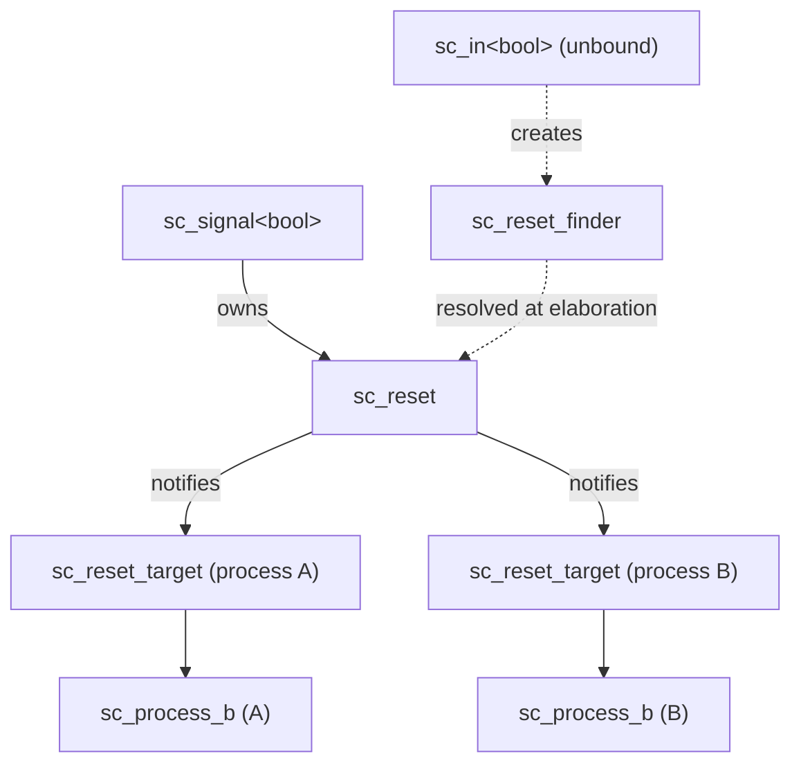
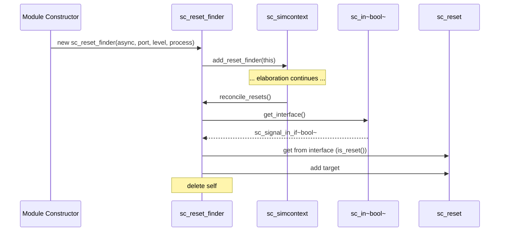
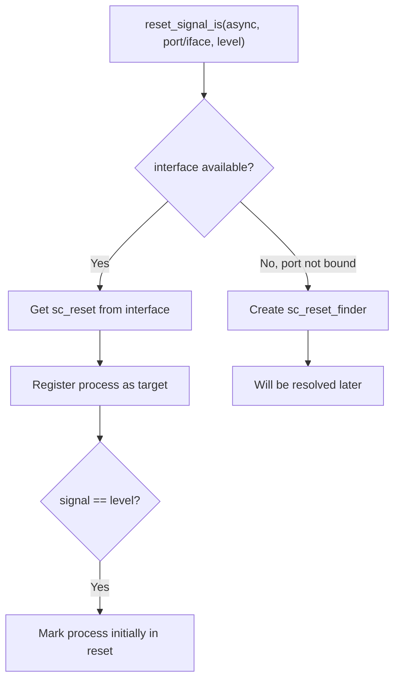

# sc_reset -- Process Reset Signal Support

## Overview

`sc_reset` provides the reset mechanism for SystemC processes. It allows processes to associate one or more boolean signals as reset sources. When a reset signal reaches the specified active level, the process is reset to its initial state.

**Analogy:** Imagine a vending machine. During normal operation, it sequentially accepts coins, selects a drink, and dispenses. But pressing the "refund/reset" button returns the machine to its initial waiting-for-coins state. `sc_reset` manages the association between this "reset button" and "who should be reset."

- **Synchronous reset** (`reset_signal_is`): Like a microwave timer that only stops when the timer expires -- the process checks reset status only on its next wake-up.
- **Asynchronous reset** (`async_reset_signal_is`): Like pulling the power plug directly -- the process is reset immediately, without waiting for the next wake-up.

## File Roles

- **Header `sc_reset.h`**: Declares `sc_reset`, `sc_reset_target`, and `sc_reset_finder` classes.
- **Implementation `sc_reset.cpp`**: Implements reset signal notification, coordination, and registration mechanisms.

## Overall Reset Architecture



### Operation Flow (as described in the `sc_reset.cpp` header comment)

1. Each `sc_signal<bool>` used as a reset has an associated `sc_reset` instance.
2. Each process sensitive to the reset signal is registered with that `sc_reset` instance.
3. When the reset signal's value changes, `sc_reset` calls `notify_processes()` to notify all registered processes.
4. A process may have multiple reset signals, so the process internally maintains active counters for asynchronous and synchronous resets.
5. The process's `semantics()` method checks the reset state when scheduled.

## Class Details

### `sc_reset_target` -- Reset Target Description

```cpp
class sc_reset_target {
public:
    bool          m_async;      // true = asynchronous, false = synchronous
    bool          m_level;      // active reset level (true or false)
    sc_process_b* m_process_p;  // target process
};
```

Describes a process's reset condition. For example, `{async=true, level=false, process=P}` means "asynchronously reset process P when the signal is `false`."

### `sc_reset_finder` -- Deferred Reset Pairing



During the elaboration phase, ports are not yet bound to signals. `sc_reset_finder` is a temporary object that records "which port, which process, what condition," and establishes the actual reset connection after port binding is complete.

```cpp
class sc_reset_finder {
protected:
    bool                   m_async;
    bool                   m_level;
    sc_reset_finder*       m_next_p;     // linked list
    const sc_in<bool>*     m_in_p;
    const sc_inout<bool>*  m_inout_p;
    const sc_out<bool>*    m_out_p;
    sc_process_b*          m_target_p;
};
```

Supports three port types (`sc_in`, `sc_inout`, `sc_out`), but all ultimately resolve to the `sc_signal_in_if<bool>` interface.

### `sc_reset` -- Reset Signal Manager

```cpp
class sc_reset {
protected:
    const sc_signal_in_if<bool>*  m_iface_p;  // reset signal interface
    std::vector<sc_reset_target>  m_targets;  // processes to notify

    void notify_processes();
    void remove_process( sc_process_b* );

    static void reconcile_resets(sc_reset_finder* reset_finder_q);
    static void reset_signal_is(bool async, ...);  // multiple overloads
};
```

## Key Methods

### `notify_processes()`

Called when the reset signal's value changes:

```cpp
void sc_reset::notify_processes() {
    bool value = m_iface_p->read();
    for (auto& target : m_targets) {
        bool active = ( target.m_level == value );
        target.m_process_p->reset_changed( target.m_async, active );
    }
}
```

Each target process compares the signal value with its configured active level to determine whether the reset is active.

### `reconcile_resets()`

Called after elaboration ends, processing all `sc_reset_finder` objects:

1. Traverses the `sc_reset_finder` linked list
2. Gets the actual signal interface from the port
3. Gets or creates the `sc_reset` instance from the interface
4. Registers the reset target
5. If the reset signal's current value is already at the active level, sets the process to be initially in reset state
6. Deletes the `sc_reset_finder` object

### `reset_signal_is()` Static Method

Multiple overloaded versions supporting different port/interface types. Core logic:



### `remove_process()`

Removes a process from the reset target list when it is terminated:

```cpp
void sc_reset::remove_process( sc_process_b* process_p ) {
    // Uses swap-with-last-and-pop technique
    for ( int i = 0; i < process_n; ) {
        if ( m_targets[i].m_process_p == process_p ) {
            m_targets[i] = m_targets[process_n-1];
            process_n--;
            m_targets.resize(process_n);
        } else {
            process_i++;
        }
    }
}
```

## Reset API in `sc_module`

```cpp
// Synchronous reset
void reset_signal_is( const sc_in<bool>& port, bool level );
void reset_signal_is( const sc_inout<bool>& port, bool level );
void reset_signal_is( const sc_out<bool>& port, bool level );
void reset_signal_is( const sc_signal_in_if<bool>& iface, bool level );

// Asynchronous reset
void async_reset_signal_is( const sc_in<bool>& port, bool level );
void async_reset_signal_is( const sc_inout<bool>& port, bool level );
void async_reset_signal_is( const sc_out<bool>& port, bool level );
void async_reset_signal_is( const sc_signal_in_if<bool>& iface, bool level );
```

## RTL Background

In Verilog, there are two common reset patterns:

```verilog
// Synchronous reset
always @(posedge clk) begin
    if (reset) begin
        // reset logic
    end else begin
        // normal logic
    end
end

// Asynchronous reset
always @(posedge clk or posedge reset) begin
    if (reset) begin
        // reset logic
    end else begin
        // normal logic
    end
end
```

SystemC's `reset_signal_is()` and `async_reset_signal_is()` correspond to these two patterns respectively.

## Design Considerations

### Why Is `sc_reset_finder` Needed?

During module construction, ports are not yet bound to signals, so the actual interface cannot be obtained. `sc_reset_finder` serves as a bridge for deferred resolution, establishing the actual reset connection only after all port bindings are complete.

### Why Does Reset Only Support `bool` Signals?

Reset signals in hardware are inherently single-bit (active-high or active-low). Using `bool` is a natural and sufficient abstraction.

### Multiple Resets

A process can have multiple reset signals (mixed synchronous and asynchronous). The process internally uses counters to track the number of active reset signals.

## Related Files

- `sc_module.h/cpp` -- Provides user-level reset API
- `sc_process.h` -- Process base class (holds reset counters)
- `sc_signal.h` -- Signal class (holds `sc_reset` instance)
- `sc_signal_ports.h` -- Signal port classes
