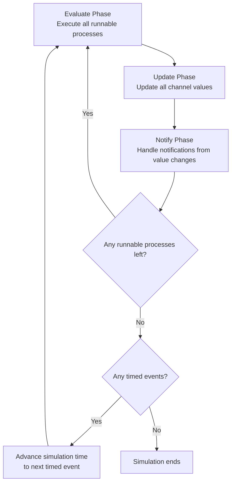
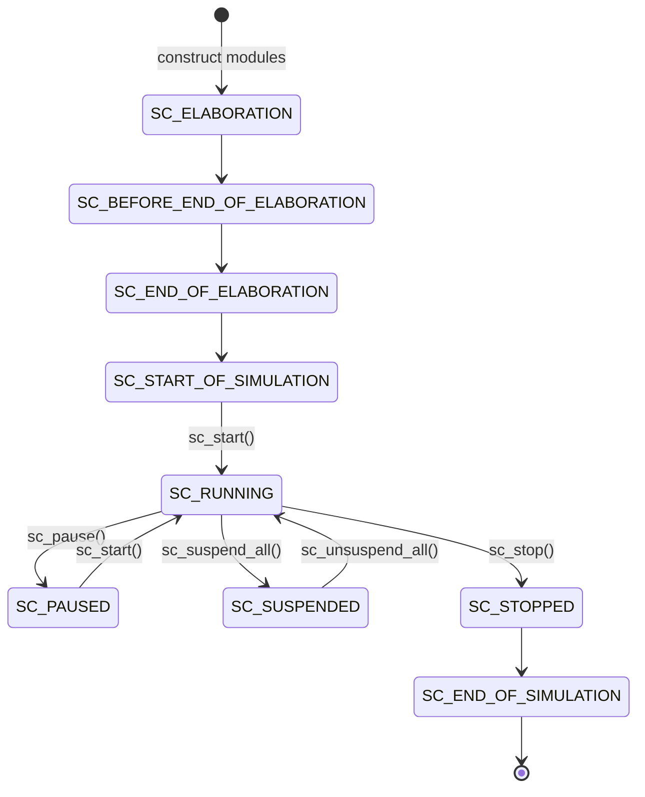
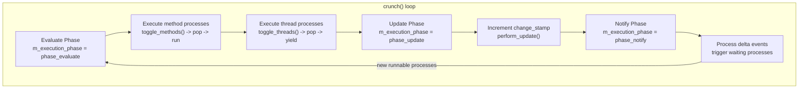

# sc_simcontext -- The Core Brain of the SystemC Simulation Engine

## Overview

`sc_simcontext` is the "central control panel" of the entire SystemC simulator. It manages all aspects of the simulation: time advancement, process scheduling, event notification, object hierarchy, etc. There is typically only one `sc_simcontext` instance (global singleton) for the entire simulator, and all modules, channels, and events register with it.

**Source code location:**
- Header: `ref/systemc/src/sysc/kernel/sc_simcontext.h`
- Implementation: `ref/systemc/src/sysc/kernel/sc_simcontext.cpp`

---

## Everyday Analogy

Imagine a large airport's **air traffic control tower**:

| Airport Tower | sc_simcontext |
|---------------|---------------|
| Manages all flight takeoff/landing schedules | Manages the execution schedule of all processes |
| Tracks the current time | Maintains simulation time (`m_curr_time`) |
| Receives communications from each flight | Handles event notifications (delta events, timed events) |
| Records all flight information | Manages the object hierarchy (object manager) |
| Controls runway usage order | Determines the execution order of method/thread processes |
| Announces "suspend takeoff/landing" | `sc_stop()`, `sc_pause()` |

---

## Core Concepts

### 1. Delta Cycle

The core operating principle of the simulator is the continuous execution of "delta cycles." Each delta cycle consists of three phases:



**Analogy:** Imagine a classroom exam process:
1. **Evaluate**: All students answer simultaneously (processes execute)
2. **Update**: The teacher collects papers and records grades (channels update values)
3. **Notify**: Grades are announced, students who need a make-up exam are notified (events fire)
4. If any students need a make-up exam, restart the process

### 2. Simulation State Machine



### 3. Global Singleton Pattern

```cpp
// sc_simcontext uses a global pointer to implement the singleton
extern sc_simcontext* sc_curr_simcontext;

inline sc_simcontext* sc_get_curr_simcontext()
{
    if( sc_curr_simcontext == 0 ) {
        sc_default_global_context = new sc_simcontext;
        sc_curr_simcontext = sc_default_global_context;
    }
    return sc_curr_simcontext;
}
```

Calling `sc_get_curr_simcontext()` automatically creates a simulation context if one doesn't exist yet. This ensures the entire program shares the same simulation engine.

---

## Class Structure and Key Members

### sc_simcontext Class

#### Managers and Registries

| Member | Description |
|--------|-------------|
| `m_object_manager` | Manages names and hierarchy of all SystemC objects |
| `m_module_registry` | Registers all modules (`sc_module`) |
| `m_port_registry` | Registers all ports (`sc_port`) |
| `m_export_registry` | Registers all export interfaces (`sc_export`) |
| `m_prim_channel_registry` | Registers all primitive channels (`sc_prim_channel`) |
| `m_stage_cb_registry` | Manages stage callback functions |
| `m_stub_registry` | Manages stub connections |

#### Time and Scheduling

| Member | Description |
|--------|-------------|
| `m_curr_time` | Current simulation time |
| `m_time_params` | Time resolution and default time unit |
| `m_delta_count` | Cumulative delta cycle count |
| `m_change_stamp` | Change stamp, used to determine whether an event has occurred |
| `m_delta_events` | List of events waiting to fire at the next delta |
| `m_timed_events` | Priority queue of timed events (sorted by time) |
| `m_runnable` | Queue of runnable processes |

#### State Control

| Member | Description |
|--------|-------------|
| `m_simulation_status` | Current simulation status (elaboration, running, paused, etc.) |
| `m_execution_phase` | Current execution phase (evaluate, update, notify) |
| `m_forced_stop` | Whether `sc_stop()` was called |
| `m_paused` | Whether `sc_pause()` was called |
| `m_ready_to_simulate` | Whether elaboration is complete |

#### Coroutine Management

| Member | Description |
|--------|-------------|
| `m_cor_pkg` | Coroutine package (QuickThreads, pthread, or fiber) |
| `m_cor` | The simulator's own coroutine |
| `m_method_invoker_p` | Helper module for invoking methods from within threads |

### Key Public Methods

#### Simulation Control

```cpp
void initialize( bool = false );  // Initialize simulation
void simulate( const sc_time& );  // Run simulation for specified time
void stop();                      // Stop simulation
void end();                       // End simulation
void reset();                     // Reset simulation
```

#### Process Creation

```cpp
sc_process_handle create_method_process(...);   // Create SC_METHOD
sc_process_handle create_thread_process(...);   // Create SC_THREAD
sc_process_handle create_cthread_process(...);  // Create SC_CTHREAD
```

#### Time and Status Queries

```cpp
const sc_time& time_stamp() const;       // Get current time
sc_dt::uint64 delta_count() const;       // Get cumulative delta count
sc_status get_status() const;            // Get simulation status
bool evaluation_phase() const;           // Whether in evaluation phase
bool update_phase() const;              // Whether in update phase
```

---

## Important Internal Mechanisms

### crunch() -- The Simulation Engine's Heartbeat

`crunch()` is the most critical method of the entire simulator, implementing the three-phase delta cycle loop:



### init() -- Initialize Everything

The `init()` method is responsible for setting up all subsystems:
1. Allocates various managers and registries
2. Checks the `SC_SIGNAL_WRITE_CHECK` environment variable
3. Initializes time parameters and event queues
4. Sets the initial status to `SC_ELABORATION`

### sc_process_table -- Process Management

The internal class `sc_process_table` uses linked lists to separately manage method processes and thread processes. Provides push_front (add) and remove operations.

### sc_invoke_method -- Method Invoker

This is a special `sc_module` that supports the `preempt_with()` feature. It maintains a set of invoker threads, which are used to execute methods from a thread context.

---

## Important Global Functions

### Simulation Control Functions

```cpp
void sc_start();                              // Start execution until nothing to do
void sc_start( const sc_time& duration, ... ); // Execute for specified duration
void sc_stop();                               // Stop simulation
void sc_pause();                              // Pause simulation
```

### Status Query Functions

```cpp
sc_status sc_get_status();                    // Get current status (thread-safe)
bool sc_is_running();                         // Whether running
sc_dt::uint64 sc_delta_count();              // Current delta count
const sc_time& sc_time_stamp();              // Current simulation time
bool sc_pending_activity();                   // Whether there is pending activity
```

### Suspend/Unsuspend

```cpp
void sc_suspend_all();    // Suspend all processes (async-safe)
void sc_unsuspend_all();  // Resume all processes
void sc_suspendable();    // Mark current process as suspendable
void sc_unsuspendable();  // Mark current process as non-suspendable
```

---

## Helper Structures

### sc_curr_proc_info

```cpp
struct sc_curr_proc_info {
    sc_process_b*     process_handle;  // Currently executing process
    sc_curr_proc_kind kind;            // Process type (METHOD/THREAD/CTHREAD)
};
```

### sc_stop_mode

| Value | Description |
|-------|-------------|
| `SC_STOP_FINISH_DELTA` | Stop after completing the current delta cycle |
| `SC_STOP_IMMEDIATE` | Stop immediately |

### sc_starvation_policy

| Value | Description |
|-------|-------------|
| `SC_EXIT_ON_STARVATION` | Return immediately when nothing to do |
| `SC_RUN_TO_TIME` | Wait until the specified time even if nothing to do |

---

## Design Rationale

### Why Is simcontext Needed?

In the hardware world, all circuit components operate within the same physical environment (chip), sharing the same clock. `sc_simcontext` is the software implementation of this "virtual chip." It ensures:

1. **Time consistency**: All components see the same time
2. **Causal correctness**: Delta cycles ensure correct signal update ordering
3. **Determinism**: Same inputs produce the same results

### Why Use a Global Singleton?

SystemC is designed with the assumption that the entire program has only one simulation environment. The global singleton avoids the hassle of passing context pointers around, allowing global functions like `sc_start()` and `sc_time_stamp()` to be used directly.

### Thread Safety Considerations

Access to `m_simulation_status` is protected by `m_simulation_status_mutex`. External threads should use `get_thread_safe_status()` instead of `get_status()`.

---

## Related Files

| File | Description |
|------|-------------|
| `sc_main.cpp` | Program entry point, calls `sc_elab_and_sim()` |
| `sc_main_main.cpp` | Implementation of `sc_elab_and_sim()` |
| `sc_time.h/cpp` | Time class `sc_time` |
| `sc_event.h/cpp` | Event class `sc_event` |
| `sc_process.h` | Process base class |
| `sc_method_process.h/cpp` | SC_METHOD implementation |
| `sc_thread_process.h/cpp` | SC_THREAD implementation |
| `sc_runnable.h` | Runnable process queue |
| `sc_prim_channel.h` | Primitive channel (with update mechanism) |
| `sc_status.h` | Simulation status enumeration |
| `sc_stage_callback_if.h` | Stage callback interface |
