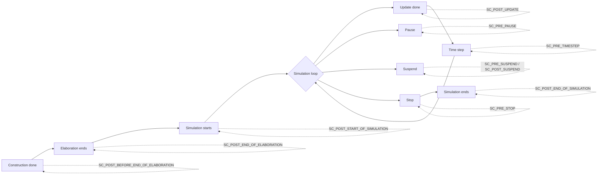

# sc_stage_callback_if.h - Simulation Stage Callback Interface

## Overview

`sc_stage_callback_if.h` defines the interface and stage enumeration for SystemC simulation stage callbacks. It allows users to insert custom logic at various key points during the simulation, such as performing checks after each update or cleaning up before the simulation pauses.

## Why Is This File Needed?

Imagine you are baking a cake. The entire process has many stages: mixing ingredients, placing in the oven, periodic checking, and cooling. If you want to automatically do something at each stage (e.g., take a photo for the record every time you check), you need a "notification system" that tells you which stage you are currently in.

`sc_stage_callback_if` is the interface to this notification system. You simply implement the `stage_callback()` method, tell SystemC which stages you care about, and SystemC will call your code at those moments.

## Simulation Stage Enumeration `sc_stage`

```cpp
enum sc_stage {
    SC_POST_BEFORE_END_OF_ELABORATION = 0x001,
    SC_POST_END_OF_ELABORATION        = 0x002,
    SC_POST_START_OF_SIMULATION       = 0x004,
    SC_POST_UPDATE                    = 0x008,
    SC_PRE_TIMESTEP                   = 0x010,
    SC_PRE_PAUSE                      = 0x020,
    SC_PRE_SUSPEND                    = 0x040,
    SC_POST_SUSPEND                   = 0x080,
    SC_PRE_STOP                       = 0x100,
    SC_POST_END_OF_SIMULATION         = 0x200,
};
```

### Stage Timeline



### Stage Descriptions

| Stage | Bit Value | Trigger Timing | Example Use |
|-------|-----------|----------------|-------------|
| `SC_POST_BEFORE_END_OF_ELABORATION` | 0x001 | After `before_end_of_elaboration()` completes | Final structural modifications |
| `SC_POST_END_OF_ELABORATION` | 0x002 | After `end_of_elaboration()` completes | Verify connection integrity |
| `SC_POST_START_OF_SIMULATION` | 0x004 | After `start_of_simulation()` completes | Initialize monitoring tools |
| `SC_POST_UPDATE` | 0x008 | After each update phase | Real-time data collection (high frequency) |
| `SC_PRE_TIMESTEP` | 0x010 | Before time advancement | Time-related checks (high frequency) |
| `SC_PRE_PAUSE` | 0x020 | Before `sc_pause()` takes effect | Save intermediate state |
| `SC_PRE_SUSPEND` | 0x040 | Before `sc_suspend_all()` | Pre-suspend cleanup |
| `SC_POST_SUSPEND` | 0x080 | After resuming from `sc_suspend_all()` | Post-resume initialization |
| `SC_PRE_STOP` | 0x100 | Before `sc_stop()` takes effect | Final data output |
| `SC_POST_END_OF_SIMULATION` | 0x200 | After simulation fully ends | Resource release, report generation |

### Bitmask Design

Each stage uses an independent bit (power of 2), allowing registration for multiple stage callbacks using bitwise OR:

```cpp
// register for both update and timestep callbacks
mask = SC_POST_UPDATE | SC_PRE_TIMESTEP;  // 0x008 | 0x010 = 0x018
```

## Interface Class `sc_stage_callback_if`

```cpp
class sc_stage_callback_if {
public:
    typedef unsigned int stage_cb_mask;
    virtual ~sc_stage_callback_if() {}
    virtual void stage_callback(const sc_stage & stage) = 0;
};
```

This is a pure virtual interface. To receive callbacks, you need to:

1. Inherit from this interface
2. Implement the `stage_callback()` method
3. Register with `sc_stage_callback_registry`

### Conceptual Usage Example

```cpp
class MyMonitor : public sc_stage_callback_if {
    void stage_callback(const sc_stage& stage) override {
        if (stage == SC_POST_UPDATE) {
            // collect data after each update
        }
        if (stage == SC_PRE_STOP) {
            // flush output before stopping
        }
    }
};
```

## Helper Function

```cpp
SC_API std::ostream& operator << (std::ostream& os, sc_stage s);
```

Provides formatted output of `sc_stage`, convenient for debugging and logging.

## Related Files

- `sc_stage_callback_registry.h` / `.cpp` - Callback registration and dispatch implementation
- `sc_status.h` - Simulation status definitions (related but different from stages)
- `sc_simcontext.h` - Simulation context that holds the callback registry
