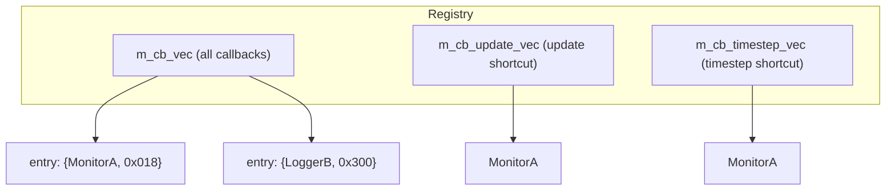
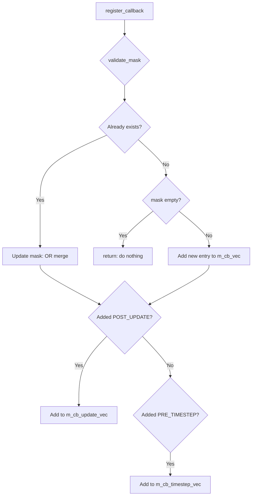
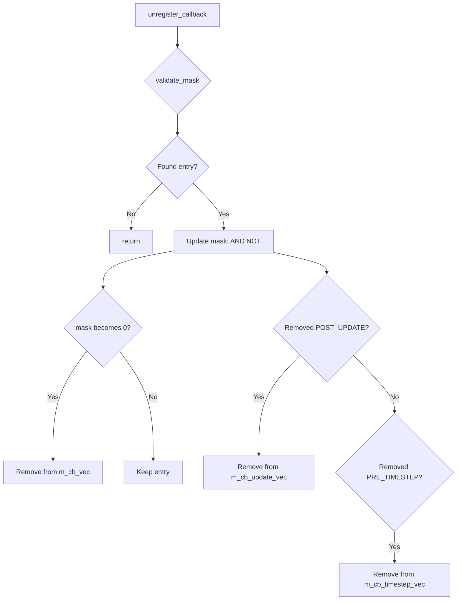

# sc_stage_callback_registry.h / .cpp - Simulation Stage Callback Registry

## Overview

`sc_stage_callback_registry` is the core manager of the SystemC simulation stage callback system. It is responsible for registering, unregistering, validating, and dispatching stage callbacks. This class is an internal component of `sc_simcontext`; users do not access it directly but instead operate through the global functions `sc_register_stage_callback()` and `sc_unregister_stage_callback()`.

## Why Is This File Needed?

Imagine an event notification system: many people (callback implementers) want to know when certain events (simulation stages) occur. `sc_stage_callback_registry` is the administrator maintaining the "subscription list":

- You can subscribe (register) to certain events
- You can unsubscribe (unregister)
- When an event occurs, the administrator notifies all subscribers

## Class Details

### Data Structures

```cpp
struct entry {
    cb_type*  target;  // callback implementation
    mask_type mask;    // which stages to notify
};
```



### Performance Optimization: Shortcut Vectors

`SC_POST_UPDATE` and `SC_PRE_TIMESTEP` are high-frequency events (triggered every delta cycle or time step). To avoid traversing the entire `m_cb_vec` and performing bitmask comparisons each time, the registry maintains two shortcut vectors:

- `m_cb_update_vec`: Contains only callbacks subscribed to `SC_POST_UPDATE`
- `m_cb_timestep_vec`: Contains only callbacks subscribed to `SC_PRE_TIMESTEP`

```cpp
// High-frequency path: direct iteration, no mask check
inline void sc_stage_callback_registry::update_done() const {
    if (SC_LIKELY_(!m_cb_update_vec.size())) return;  // fast exit
    for (auto it = vec.begin(); it != vec.end(); ++it)
        (*it)->stage_callback(SC_POST_UPDATE);
}

// Low-frequency path: check mask
void sc_stage_callback_registry::do_callback(sc_stage s) const {
    for (auto it = vec.begin(); it != vec.end(); ++it) {
        if (s & it->mask)
            it->target->stage_callback(s);
    }
}
```

### `scoped_stage` - RAII Stage Management

```cpp
struct scoped_stage {
    scoped_stage(sc_stage& ref, sc_stage s)
      : ref_(ref), prev_(ref) { ref_ = s; }
    ~scoped_stage() { ref_ = prev_; }
};
```

This is an RAII utility that temporarily sets the value of `m_simc->m_stage` during a callback and automatically restores it when the callback ends. Like flipping a door sign to "Meeting in Progress" when entering a conference room and flipping it back to "Available" when leaving.

Note that it uses a mutex to protect access to `m_stage`, ensuring multi-thread safety.

## Main Operations

### Register Callback



### Unregister Callback



### Mask Validation `validate_mask()`

Ensures the mask value is valid and handles timing issues:

1. **Illegal bits**: If the mask contains bits outside `SC_STAGE_CALLBACK_MASK`, issue a warning and clear them
2. **Elaboration already done**: If the simulation has already passed the elaboration phase, `SC_POST_BEFORE_END_OF_ELABORATION` or `SC_POST_END_OF_ELABORATION` can no longer be registered (those events have already passed)

## Callback Forwarding Methods

Each stage has a corresponding forwarding method, implemented as `inline` in the `.h` file:

| Method | Triggered Stage | Performance Path |
|--------|----------------|-----------------|
| `construction_done()` | `SC_POST_BEFORE_END_OF_ELABORATION` | General |
| `elaboration_done()` | `SC_POST_END_OF_ELABORATION` | General |
| `start_simulation()` | `SC_POST_START_OF_SIMULATION` | General |
| `update_done()` | `SC_POST_UPDATE` | Shortcut (high frequency) |
| `before_timestep()` | `SC_PRE_TIMESTEP` | Shortcut (high frequency) |
| `pre_suspend()` | `SC_PRE_SUSPEND` | General |
| `post_suspend()` | `SC_POST_SUSPEND` | General |
| `simulation_paused()` | `SC_PRE_PAUSE` | General |
| `simulation_stopped()` | `SC_PRE_STOP` | General |
| `simulation_done()` | `SC_POST_END_OF_SIMULATION` | General |

## Formatted Output of `sc_stage`

The `.cpp` file implements `operator<<` for pretty-printing `sc_stage`:

- Single stage: prints the name directly, e.g., `SC_POST_UPDATE`
- Combined mask: joined with `|`, e.g., `(SC_POST_UPDATE|SC_PRE_TIMESTEP)`
- Invalid value: prints hexadecimal, e.g., `0x800`

## Access Control

The entire class interface is `private`, with only the following friends having access:

- `sc_simcontext` - Simulation context (owner)
- `sc_object` - System object base class
- `sc_register_stage_callback()` - Global registration function
- `sc_unregister_stage_callback()` - Global unregistration function

## Related Files

- `sc_stage_callback_if.h` - Callback interface and stage enumeration definitions
- `sc_simcontext.h` - Simulation context that holds this registry
- `sc_status.h` - Simulation status definitions
- `sc_kernel_ids.h` - Error message ID (`SC_ID_STAGE_CALLBACK_REGISTER_`)
