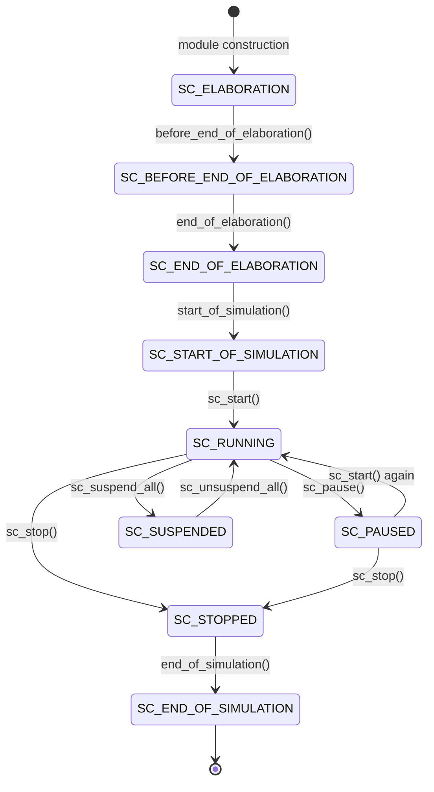

# sc_status.h - Simulation Status Definitions

## Overview

`sc_status.h` defines the status codes that a SystemC simulator may be in at different points in time. These statuses can be queried via `sc_get_status()`, letting user code know what the simulation is currently doing.

## Why Is This File Needed?

Imagine a washing machine -- it has different states: filling water, washing, spinning, done. You can tell which stage it is in through the panel indicators. `sc_status` is the SystemC simulator's "panel indicator," telling you which phase the simulation is currently in.

## Simulation Result Codes

```cpp
const int SC_SIM_OK        = 0;  // simulation finished without error
const int SC_SIM_ERROR     = 1;  // simulation ended with error
const int SC_SIM_USER_STOP = 2;  // simulation stopped by sc_stop()
```

These are the "grades" after the simulation ends:

| Code | Meaning | Analogy |
|------|---------|---------|
| `SC_SIM_OK` | Completed normally | Washing machine finished normally |
| `SC_SIM_ERROR` | An error occurred | Washing machine broke down |
| `SC_SIM_USER_STOP` | User stopped manually | You pressed the pause button |

## Simulation Status Enumeration `sc_status`

```cpp
enum sc_status {
    SC_ELABORATION               = 0x001,
    SC_BEFORE_END_OF_ELABORATION = 0x002,
    SC_END_OF_ELABORATION        = 0x004,
    SC_START_OF_SIMULATION       = 0x008,
    SC_RUNNING                   = 0x010,
    SC_PAUSED                    = 0x020,
    SC_SUSPENDED                 = 0x040,
    SC_STOPPED                   = 0x080,
    SC_END_OF_SIMULATION         = 0x100,
};
```

### Status Timeline



### Status Descriptions

| Status | Bit Value | Trigger Timing | Description |
|--------|-----------|----------------|-------------|
| `SC_ELABORATION` | 0x001 | During module construction | Building module hierarchy, ports, and signals |
| `SC_BEFORE_END_OF_ELABORATION` | 0x002 | During `before_end_of_elaboration()` callback | Last chance to modify structure |
| `SC_END_OF_ELABORATION` | 0x004 | During `end_of_elaboration()` callback | Structure is fixed, can do final checks |
| `SC_START_OF_SIMULATION` | 0x008 | During `start_of_simulation()` callback | Simulation is about to begin |
| `SC_RUNNING` | 0x010 | During initialization, evaluation, or update phases | Simulation is running |
| `SC_PAUSED` | 0x020 | After `sc_pause()` | Simulation is paused, can inspect state or continue |
| `SC_SUSPENDED` | 0x040 | After `sc_suspend_all()` | All processes are suspended |
| `SC_STOPPED` | 0x080 | After `sc_stop()` | Simulation has stopped, cannot continue |
| `SC_END_OF_SIMULATION` | 0x100 | During `end_of_simulation()` callback | Final cleanup in progress |

### Bitmask Design

Similar to `sc_stage`, each status uses one bit, allowing combined queries with bitwise operations:

```cpp
// Check if simulation is in any "active" state
if (sc_get_status() & (SC_RUNNING | SC_PAUSED | SC_SUSPENDED)) {
    // simulation has started but not yet ended
}
```

## `sc_status` vs `sc_stage`

These two enumerations are easy to confuse but serve different purposes:

| Aspect | `sc_status` | `sc_stage` |
|--------|-------------|------------|
| Purpose | Query current simulation state | Callback notification time point |
| Direction | Passive query | Active notification |
| Granularity | Coarser (overall phases) | Finer (PRE/POST time points) |
| Defined in | `sc_status.h` | `sc_stage_callback_if.h` |
| Query method | `sc_get_status()` | Parameter of `stage_callback()` |

## Formatted Output

```cpp
SC_API std::ostream& operator << (std::ostream&, sc_status);
```

Provides human-readable output of `sc_status`, convenient for debugging.

## Related Files

- `sc_stage_callback_if.h` - Stage callback interface (related but different concept)
- `sc_simcontext.h` - Holds the current simulation status
- `sc_stage_callback_registry.h` - Uses definitions from `sc_status.h`
