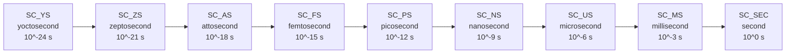

# sc_time -- The Clock of the SystemC Simulation World

## Overview

`sc_time` is the core class in SystemC for representing simulation time. In hardware simulation, time is one of the most fundamental concepts. `sc_time` abstracts time as an immutable value object, supporting various time units (from yoctosecond to second), arithmetic operations, comparison operations, and tight integration with the simulation engine.

**Source code location:**
- Header: `ref/systemc/src/sysc/kernel/sc_time.h`
- Implementation: `ref/systemc/src/sysc/kernel/sc_time.cpp`

---

## Everyday Analogy

Imagine you are playing a **turn-based strategy game**:

| Game Concept | sc_time |
|-------------|---------|
| "Turn N" in the game | `sc_time`'s `m_value` (internal integer value) |
| Whether each turn represents "1 day" or "1 hour" | Time resolution |
| "3 days later", "next week" | `sc_time(3, SC_NS)`, `sc_time(1, SC_US)` |
| The game's timeline | Simulation timeline |
| The game cannot rewind time | `sc_time` values only increase (during normal simulation) |

**Key insight:** The game internally only tracks "turn count" (integer), while "how long each turn is" is configured separately. `sc_time` works the same way -- internally it stores an integer tick count, and how much real time each tick represents is determined by the time resolution.

---

## Time Units



```cpp
enum sc_time_unit {
    SC_YS = -3,  // yoctosecond (smallest)
    SC_ZS = -2,  // zeptosecond
    SC_AS = -1,  // attosecond
    SC_FS = 0,   // femtosecond
    SC_PS = 1,   // picosecond
    SC_NS = 2,   // nanosecond (most commonly used)
    SC_US = 3,   // microsecond
    SC_MS = 4,   // millisecond
    SC_SEC = 5   // second
};
```

---

## sc_time Class Details

### Internal Representation

```cpp
class sc_time {
public:
    typedef SC_TIME_DT value_type;  // sc_dt::uint64, at least 64 bits

private:
    value_type m_value{};  // internal tick count
};
```

**Core design**: `sc_time` internally stores only a 64-bit unsigned integer `m_value`, representing the tick count relative to the time resolution. All time calculations are performed in integer space, avoiding floating-point errors.

### Construction Methods

```cpp
// 1. Default: zero time
constexpr sc_time();

// 2. Specify value and unit (most common)
sc_time(double, sc_time_unit);
// example: sc_time(10, SC_NS) = 10 nanoseconds

// 3. From string
explicit sc_time(std::string_view strv);
static sc_time from_string(std::string_view strv);

// 4. From internal value
static sc_time from_value(value_type);

// 5. From seconds
static sc_time from_seconds(double);

// 6. Maximum value
static constexpr sc_time max();
```

### Conversion Functions

```cpp
value_type value() const;          // Get internal tick value
double to_double() const;          // Convert to double (relative to time resolution)
double to_seconds() const;         // Convert to seconds
double to_default_time_units() const; // Convert to default time units
const std::string to_string() const;  // Convert to human-readable string
```

### Comparison Operators

All six comparisons are supported: `==`, `!=`, `<`, `<=`, `>`, `>=`. The implementation is straightforward, simply comparing `m_value`:

```cpp
bool operator == (const sc_time& t) const { return m_value == t.m_value; }
bool operator <  (const sc_time& t) const { return m_value <  t.m_value; }
// ... etc
```

### Arithmetic Operators

```cpp
sc_time& operator += (const sc_time&);  // add
sc_time& operator -= (const sc_time&);  // subtract
sc_time& operator *= (double);          // multiply by factor
sc_time& operator /= (double);          // divide by factor
sc_time& operator %= (const sc_time&);  // modulo

// friend operators
const sc_time operator + (const sc_time&, const sc_time&);
const sc_time operator - (const sc_time&, const sc_time&);
const sc_time operator * (const sc_time&, double);
const sc_time operator * (double, const sc_time&);
const sc_time operator / (const sc_time&, double);
double        operator / (const sc_time&, const sc_time&);  // time ratio
const sc_time operator % (const sc_time&, const sc_time&);
```

**Note on rounding for multiplication/division**:

```cpp
sc_time& operator *= (double d) {
    m_value = static_cast<sc_dt::int64>(
        static_cast<double>(m_value) * d + 0.5  // round to nearest
    );
    return *this;
}
```

When multiplying by a `double`, the value is first converted to floating-point for calculation, then 0.5 is added for rounding back to integer.

---

## SC_ZERO_TIME

```cpp
inline constexpr sc_time SC_ZERO_TIME;
```

A global constant representing "zero time." Since `m_value` defaults to 0, `SC_ZERO_TIME`'s `m_value` is 0. Commonly used for:
- Immediate notification: `event.notify(SC_ZERO_TIME)` means notify at the next delta cycle
- Time comparison: `if (t == SC_ZERO_TIME)`

---

## sc_time_tuple -- Human-Readable Time Representation

`sc_time_tuple` is a helper class for converting internal tick values to a "value + unit" form.

```cpp
class sc_time_tuple {
    value_type   m_value;   // normalized value
    sc_time_unit m_unit;    // best-fit unit
    unsigned     m_offset;  // scaling factor
};
```

**Purpose**: When you call `sc_time::to_string()`, it creates an `sc_time_tuple` to find the most suitable unit representation. For example, 1000 ps would be displayed as "1 ns" rather than "1000 ps."

---

## sc_time_params -- Time System Configuration

```cpp
struct sc_time_params {
    double              time_resolution;              // in yoctoseconds
    unsigned            time_resolution_log10;        // log10 of resolution
    bool                time_resolution_specified;    // user set it?
    std::atomic<bool>   time_resolution_fixed;        // locked after first use?

    sc_time::value_type default_time_unit;            // in resolution ticks
    bool                default_time_unit_specified;   // user set it?
};
```

### Time Resolution

Time resolution determines how much real time `m_value = 1` represents. The default is typically 1 ps (picosecond).

```cpp
sc_set_time_resolution(1, SC_PS);  // 1 tick = 1 ps
sc_set_time_resolution(1, SC_NS);  // 1 tick = 1 ns (lower precision, faster)
```

**Important restrictions**:
- Time resolution must be set before creating any `sc_time` object (except `SC_ZERO_TIME`)
- Once set, it cannot be changed (`time_resolution_fixed` is locked)
- Uses `std::atomic<bool>` for thread safety

### Default Time Unit

```cpp
sc_set_default_time_unit(1, SC_NS);
```

Once set, `sc_time(10, true)` where `10` represents 10 ns.

---

## Design Rationale

### Why Use Integers Instead of Floating-Point?

**Precision issue**: Floating-point numbers produce errors during accumulation. For example, `0.1 + 0.1 + ... + 0.1` (10 times) may not equal `1.0` in floating-point. But in hardware simulation, time must be precise to the tick. Using integers completely avoids accumulated errors.

**Performance consideration**: Integer comparison and arithmetic are faster than floating-point, and time comparison is one of the most frequent operations in a simulator.

### Why So Many Time Units?

Different hardware operates at different time scales:
- **Digital logic**: nanosecond (ns) level
- **Analog circuits**: picosecond (ps) level
- **Optical communications**: femtosecond (fs) level
- **System-level simulation**: microsecond (us) to millisecond (ms)

As a "system-level to gate-level" general-purpose framework, SystemC needs to cover all scales.

### RTL Background

In Verilog/VHDL, time is also represented using integer ticks plus a timescale:

```verilog
`timescale 1ns / 1ps   // unit = 1ns, precision = 1ps
#10;                    // wait 10ns
```

SystemC's `sc_time` + `sc_set_time_resolution()` corresponds to this concept.

---

## Usage Examples

```cpp
// basic construction
sc_time t1(10, SC_NS);        // 10 ns
sc_time t2(1.5, SC_US);       // 1.5 us = 1500 ns
sc_time t3 = SC_ZERO_TIME;    // 0

// arithmetic
sc_time t4 = t1 + t2;         // 1510 ns
sc_time t5 = t1 * 3;          // 30 ns
double ratio = t2 / t1;       // 150.0

// comparison
bool b = (t1 < t2);           // true

// output
std::cout << t1 << std::endl;  // "10 ns"
std::cout << t2 << std::endl;  // "1500 ns" or "1.5 us"
```

---

## Related Files

| File | Description |
|------|-------------|
| `sc_simcontext.h/cpp` | Manages `sc_time_params`, maintains current simulation time |
| `sc_event.h/cpp` | Event notification requires `sc_time` to specify delay |
| `sc_clock.h/cpp` | Clock uses `sc_time` to define period and duty cycle |
| `sc_wait.h` | `wait(sc_time)` function |
| `sc_nbdefs.h` | Defines `sc_dt::uint64` |
