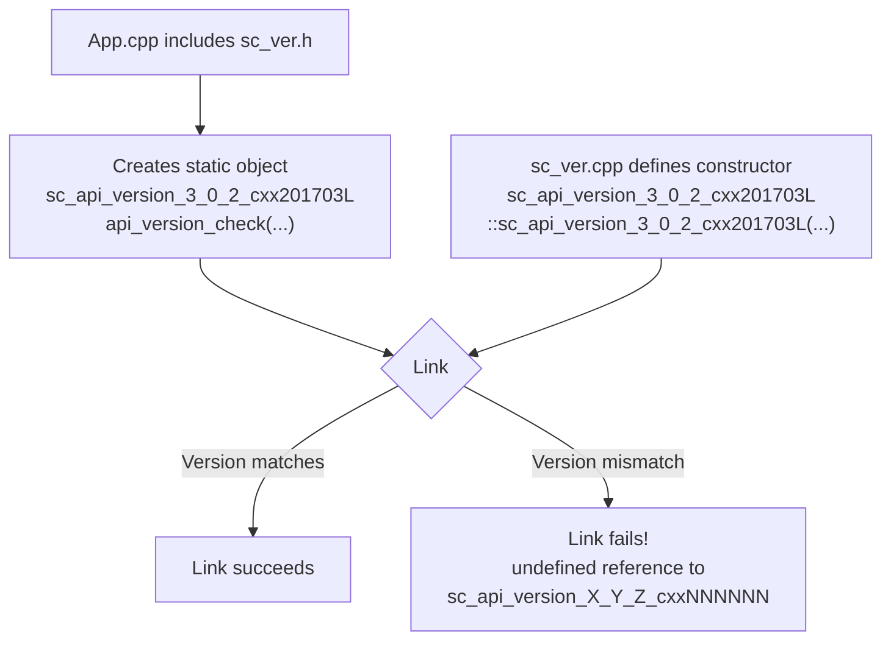

# sc_ver.h / .cpp - Version and Copyright Information

## Overview

`sc_ver.h` and `sc_ver.cpp` manage the SystemC library's version number, copyright information, and API version compatibility checks. They ensure that the SystemC library version linked by the application matches the header file version used at compile time.

## Why Is This File Needed?

Imagine you bought an appliance (your program) that comes with a manual (header files). If you operate an old appliance using the instructions from a new manual, things might go wrong. `sc_ver`'s API version check is the mechanism that ensures the "manual version" and "appliance version" match.

## Version Information

### Current Version Definitions

```cpp
#define SYSTEMC_3_0_2
#define SYSTEMC_VERSION       20251031
#define SC_VERSION_ORIGINATOR "Accellera"
#define SC_VERSION_MAJOR      3
#define SC_VERSION_MINOR      0
#define SC_VERSION_PATCH      2
#define SC_IS_PRERELEASE      0
#define IEEE_1666_SYSTEMC     202301L  // IEEE 1666-2023
```

### Version String Format

- Release: `3.0.2-Accellera`
- Preview: `3.0.2_pub_rev_20251031-Accellera`
- Full version: `SystemC 3.0.2-Accellera --- <date> <time>`

### Version Query Functions

| Function | Return Value |
|----------|-------------|
| `sc_version()` | `"SystemC 3.0.2-Accellera --- Mar 15 2026 10:30:00"` |
| `sc_release()` | `"3.0.2-Accellera"` |
| `sc_copyright()` | Copyright notice text |

### Version Variables

| Variable | Type | Description |
|----------|------|-------------|
| `sc_version_major` | `unsigned int` | Major version (3) |
| `sc_version_minor` | `unsigned int` | Minor version (0) |
| `sc_version_patch` | `unsigned int` | Patch number (2) |
| `sc_is_prerelease` | `bool` | Whether it is a prerelease |
| `sc_version_originator` | `string` | Originator ("Accellera") |
| `sc_version_release_date` | `string` | Release date |

## API Version Check Mechanism

### Link-Time Check

This is the most clever design in the entire file. The goal is to catch version mismatches at **link time** (not at runtime).



#### How It Works

1. The `SC_API_VERSION_STRING` macro generates a class name containing the version number and C++ standard version, such as `sc_api_version_3_0_2_cxx201703L`
2. Every `.cpp` file that includes `sc_ver.h` creates a static instance of this class
3. The constructor of this instance is defined in `sc_ver.cpp`
4. If the header version (from the application's compile time) and the library version differ, the class names differ, and the linker reports an error

### Runtime Check

The constructor also checks consistency of some compile-time switches:

```cpp
SC_API_PERFORM_CHECK_(sc_writer_policy,
                      default_writer_policy,
                      "SC_DEFAULT_WRITER_POLICY");
SC_API_PERFORM_CHECK_(bool,
                      has_covariant_virtual_base,
                      "SC_ENABLE_COVARIANT_VIRTUAL_BASE");
```

`SC_API_PERFORM_CHECK_` logic:
- First call: remember this value
- Subsequent calls: compare whether the value is consistent
- Inconsistent: `SC_REPORT_FATAL`

This ensures all translation units (`.cpp` files) use the same compile options.

## Copyright Message Display

### `pln()` Function

`pln()` prints version and copyright information to `stderr` when the simulation starts:

```
        SystemC 3.0.2-Accellera --- Mar 15 2026 10:30:00
        Copyright (c) 1996-2025 by all Contributors,
        ALL RIGHTS RESERVED
```

Can be disabled through:
1. Defining `SC_DISABLE_COPYRIGHT_MESSAGE` at compile time
2. Setting the environment variable `SYSTEMC_DISABLE_COPYRIGHT_MESSAGE`
3. Setting the environment variable `SC_COPYRIGHT_MESSAGE=DISABLE`

### Regression Test Support

```cpp
if (getenv("SYSTEMC_REGRESSION") != 0) {
    cerr << "SystemC Simulation" << endl;
}
```

Prints a fixed string in regression test environments, facilitating automated comparison.

## Related Files

- `sc_cmnhdr.h` - Defines the `SC_CPLUSPLUS` macro
- `sc_macros.h` - Defines `SC_CONCAT_UNDERSCORE_`, `SC_STRINGIFY_HELPER_`, and other macros
- `sc_kernel_ids.h` - `SC_ID_INCONSISTENT_API_CONFIG_` error ID
- `sc_communication/sc_writer_policy.h` - `SC_DEFAULT_WRITER_POLICY` definition
