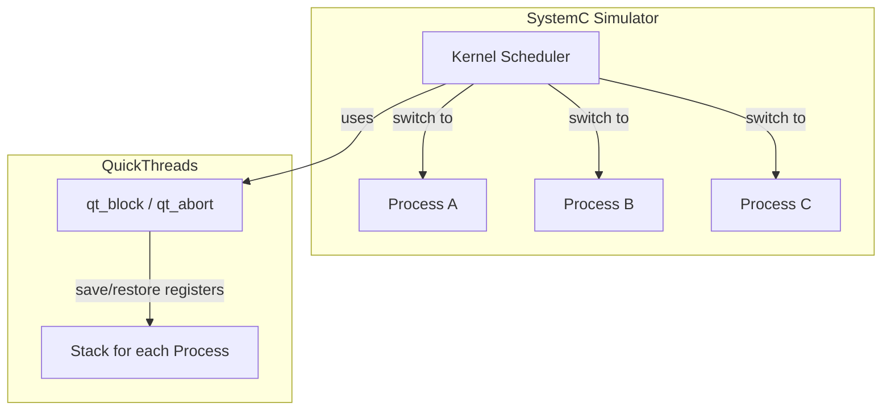

# SystemC Packages - External Libraries

## Overview

The `sysc/packages/` directory contains external libraries used by SystemC. Currently, the only package is **QuickThreads (Qt)** -- a user-level threading (coroutine) library.

> **Important note**: The "Qt" here stands for **QuickThreads** and has nothing to do with the well-known **Qt GUI framework**. QuickThreads is a lightweight context-switching library developed by David Keppel in 1993.

## The Role of QuickThreads in SystemC

The SystemC simulator needs to rapidly switch execution among multiple "processes" (`SC_THREAD`, `SC_METHOD`). This is like a chef cooking multiple dishes at the same time -- although there is only one person (one CPU thread), they must switch quickly between dishes so that each one is "in progress".

QuickThreads provides a context-switching mechanism that is more lightweight than OS threads:

### Three Context-Switching Backends

SystemC supports three context-switching implementations:

| Backend | How to Enable | Characteristics |
|---------|--------------|-----------------|
| QuickThreads | Default | Fastest, uses assembly language |
| POSIX Threads | `SC_USE_PTHREADS` | Uses `ucontext` or pthreads |
| C++ Threads | `SC_USE_STD_THREADS` | Uses C++11 `std::thread` |

When `SC_USE_PTHREADS` or `SC_USE_STD_THREADS` is defined, QuickThreads is completely disabled.

## File Structure

| File | Description |
|------|-------------|
| [qt.md](qt.md) | QuickThreads main API -- thread creation, switching, abort |
| [qtmd.md](qtmd.md) | Machine-dependent definitions -- selects assembly implementation by CPU architecture |

### md/ Subdirectory -- Assembly Implementations for Each Architecture

The `md/` subdirectory contains assembly files for various CPU architectures, responsible for the actual register save/restore:

| Architecture | Header File | Assembly | Status |
|-------------|-------------|----------|--------|
| x86-64 | `iX86_64.h` | `iX86_64.s` | Primary |
| AArch64 (ARM64) | `aarch64.h` | `aarch64.s` | Primary |
| RISC-V 64 | `riscv64.h` | `riscv64.s` | Newer support |
| x86 (32-bit) | `i386.h` | `i386.s` | Legacy support |
| SPARC | `sparc.h` | `sparc.s` | Legacy support |
| PA-RISC | `hppa.h` | `hppa.s` | Legacy support |
| PowerPC (macOS) | `powerpc_mach.h` | `powerpc_mach.s` | Legacy support |
| PowerPC (SysV) | `powerpc_sys5.h` | `powerpc_sys5.s` | Legacy support |
| Alpha | `axp.h` | `axp.s` | Historical |
| MIPS | `mips.h` | `mips.s` | Historical |
| VAX | `vax.h` | `vax.s` | Historical |
| KSR1 | `ksr1.h` | `ksr1.s` | Historical |
| M88K | `m88k.h` | `m88k.s` | Historical |

Each architecture includes:
- `.h` file: Defines stack layout constants (register offsets on the stack)
- `.s` file: Assembly implementation of functions such as `qt_block`, `qt_blocki`, `qt_abort`
- `_b.s` file: Additional helper assembly for some architectures

## Design Rationale

Why not use OS threads directly?

1. **Performance**: QuickThreads context switching only needs to save/restore a small number of registers (callee-saved), making it 10-100x faster than OS threads
2. **Determinism**: User-level switching is entirely controlled by the simulator, unaffected by the OS scheduler
3. **Single-threaded semantics**: SystemC's semantics dictate that "only one process executes at a time", so true parallelism is not needed
