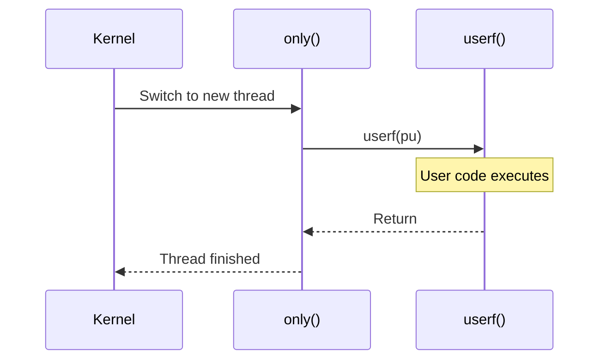
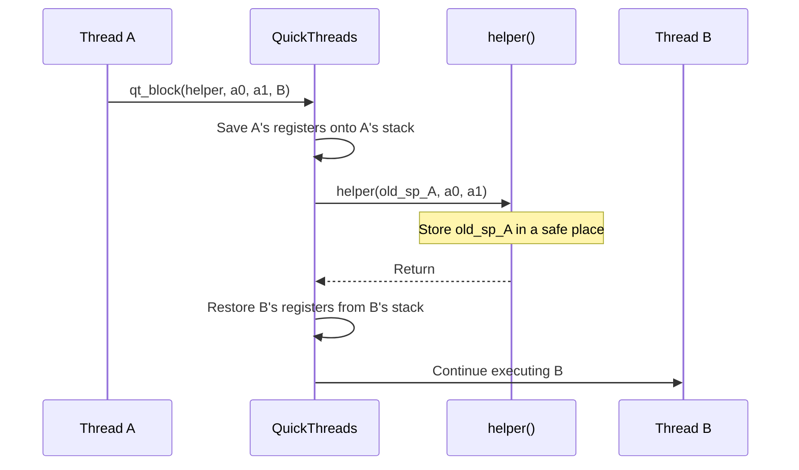

# qt.h / qt.c - QuickThreads Main API

## Overview

`qt.h` defines the core API of the QuickThreads library, including thread creation, context switching, and abort operations. `qt.c` provides the varargs version implementation and helper functions.

**Source files**: `sysc/packages/qt/qt.h` + `qt.c`

## Analogy

Imagine you are a novelist writing three novels simultaneously:

1. You are halfway through writing novel A, you make a mark on the desk (**save state**), and put the manuscript away
2. You take out the manuscript for novel B, find the previous mark (**restore state**), and continue writing
3. After reaching a certain section, you switch to novel C...

QuickThreads is the system that manages these "marks" and "switches" for you. Each "mark" is a stack pointer (`qt_t*`) that records the complete state of a thread when it was paused.

## Core Types

### qt_t -- Thread State

```cpp
typedef struct qt_t {
    char dummy;
} qt_t;
```

`qt_t*` represents the current state of a thread; it is essentially a stack pointer. The entire structure exists only for type safety -- you do not need to (and should not) access its contents directly.

### Function Pointer Types

```cpp
typedef void  (qt_userf_t)(void *pu);                  // User function
typedef void *(qt_vuserf_t)(int arg0, ...);             // Varargs user function
typedef void  (qt_only_t)(void *pu, void *pt, qt_userf_t *userf); // Wrapper function
typedef void *(qt_helper_t)(qt_t *old, void *a0, void *a1);       // Switch helper function
```

## Stack Management

### Alignment

```cpp
#define QUICKTHREADS_STKROUNDUP(bytes) \
    (((bytes) + QUICKTHREADS_STKALIGN) & ~(QUICKTHREADS_STKALIGN - 1))
```

Rounds up the byte count to the stack alignment boundary.

### Calculating the Stack Top

```cpp
// Stack grows downward
#define QUICKTHREADS_SP(sto, size) ((qt_t *)(&((char *)(sto))[(size)]))

// Stack grows upward
#define QUICKTHREADS_SP(sto, size) ((qt_t *)(sto))
```

Given a memory block (`sto`) and size (`size`), computes the initial value of the stack pointer.

## Thread Creation

### Non-varargs Version

```cpp
#define QUICKTHREADS_ARGS(sp, pu, pt, userf, only)
```

Lays out initial arguments on the stack so that the user function can be called correctly when the thread is switched to for the first time.

Parameters:
- `sp`: Stack pointer
- `pu`: User argument (passed to `userf`)
- `pt`: Extra argument (passed to `only`)
- `userf`: User function
- `only`: Wrapper function, responsible for calling `userf` and handling startup/cleanup



### Varargs Version

```cpp
qt_t *qt_vargs(qt_t *sp, int nbytes, void *vargs,
               void *pt, qt_startup_t *startup,
               qt_vuserf_t *vuserf, qt_cleanup_t *cleanup);
```

Used when a variable number of arguments need to be passed. Calls `startup` first, then `vuserf`, and finally `cleanup`.

## Context Switching

### qt_block -- Cooperative Switch

```cpp
void *qt_block(qt_helper_t *h, void *a0, void *a1, qt_t *newthread);
#define QUICKTHREADS_BLOCK(h, a0, a1, newthread) \
    (qt_block(h, a0, a1, newthread))
```

**Saves** the current thread's state and **restores** the state of `newthread`. Before switching, it calls the helper function `h(old_sp, a0, a1)`, giving the caller a chance to store the old stack pointer.



### qt_blocki -- Interrupt-Safe Version

```cpp
void *qt_blocki(qt_helper_t *h, void *a0, void *a1, qt_t *newthread);
```

Similar to `qt_block`, but handles interrupt-related registers on certain platforms.

### qt_abort -- No-Return Switch

```cpp
void *qt_abort(qt_helper_t *h, void *a0, void *a1, qt_t *newthread);
#define QUICKTHREADS_ABORT(h, a0, a1, newthread) \
    do { qt_abort(h, a0, a1, newthread); } while (0)
```

Unlike `qt_block`, `qt_abort` **does not save** the current thread's state. Used when the current thread has finished and does not need to be resumed.

## Helper Functions in qt.c

### qt_vargs -- Varargs Stack Layout

```cpp
qt_t *qt_vargs(qt_t *sp, int nbytes, void *vargs,
               void *pt, qt_startup_t *startup,
               qt_vuserf_t *vuserf, qt_cleanup_t *cleanup);
```

Copies variable arguments onto the new thread's stack and sets up the positions of the startup, userf, and cleanup functions. The copy order differs depending on the stack growth direction.

### qt_null and qt_error

```cpp
void qt_null(void);   // Empty function, used as default callback
void qt_error(void);  // Calls abort(), used for unreachable code paths
```

## Conditional Compilation

```cpp
#if !defined(SC_USE_PTHREADS) && !defined(SC_USE_STD_THREADS)
// ... QuickThreads code ...
#endif
```

When the pthreads or C++ threads backend is used, the entire QuickThreads header is not included.

## Usage in SystemC

The SystemC kernel wraps the QuickThreads API through the `sc_cor_qt` class:

1. Each `SC_THREAD` instance has its own stack
2. Uses `QUICKTHREADS_ARGS` to initialize the stack
3. Uses `QUICKTHREADS_BLOCK` to switch between processes
4. Uses `QUICKTHREADS_ABORT` to terminate a thread

## Related Files

- [qtmd.md](qtmd.md) -- Machine-dependent definitions
- [_index.md](_index.md) -- Package overview
