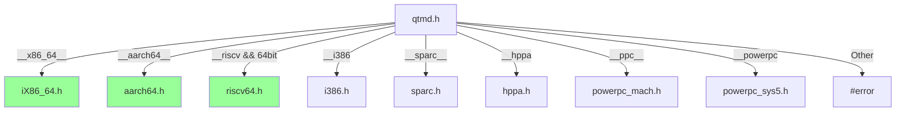

# qtmd.h - Machine-Dependent Definitions

## Overview

`qtmd.h` is the architecture dispatcher for QuickThreads. Based on the CPU architecture detected by the compiler, it includes the corresponding machine-dependent header file. Each architecture's header file defines constants such as stack layout, register offsets, and alignment requirements.

**Source file**: `sysc/packages/qt/qtmd.h` (header only)

## Analogy

Imagine you are a warehouse manager at an international courier company. Each country has different parcel size specifications and placement methods:

- Japanese parcels must be placed upright
- American parcels must be placed sideways
- European parcels need a layer of foam padding first

`qtmd.h` is like the "parcel placement guide for each country", telling you: based on which country you are in (CPU architecture), which placement method (stack layout) to use.

## Architecture Selection Logic

```cpp
#if defined(__sparc) || defined(__sparc__)
    #include "sysc/packages/qt/md/sparc.h"
#elif defined(__hppa)
    #include "sysc/packages/qt/md/hppa.h"
#elif defined(__x86_64__)
    #include "sysc/packages/qt/md/iX86_64.h"
#elif defined(__i386)
    #include "sysc/packages/qt/md/i386.h"
#elif defined(__ppc__)
    #include "sysc/packages/qt/md/powerpc_mach.h"
#elif defined(__powerpc)
    #include "sysc/packages/qt/md/powerpc_sys5.h"
#elif defined(__aarch64__)
    #include "sysc/packages/qt/md/aarch64.h"
#elif defined(__riscv) && (__riscv_xlen == 64)
    #include "sysc/packages/qt/md/riscv64.h"
#else
    #error "Unknown architecture!"
#endif
```



Architectures highlighted in green are commonly used in modern systems.

## Constants Defined in Each Architecture Header

Each architecture header file typically defines the following macros:

| Macro | Description |
|-------|-------------|
| `QUICKTHREADS_GROW_DOWN` or `QUICKTHREADS_GROW_UP` | Stack growth direction |
| `QUICKTHREADS_STKALIGN` | Stack alignment requirement (bytes) |
| `QUICKTHREADS_STKBASE` | Stack base offset |
| `QUICKTHREADS_ONLY_INDEX` | Index of the `only` function on the stack |
| `QUICKTHREADS_USER_INDEX` | Index of the `userf` function on the stack |
| `QUICKTHREADS_ARGT_INDEX` | Index of the `pt` argument on the stack |
| `QUICKTHREADS_ARGU_INDEX` | Index of the `pu` argument on the stack |
| `qt_word_t` | Machine word type |

### Stack Layout Example (Conceptual)

Using x86-64 as an example (stack grows downward):

```
High address
┌─────────────────┐
│  QUICKTHREADS_SP │ <- Stack top (initial pointer)
├─────────────────┤
│  return address  │
│  saved rbx       │
│  saved rbp       │
│  saved r12       │ <- callee-saved registers
│  saved r13       │
│  saved r14       │
│  saved r15       │
├─────────────────┤
│  pu (user arg)   │
│  pt (extra arg)  │
│  userf           │
│  only            │
└─────────────────┘
Low address <- Stack growth direction
```

## Why Is Assembly Required?

Context switching requires directly manipulating CPU registers, which is something C/C++ cannot do. The assembly files (`.s`) are responsible for:

1. **Saving callee-saved registers**: Push the registers that the current thread needs to preserve onto the stack
2. **Switching the stack pointer**: Replace the CPU's stack pointer (e.g., `rsp` on x86-64) with the new thread's
3. **Restoring callee-saved registers**: Pop the previously saved registers from the new stack
4. **Jumping to execution**: Continue executing the new thread's code

This entire process only involves callee-saved registers (not all registers), because according to the ABI convention, caller-saved registers are not guaranteed to be preserved across function calls.

## Special Handling for PowerPC

Note there are two PowerPC headers:
- `powerpc_mach.h`: macOS (Mach-O) platform
- `powerpc_sys5.h`: Linux (System V ABI) platform

The same CPU architecture may have a different ABI on different operating systems, so they need to be handled separately.

## Related Files

- [qt.md](qt.md) -- QuickThreads API that uses these constants
- [_index.md](_index.md) -- Package overview and full architecture list
