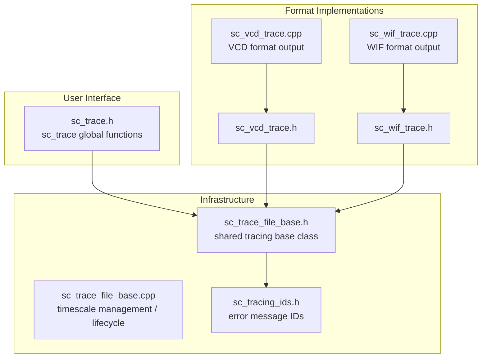
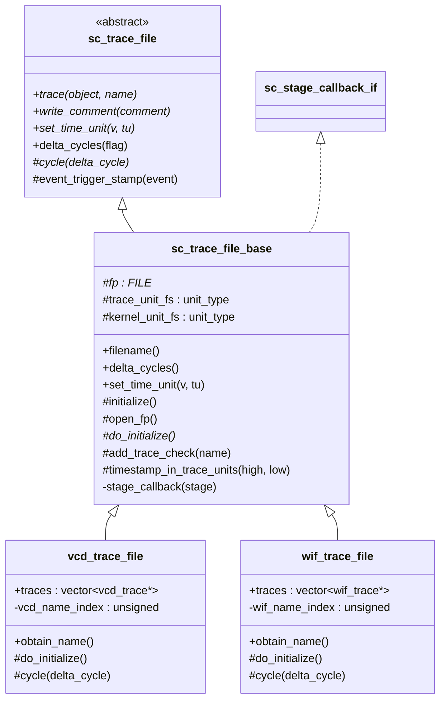
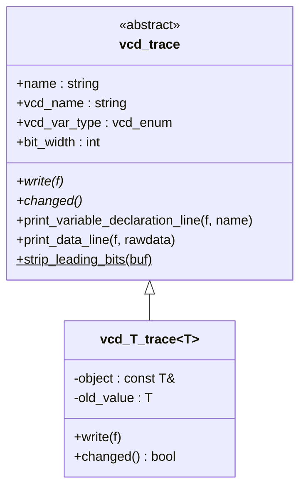
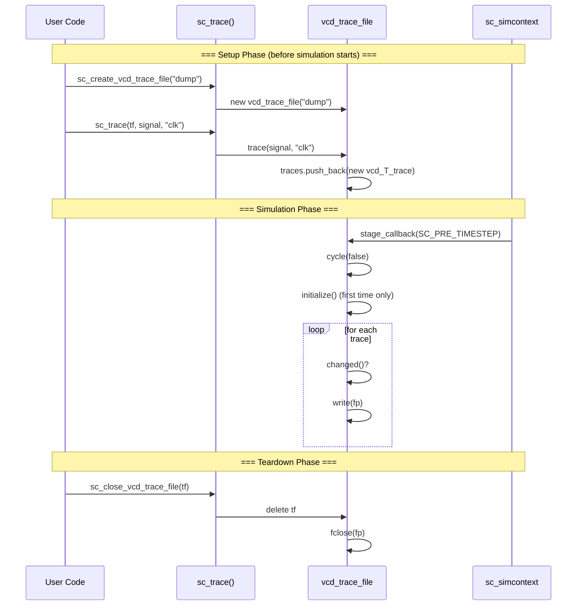

# sysc/tracing/ - Waveform Tracing Subsystem

> The signal recording mechanism during SystemC simulation, which exports signal value changes over time to VCD or WIF format files for subsequent analysis with waveform viewing tools.

## Everyday Analogy

Imagine you are watching a football match. **Tracing** is like a "live text commentary" of the game -- recording the position and state of each player (signal) at every moment. After the game, you can use this record to reconstruct what happened at any point in time.

- **sc_trace_file** = The commentator (an abstract role, responsible for "recording")
- **sc_trace_file_base** = The commentator's standard operating procedure (opening files, time calibration, when to record)
- **vcd_trace_file** = A commentator who writes records in "VCD format"
- **wif_trace_file** = A commentator who writes records in "WIF format"
- **sc_trace()** = Telling the commentator "please keep an eye on this player"

## Subsystem Overview

## Class Inheritance Hierarchy

## VCD Internal Trace Object Hierarchy

## Tracing Flow

## File List

| File | Description |
|------|-------------|
| [sc_trace.md](sc_trace.md) | Tracing public API: `sc_trace_file` abstract class and global `sc_trace()` functions |
| [sc_trace_file_base.md](sc_trace_file_base.md) | Tracing file shared base class: timescale, file lifecycle, callback mechanism |
| [sc_tracing_ids.md](sc_tracing_ids.md) | Tracing subsystem error/warning message ID definitions |
| [sc_vcd_trace.md](sc_vcd_trace.md) | VCD (Value Change Dump) format tracing implementation |
| [sc_wif_trace.md](sc_wif_trace.md) | WIF (Waveform Interchange Format) format tracing implementation |

## Related Subsystems

- `sysc/kernel/` -- Simulation kernel, providing `sc_simcontext`, `sc_event`, `sc_time`
- `sysc/communication/` -- Signal interface `sc_signal_in_if`, trace functions can directly trace signals
- `sysc/datatypes/` -- Various data types (`sc_logic`, `sc_bv_base`, etc.), tracing must support all types
- `sysc/utils/` -- Error reporting mechanism `sc_report`
