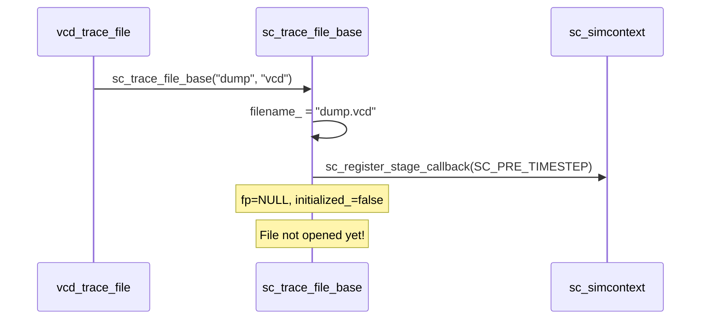
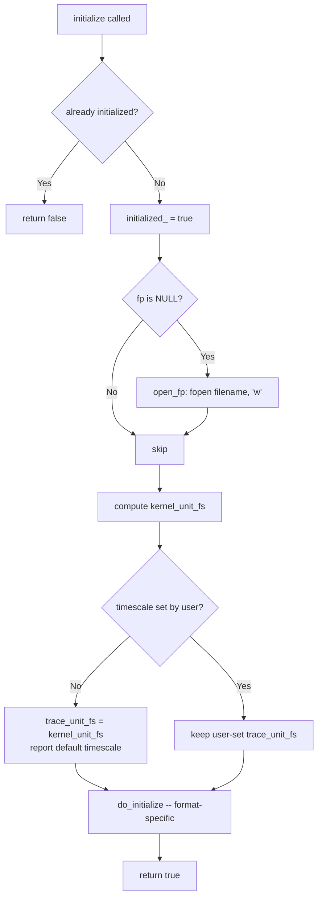
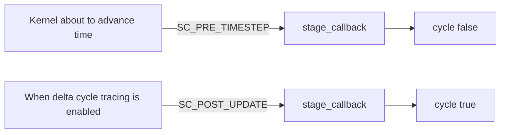

# sc_trace_file_base.h / sc_trace_file_base.cpp - Trace File Shared Base Class

> Provides the shared implementation for VCD and WIF trace files: file open/close, timescale management, and simulation kernel callback integration. It serves as the bridge between the abstract interface `sc_trace_file` and the concrete format implementations.

## Everyday Analogy

If `sc_trace_file` is the "job description" for a reporter (must be able to write articles, take photos), then `sc_trace_file_base` is the "standard equipment and operations manual for the reporter" -- specifying how to prepare pen and paper (open the file), how to calibrate the watch (set the timescale), and when to start writing (callback timing).

As for whether the article should be written in VCD or WIF format, that is the subclass's job.

## Overview

`sc_trace_file_base` inherits from `sc_trace_file` (public) and `sc_stage_callback_if` (private), and takes on the following responsibilities:

1. **File management**: opening and closing trace files
2. **Timescale**: converting between kernel time units and trace file time units
3. **Lifecycle**: managing initialization timing, ensuring no new trace objects can be added after tracing has started
4. **Trigger mechanism**: calling `cycle()` at the correct time through stage callbacks

## Class Definition

```cpp
class sc_trace_file_base
  : public sc_trace_file
  , private sc_stage_callback_if
{
public:
    typedef sc_time::value_type unit_type;

    const char* filename() const;
    bool delta_cycles() const;
    virtual void delta_cycles(bool flag);
    virtual void set_time_unit(double v, sc_time_unit tu);

protected:
    sc_trace_file_base(const char* name, const char* extension);
    bool is_initialized() const;
    bool initialize();
    void open_fp();
    virtual void do_initialize() = 0;
    bool add_trace_check(const std::string& name) const;
    bool has_low_units() const;
    int  low_units_len() const;
    void timestamp_in_trace_units(unit_type &high, unit_type &low) const;
    virtual ~sc_trace_file_base();

    static unit_type unit_to_fs(sc_time_unit tu);
    static std::string fs_unit_to_str(unit_type tu);

private:
    virtual void stage_callback(const sc_stage& stage);

protected:
    FILE*       fp;                    // trace file pointer
    unit_type   trace_unit_fs;         // trace timescale in femtoseconds
    unit_type   kernel_unit_fs;        // kernel timescale in femtoseconds
    bool        timescale_set_by_user;

private:
    std::string filename_;
    bool        initialized_;
    bool        trace_delta_cycles_;
    static bool tracing_initialized_;
};
```

## Core Mechanism Details

### 1. Construction and File Opening



The file is **not opened immediately** during construction; it waits until the first `initialize()` call. This gives the user a chance to set the timescale before simulation starts.

### 2. Initialization Flow

`initialize()` is triggered on the first `cycle()` call:



### 3. Timescale Management

This is the most intricate part. The trace file's time unit (`trace_unit_fs`) and the simulation kernel's time unit (`kernel_unit_fs`) may differ.

**All time units are stored in femtoseconds (fs) as the base**, avoiding floating-point precision issues.

| Time Unit | Femtosecond Value |
|-----------|-------------------|
| `SC_FS` | 1 |
| `SC_PS` | 1,000 |
| `SC_NS` | 1,000,000 |
| `SC_US` | 1,000,000,000 |
| `SC_MS` | 1,000,000,000,000 |
| `SC_SEC` | 1,000,000,000,000,000 |

#### High/Low Timestamp

`timestamp_in_trace_units()` splits the current simulation time into `high` and `low` parts:

- **When the kernel resolution is finer than the trace unit** (`kernel_unit_fs > trace_unit_fs`, i.e., `has_low_units() == true`):
  - For example, trace uses 1ns, kernel uses 1ps
  - `high` = time value (in trace units)
  - `low` = delta cycle offset (if delta cycle tracing is enabled)

- **When the trace unit equals or is finer than the kernel**:
  - `high` = time value divided by unit ratio
  - `low` = remainder (sub-unit portion)

### 4. Stage Callback Triggering



- By default, `SC_PRE_TIMESTEP` is registered: record once before each time advance
- If `delta_cycles(true)` is enabled, `SC_POST_UPDATE` is additionally registered: also record after each delta cycle update

### 5. set_time_unit

```cpp
void set_time_unit(double v, sc_time_unit tu);
```

Users can call this method to set the trace file's time unit, for example:

```cpp
tf->set_time_unit(1, SC_NS);   // 1 nanosecond
tf->set_time_unit(10, SC_PS);  // 10 picoseconds
```

**Restriction**: must be called before simulation starts. If tracing has already started (`initialized_ == true`), calling this will trigger `SC_ID_TRACING_ALREADY_INITIALIZED_` error.

### 6. add_trace_check

```cpp
bool add_trace_check(const std::string& name) const;
```

Subclasses call this method on each `trace()` to confirm whether new trace objects can still be added. If already initialized, it reports an error and returns `false` -- because the trace file header has already been written and no more variable declarations can be added.

### 7. Destruction

During destruction:
1. If never initialized, emit `SC_ID_TRACING_CLOSE_EMPTY_FILE_` warning
2. Close `fp`
3. Unregister callback from simcontext

## Static Helper Functions

| Function | Description |
|----------|-------------|
| `unit_to_fs(tu)` | Convert `sc_time_unit` enum to femtosecond value |
| `fs_unit_to_str(tu)` | Convert femtosecond value to human-readable string, e.g., `"1 ns"` |
| `localtime_string()` | Get a formatted string of the current local time, used in trace file headers |

## Member Variable Summary

| Variable | Access Level | Description |
|----------|-------------|-------------|
| `fp` | protected | FILE pointer for the trace file |
| `trace_unit_fs` | protected | Time unit of the trace file (femtoseconds) |
| `kernel_unit_fs` | protected | Time resolution of the simulation kernel (femtoseconds) |
| `timescale_set_by_user` | protected | Whether the user has manually set the timescale |
| `filename_` | private | File name (including extension) |
| `initialized_` | private | Whether initialization has been completed |
| `trace_delta_cycles_` | private | Whether to trace delta cycles |
| `tracing_initialized_` | private static | Whether global tracing setup is complete (used to suppress messages in regression tests) |

## Design Decisions

### Why Private Inheritance of sc_stage_callback_if?

Because `stage_callback()` is an internal implementation detail. Users should not know that the trace file is triggered through stage callbacks -- this is a private protocol between the tracing subsystem and the simulation kernel.

### Why Not Open the File During Construction?

Because `write_comment()` may be called before `initialize()` (the user wants to add comments at the beginning of the file). `open_fp()` is a separate method that can open the file early on demand. However, timescale-related settings must wait until the simulation kernel is ready.

### Why Use Femtoseconds Instead of Double?

Floating-point numbers have precision issues. Using a 64-bit integer to represent femtoseconds can precisely represent all commonly used time units from 1fs to 100s, without rounding errors.

## Related Files

- [sc_trace.md](sc_trace.md) -- Parent class `sc_trace_file` definition
- [sc_vcd_trace.md](sc_vcd_trace.md) -- VCD format subclass
- [sc_wif_trace.md](sc_wif_trace.md) -- WIF format subclass
- [sc_tracing_ids.md](sc_tracing_ids.md) -- Error message IDs
- `sysc/kernel/sc_stage_callback_if.h` -- Stage callback interface
- `sysc/kernel/sc_simcontext.h` -- Simulation context, provides time information
