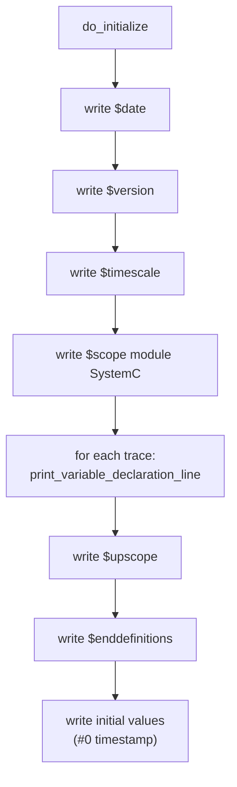
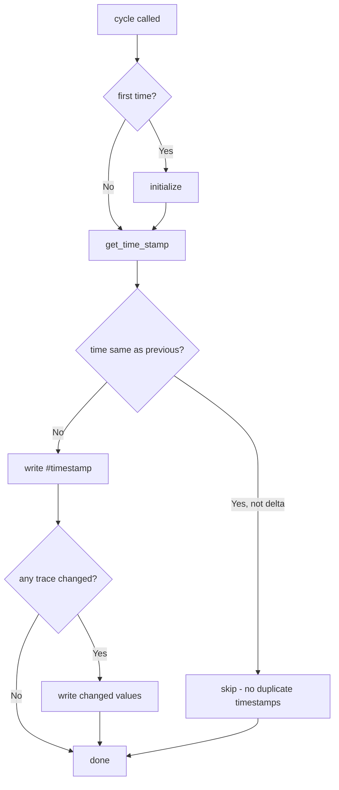

# sc_vcd_trace.h / sc_vcd_trace.cpp - VCD Format Waveform Tracing

> Implements VCD (Value Change Dump) format waveform file output. VCD is the most widely used waveform format, supported by virtually all waveform viewing tools (GTKWave, Verdi, SimVision).

## Everyday Analogy

If the tracing system is a "reporter", the VCD tracer is a reporter who writes records using "shorthand notation". Instead of writing down every player's position every second, they only make a note when "someone moves". This is the essence of the VCD format -- **only recording value changes**, not a complete snapshot at every moment.

Just like shorthand uses its own abbreviation symbols (`!` for one player, `@` for another), VCD also assigns a short code (such as `!`, `"`, `#`) to each traced signal, keeping the file as compact as possible.

## VCD File Format Introduction

A typical VCD file looks like this:

```
$date
   Mar 15, 2026       10:30:00
$end
$version
   SystemC 3.0.0 ...
$end
$timescale
     1 ns
$end
$scope module SystemC $end
$var wire  1  !  clk       $end
$var wire  8  "  data [7:0]  $end
$upscope $end
$enddefinitions  $end

#0
1!
b00000000 "
#10
0!
#20
1!
b11001010 "
```

### Format Key Points

| Section | Description |
|---------|-------------|
| `$date ... $end` | File creation time |
| `$version ... $end` | SystemC version information |
| `$timescale ... $end` | Time unit |
| `$scope` / `$upscope` | Hierarchical scope (corresponds to module structure) |
| `$var` | Variable declaration: type, bit width, code, name |
| `#<time>` | Timestamp |
| `<value><code>` | Value change (1-bit: `1!`, multi-bit: `b11001010 "`) |

## Class Structure

### vcd_trace_file

```cpp
class vcd_trace_file : public sc_trace_file_base
{
public:
    enum vcd_enum { VCD_WIRE=0, VCD_REAL, VCD_EVENT, VCD_TIME, VCD_LAST };

    vcd_trace_file(const char* name);
    ~vcd_trace_file();

    std::vector<vcd_trace*> traces;   // all traced variables
    std::string obtain_name();         // generate next VCD short code

protected:
    void do_initialize();
    void cycle(bool delta_cycle);
    // trace() overloads for all types...

private:
    unsigned vcd_name_index;
    unit_type previous_time_units_low;
    unit_type previous_time_units_high;
};
```

### vcd_trace (Internal Base Class)

Defined in `sc_vcd_trace.cpp`, not visible externally:

```cpp
class vcd_trace
{
public:
    vcd_trace(const std::string& name_, const std::string& vcd_name_);

    virtual void write(FILE* f) = 0;    // write current value
    virtual bool changed() = 0;         // has value changed?
    virtual void set_width();

    void print_variable_declaration_line(FILE* f, const char* scoped_name);
    void print_data_line(FILE* f, const char* rawdata);
    static const char* strip_leading_bits(const char* originalbuf);

    const std::string name;             // original signal name
    const std::string vcd_name;         // short VCD identifier
    vcd_trace_file::vcd_enum vcd_var_type;
    int bit_width;
};
```

### vcd_T_trace\<T\> (Template Subclass)

```cpp
template<class T>
class vcd_T_trace : public vcd_trace
{
    const T& object;    // reference to the traced variable
    T old_value;        // previous value (for change detection)
    // ...
    bool changed() { return object != old_value; }
    void write(FILE* f) { /* format and write current value */ }
};
```

## Core Mechanisms

### 1. VCD Name Generation

`obtain_name()` generates a unique short code for each traced variable. The rule:

```
index 0 -> "!"
index 1 -> "\""
index 2 -> "#"
...
index 93 -> "~"
index 94 -> "!!"
index 95 -> "!\""
...
```

It uses printable ASCII characters (33 `!` to 126 `~`, 94 characters total), similar to base-94 encoding. This keeps VCD files extremely compact -- even when tracing thousands of signals, codes only need 2-3 characters.

### 2. Initialization (do_initialize)



### 3. cycle (Recording at Each Timestep)



**Key logic**: `cycle()` iterates through all `traces`, calling each trace's `changed()` method. Only signals whose values actually changed are written -- this is the core concept of VCD "Value Change Dump".

### 4. Value Formatting

Different types have different output formats:

| VCD Type | Format Example | Description |
|----------|---------------|-------------|
| `VCD_WIRE` (1-bit) | `1!` or `0!` | Value directly followed by code |
| `VCD_WIRE` (multi-bit) | `b11001010 "` | `b` prefix + binary value + space + code |
| `VCD_REAL` | `r3.14 #` | `r` prefix + float value + space + code |
| `VCD_EVENT` | `1!` then `0!` next time | Output 1 on event trigger, automatically reset to 0 at next timestep |
| `VCD_TIME` | `r<value> #` | Time value recorded as real type |

### 5. Name Sanitization

VCD format does not allow `[` and `]` characters in signal names (these have special meaning in VCD, used to indicate bit ranges). `remove_vcd_name_problems()` replaces `[` with `(` and `]` with `)` in names.

### 6. strip_leading_bits

When outputting multi-bit values, redundant leading bits are stripped:

```
b000z100  -> b0z100
b00000xxx -> b0xxx
b000      -> b0
bzzzzz1   -> bz1
b00001    -> b1
```

This is done to compress VCD file size.

## Public API Functions

```cpp
// Create VCD trace file (adds .vcd extension)
sc_trace_file* sc_create_vcd_trace_file(const char* name);

// Close and flush VCD trace file
void sc_close_vcd_trace_file(sc_trace_file* tf);
```

These two functions are defined at the bottom of `sc_vcd_trace.cpp` and are the only entry points for users to create and close VCD trace files.

## Delta Cycle Tracing

The VCD format itself has no concept of delta cycles (it only has "time"). SystemC uses a clever workaround: each delta cycle is treated as "1 additional time unit".

For example, if 3 delta cycles occur at time 10ns:
```
#10
1!
#11
0!
#12
1!
```

This is not actual time advancement, but rather "pseudo timesteps". When enabled, the `SC_ID_TRACING_VCD_DELTA_CYCLE_` info message is emitted.

## VCD Type Enum

```cpp
enum vcd_enum { VCD_WIRE=0, VCD_REAL, VCD_EVENT, VCD_TIME, VCD_LAST };
```

| Enum Value | VCD Keyword | Purpose |
|------------|-------------|---------|
| `VCD_WIRE` | `wire` | Digital signals (bool, logic, integer) |
| `VCD_REAL` | `real` | Floating-point numbers (float, double, sc_fxval) |
| `VCD_EVENT` | `event` | SystemC events |
| `VCD_TIME` | `time` | Time values |

## RTL Background

The VCD format was originally the standard output format for Verilog simulators, defined in IEEE 1364 (Verilog standard). It was designed to record signal changes in digital circuits. SystemC borrows this format so that hardware engineers can use familiar tools (such as GTKWave) to view SystemC simulation results.

The `wire` type in VCD corresponds to Verilog's `wire`/`reg`, and `real` corresponds to Verilog's `real`. `event` and `time` are less commonly used Verilog data types.

## Related Files

- [sc_trace.md](sc_trace.md) -- Grandparent class `sc_trace_file` and global `sc_trace()` functions
- [sc_trace_file_base.md](sc_trace_file_base.md) -- Parent class, provides timescale and callback mechanism
- [sc_wif_trace.md](sc_wif_trace.md) -- Alternative tracing format implementation
- [sc_tracing_ids.md](sc_tracing_ids.md) -- VCD-specific error messages (704, 713)
- `sysc/kernel/sc_ver.h` -- Provides SystemC version string, written to VCD header
