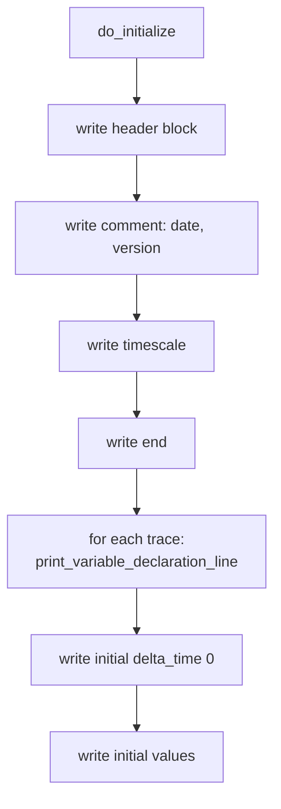
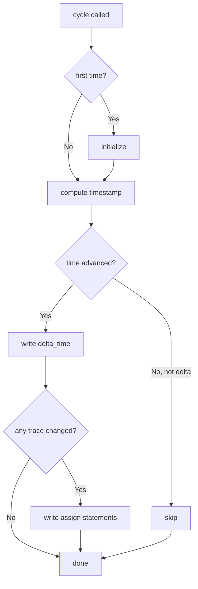

# sc_wif_trace.h / sc_wif_trace.cpp - WIF Format Waveform Tracing

> Implements WIF (Waveform Interchange Format) waveform file output. WIF is a waveform format developed by Synopsys, primarily used with Synopsys VSS (VHDL System Simulator).

## Everyday Analogy

If the VCD reporter uses "shorthand codes", the WIF reporter uses a "formal report format" -- every variable has a complete declaration (`declare`), and every record states "which variable changed to what value at what time". The format is more structured, but the files are also larger.

It's like the same football match: one reporter writes short Twitter posts (VCD), while the other writes a formal match report (WIF) -- same content, different format.

## WIF Format Introduction

SystemC generates ASCII WIF format (`.awif` extension), which can be converted to binary WIF format using Synopsys's `a2wif` tool.

A typical ASCII WIF file looks like this:

```
header
  comment "Generated by SystemC"
  timescale 1 ns
end

declare  sig0   "top.clk"  BIT  variable ;
start_trace sig0 ;
declare  sig1   "top.data"  MVL  0 7 variable ;
start_trace sig1 ;

delta_time 0 ;
assign sig0 '1' ;
assign sig1 "00000000" ;

delta_time 10 ;
assign sig0 '0' ;

delta_time 20 ;
assign sig0 '1' ;
assign sig1 "11001010" ;
```

### Format Key Points

| Section | Description |
|---------|-------------|
| `header ... end` | File metadata (timescale, comments, version) |
| `declare` | Variable declaration: WIF name, original name, type, bit range |
| `start_trace` | Start tracing that variable |
| `delta_time <t>` | Timestamp (relative to previous or absolute time) |
| `assign <name> <value>` | Variable value update |

## Class Structure

### wif_trace_file

```cpp
class wif_trace_file : public sc_trace_file_base
{
public:
    enum wif_enum { WIF_BIT=0, WIF_MVL=1, WIF_REAL=2, WIF_LAST };

    explicit wif_trace_file(const char* name);
    ~wif_trace_file();

    std::vector<wif_trace*> traces;   // all traced variables
    std::string obtain_name();         // generate next WIF variable name

protected:
    void do_initialize();
    void cycle(bool delta_cycle);
    // trace() overloads for all types...

private:
    unsigned wif_name_index;
    unit_type previous_units_low;
    unit_type previous_units_high;
};
```

### wif_trace (Internal Base Class)

Defined in `sc_wif_trace.cpp`:

```cpp
class wif_trace
{
public:
    wif_trace(const std::string& name_, const std::string& wif_name_);

    virtual void write(FILE* f) = 0;
    virtual bool changed() = 0;
    virtual void set_width();
    virtual void print_variable_declaration_line(FILE* f);

    const std::string name;       // original signal name
    const std::string wif_name;   // WIF variable name (e.g., "sig0")
    const char* wif_type;         // "BIT", "MVL", or "real"
    int bit_width;
};
```

### wif_T_trace\<T\> (Template Subclass)

Same template structure as VCD -- holds a const reference to the traced object and the old value, detecting changes through comparison.

## Differences Between WIF and VCD

```mermaid
flowchart LR
    subgraph VCD
        direction TB
        V1["Code system: ! \" # ..."]
        V2["Value format: 1! or b1010 \""]
        V3["Timestamp: #100"]
        V4["Extension: .vcd"]
        V5["Open standard"]
    end
    subgraph WIF
        direction TB
        W1["Naming system: sig0, sig1 ..."]
        W2["Value format: assign sig0 '1'"]
        W3["Timestamp: delta_time 100"]
        W4["Extension: .awif"]
        W5["Synopsys proprietary"]
    end
```

| Feature | VCD | WIF |
|---------|-----|-----|
| Variable codes | Short ASCII codes (`!`, `"`, `#`) | Semantic names (`sig0`, `sig1`) |
| Value format | Compact (`1!`) | Explicit (`assign sig0 '1'`) |
| Readability | Lower | Higher |
| File size | Smaller | Larger |
| Tool support | Almost all waveform tools | Primarily Synopsys tools |
| Event tracing | Supported | Not supported (emits warning) |
| Time value tracing | Supported | Not supported (emits warning) |

## Core Mechanisms

### 1. WIF Name Generation

`obtain_name()` generates names in the format `"sig0"`, `"sig1"`, `"sig2"`, ... -- more intuitive than VCD's ASCII codes, but also takes more space.

### 2. Initialization (do_initialize)



WIF variable declarations are more detailed than VCD:

```
declare  sig0   "top.clk"  BIT  variable ;
start_trace sig0 ;
```

Including: WIF name, original hierarchical name (quoted), data type, and bit range (if applicable).

### 3. cycle (Recording at Each Timestep)

The logic is the same as VCD, but with different output format:



### 4. Value Formatting

| WIF Type | Format Example | Description |
|----------|---------------|-------------|
| `WIF_BIT` | `assign sig0 '1' ;` | 0/1 enclosed in single quotes |
| `WIF_MVL` (1-bit) | `assign sig0 '1' ;` | Same as BIT, but supports 0/1/Z/X |
| `WIF_MVL` (multi-bit) | `assign sig1 "11001010" ;` | Binary string enclosed in double quotes |
| `WIF_REAL` | `assign sig2  3.14 ;` | Floating-point value output directly |

### 5. Unsupported Trace Types

WIF format does not support tracing of `sc_event` and `sc_time`. Attempting to trace these types emits a `SC_ID_TRACING_OBJECT_IGNORED_` warning and silently skips:

```cpp
void wif_trace_file::trace(const sc_event&, const std::string& name) {
    SC_REPORT_WARNING(SC_ID_TRACING_OBJECT_IGNORED_,
                      "sc_event tracing not supported by WIF format");
}
```

## WIF Type Enum

```cpp
enum wif_enum { WIF_BIT=0, WIF_MVL=1, WIF_REAL=2, WIF_LAST };
```

| Enum Value | WIF Keyword | Purpose |
|------------|-------------|---------|
| `WIF_BIT` | `BIT` | Pure binary signals (bool) |
| `WIF_MVL` | `MVL` | Multi-valued logic signals (0, 1, Z, X) -- corresponds to `sc_logic` |
| `WIF_REAL` | `real` | Floating-point numbers |

### BIT vs MVL

- `BIT`: Only has values 0 and 1, used for `bool` type
- `MVL` (Multi-Valued Logic): Has four values 0, 1, Z (high-impedance), X (unknown), used for `sc_logic` and integer types

This reflects four-state logic in digital circuits -- real hardware signals have more than just 0 and 1; there is also "no driver" (Z) and "conflict/undetermined" (X).

## Public API Functions

```cpp
// Create WIF trace file (adds .awif extension)
sc_trace_file* sc_create_wif_trace_file(const char* name);

// Close and flush WIF trace file
void sc_close_wif_trace_file(sc_trace_file* tf);
```

Note the extension is `.awif` (ASCII WIF), not `.wif`.

## RTL Background

The WIF format originated from Synopsys's VHDL simulator VSS. In early EDA tool chains, different companies had different waveform formats:

- **VCD**: Verilog camp (Cadence's Verilog-XL)
- **WIF**: VHDL camp (Synopsys's VSS)
- **FSDB**: Synopsys's Verdi (proprietary high-efficiency format)

Today, VCD has become mainstream because it is an open standard, and WIF usage has significantly declined. SystemC retains WIF support primarily for backward compatibility.

## Design Decisions

### Why Generate ASCII WIF Instead of Binary WIF?

The source code explicitly states: ASCII format can be generated by anyone without requiring a Synopsys license. Users who need binary format can convert using the `a2wif` tool. This reduces SystemC's dependency on commercial tools.

### Why Is wif_trace_file's Constructor Explicit?

To prevent implicit conversion from `const char*`. Although the VCD version is not marked `explicit` (likely an oversight), the WIF version follows better C++ practice.

## Related Files

- [sc_trace.md](sc_trace.md) -- Grandparent class `sc_trace_file` and global API
- [sc_trace_file_base.md](sc_trace_file_base.md) -- Parent class, provides shared infrastructure
- [sc_vcd_trace.md](sc_vcd_trace.md) -- Alternative tracing format implementation (more commonly used)
- [sc_tracing_ids.md](sc_tracing_ids.md) -- Error message IDs
