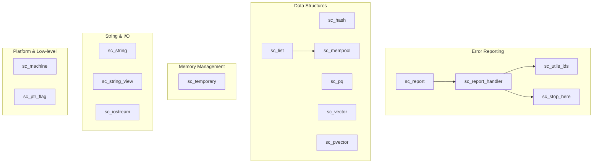

# SystemC Utils - Utility Library

## Overview

The `sysc/utils/` directory contains various foundational utility classes and functions required by the SystemC simulator. These utilities are like the plumbing and electrical wiring of a building -- users rarely interact with them directly, but the entire building depends on them to operate.

## Submodule Categories

### Error Reporting
The simulator's "alert system" at runtime, responsible for collecting, categorizing, and handling various messages and errors.

| File | Description |
|------|-------------|
| [sc_report.md](sc_report.md) | Error report object -- represents a single report message |
| [sc_report_handler.md](sc_report_handler.md) | Error report handler -- decides how to process reports |
| [sc_utils_ids.md](sc_utils_ids.md) | Report ID definitions -- numeric IDs and text for all error messages |
| [sc_stop_here.md](sc_stop_here.md) | Debug helper functions -- provides locations for setting breakpoints |

### Data Structures
Various containers and data structures used internally by the simulator.

| File | Description |
|------|-------------|
| [sc_hash.md](sc_hash.md) | Chained hash table -- efficient lookup with MTF strategy |
| [sc_list.md](sc_list.md) | Doubly linked list -- a simple doubly linked list implementation |
| [sc_pq.md](sc_pq.md) | Priority queue -- binary heap for event scheduling |
| [sc_vector.md](sc_vector.md) | Named object vector -- IEEE 1666 standard `sc_vector` |
| [sc_pvector.md](sc_pvector.md) | Pointer vector -- legacy internal pointer vector |

### Memory Management
Efficient memory management for small objects.

| File | Description |
|------|-------------|
| [sc_mempool.md](sc_mempool.md) | Memory pool -- fast allocation and deallocation for small objects |
| [sc_temporary.md](sc_temporary.md) | Temporary value pool -- fixed-size circular temporary object pool |

### String & I/O
String handling and input/output helper utilities.

| File | Description |
|------|-------------|
| [sc_string.md](sc_string.md) | String utilities -- number representation enum and I/O helpers |
| [sc_string_view.md](sc_string_view.md) | String view -- non-owning constant string reference |
| [sc_iostream.md](sc_iostream.md) | I/O stream header -- portable iostream wrapper |

### Platform & Low-level
Platform detection, bit manipulation, and other low-level utilities.

| File | Description |
|------|-------------|
| [sc_machine.md](sc_machine.md) | Machine environment detection -- endianness and data size detection |
| [sc_ptr_flag.md](sc_ptr_flag.md) | Pointer flag -- stores a boolean flag in the least significant bit of a pointer |

## Module Relationship Diagram

## Design Philosophy

These utility classes share several common design traits:

1. **Self-contained**: When SystemC was first developed, the C++ standard library was not yet mature, so many containers (such as `sc_list`, `sc_pvector`, `sc_hash`) were implemented from scratch.
2. **Performance-first**: `sc_mempool` provides fast allocation for small objects, avoiding frequent calls to the system `malloc`.
3. **Portability**: `sc_machine.h` and `sc_iostream.h` encapsulate platform differences.
4. **Backward compatibility**: Many legacy APIs (such as integer ID reporting) are still preserved but marked as deprecated.
