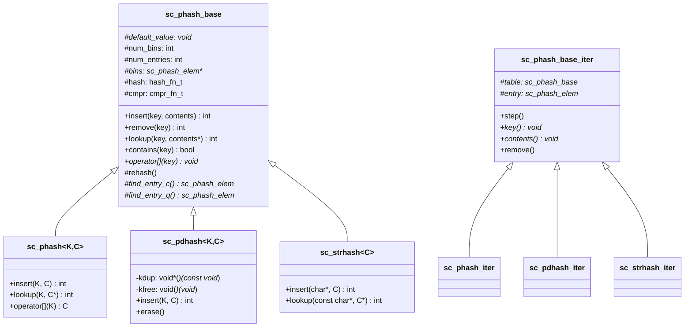

# sc_hash - Chained Hash Table

## Overview

`sc_hash` implements a chained hash table with an MTF (Move-To-Front) optimization strategy. This is an efficient lookup data structure used internally by SystemC for scenarios in the simulator core that require fast key-value lookups.

**Source files**: `sysc/utils/sc_hash.h` + `sc_hash.cpp`

## Analogy

Imagine a large library's index card system:

- The **hash function** is like a rule that says "sort by the first letter of the book title", assigning books to different drawers
- **Chaining** means the cards in each drawer are linked together with a chain
- The **MTF strategy** is like "put the most recently looked-up card at the front" -- if you looked up a book yesterday, finding it again today will be faster

## Core Configuration Constants

```cpp
const int    PHASH_DEFAULT_MAX_DENSITY     = 5;    // max 5 elements per bucket
const int    PHASH_DEFAULT_INIT_TABLE_SIZE = 11;   // initial bucket count (prime)
const double PHASH_DEFAULT_GROW_FACTOR;            // expansion factor
const bool   PHASH_DEFAULT_REORDER_FLAG    = true; // MTF enabled by default
```

## Class Hierarchy



## sc_phash_base -- Base Class

### Constructor

```cpp
sc_phash_base(
    void* def       = 0,                            // default value
    int   size      = PHASH_DEFAULT_INIT_TABLE_SIZE, // initial bucket count
    int   density   = PHASH_DEFAULT_MAX_DENSITY,     // max density
    double grow     = PHASH_DEFAULT_GROW_FACTOR,     // expansion factor
    bool   reorder  = PHASH_DEFAULT_REORDER_FLAG,    // whether to enable MTF
    hash_fn_t hash_fn = default_ptr_hash_fn,         // hash function
    cmpr_fn_t cmpr_fn = 0                            // comparison function
);
```

### Lookup Strategies

There are two lookup methods:
- `find_entry_q()`: Quick comparison -- uses pointer equality (when `cmpr == 0`)
- `find_entry_c()`: Custom comparison -- uses a user-provided comparison function

### Automatic Expansion (Rehash)

When `num_entries / num_bins > max_density`, `rehash()` is triggered, multiplying the bucket count by `grow_factor` and redistributing all elements.

### Main Operations

| Method | Description |
|--------|-------------|
| `insert(key, contents)` | Insert a key-value pair; overwrites if key already exists |
| `insert_if_not_exists(key, contents)` | Insert only if the key does not exist |
| `remove(key)` | Remove the specified key |
| `remove_by_contents(contents)` | Remove by content value |
| `lookup(key, contents*)` | Look up the value for a key |
| `contains(key)` | Check whether a key exists |
| `operator[](key)` | Get the value for a key |

## sc_phash -- Type-safe Hash Table

The template class `sc_phash<K, C>` wraps `sc_phash_base`, providing a type-safe interface. All pointer casts are done within the template methods.

## sc_pdhash -- Hash Table with Memory Management

`sc_pdhash<K, C>` additionally provides key duplication (`kdup`) and deallocation (`kfree`) functions, suitable for scenarios where the hash table needs to own the keys. All keys are automatically freed upon destruction.

## sc_strhash -- String-keyed Hash Table

`sc_strhash<C>` is specialized for string-keyed scenarios, using by default:
- `default_str_hash_fn` as the hash function
- `sc_strhash_cmp` as the comparison function (`strcmp` semantics)
- `sc_strhash_kdup` and `sc_strhash_kfree` for string memory management

## Predefined Hash Functions

```cpp
unsigned default_int_hash_fn(const void*);  // integer hash
unsigned default_ptr_hash_fn(const void*);  // pointer hash
unsigned default_str_hash_fn(const void*);  // string hash
```

## Design Notes

This hash table was designed before C++ standard library's `unordered_map` became widely available. Modern C++ projects typically use `std::unordered_map` directly, but the SystemC core retains this implementation for backward compatibility and internal performance considerations.

## Related Files

- [sc_list.md](sc_list.md) -- Another internal data structure
- [sc_mempool.md](sc_mempool.md) -- Memory pool potentially used by hash table nodes
