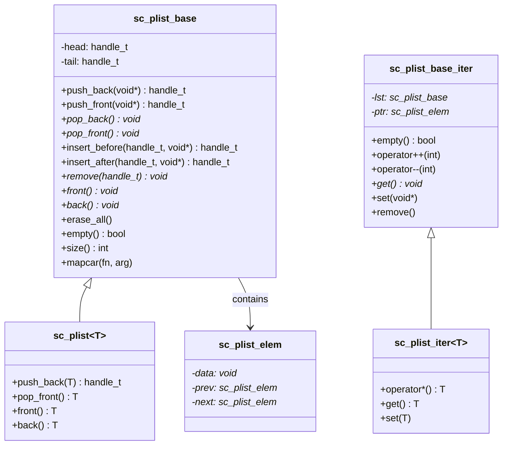

# sc_list - Doubly Linked List

## Overview

`sc_list` provides a simple doubly linked list implementation. It is a container used internally by SystemC, where node memory allocation is performed through `sc_mempool` to improve performance for small object allocation.

**Source files**: `sysc/utils/sc_list.h` + `sc_list.cpp`

## Analogy

Imagine a train of carriages:
- Each carriage (`sc_plist_elem`) carries a piece of cargo (`data`)
- Each carriage has connectors to the one in front and behind (`prev` and `next`)
- You can attach new carriages at the front or back (`push_front` / `push_back`)
- You can also insert new carriages before or after any given carriage (`insert_before` / `insert_after`)
- When a carriage is removed, the carriages on either side automatically reconnect

## Class Structure



## sc_plist_elem -- Node

```cpp
class sc_plist_elem {
    void* data;
    sc_plist_elem* prev;
    sc_plist_elem* next;
};
```

Nodes use `sc_mempool` for memory allocation (overriding `operator new` and `operator delete`), which is particularly efficient for small objects that are frequently created and destroyed.

## sc_plist_base -- Base List

### Main Operations

| Method | Time Complexity | Description |
|--------|----------------|-------------|
| `push_back(d)` | O(1) | Append an element at the tail |
| `push_front(d)` | O(1) | Prepend an element at the head |
| `pop_back()` | O(1) | Remove and return the tail element |
| `pop_front()` | O(1) | Remove and return the head element |
| `insert_before(h, d)` | O(1) | Insert before the specified position |
| `insert_after(h, d)` | O(1) | Insert after the specified position |
| `remove(h)` | O(1) | Remove the element at the specified position |
| `size()` | O(n) | Count the number of elements (requires traversal) |
| `mapcar(fn, arg)` | O(n) | Execute a function on each element |

Note that `size()` is O(n) because the list does not maintain a counter.

### Error Handling

`front()` and `back()` trigger `SC_REPORT_ERROR` when the list is empty:
- `SC_ID_FRONT_ON_EMPTY_LIST_` -- calling `front()` on an empty list
- `SC_ID_BACK_ON_EMPTY_LIST_` -- calling `back()` on an empty list

## sc_plist\<T\> -- Type-safe Wrapper

The template class `sc_plist<T>` inherits from `sc_plist_base`, casting `void*` to the template parameter `T` to provide a type-safe interface.

## sc_plist_iter -- Iterator

The iterator supports bidirectional traversal:
- `operator++(int)` -- advance to the next element
- `operator--(int)` -- move back to the previous element
- `remove()` -- remove the current element and automatically advance
- `remove(direction)` -- remove the current element; `direction=1` advances, otherwise moves back

## Related Files

- [sc_mempool.md](sc_mempool.md) -- Node memory is allocated from here
- [sc_hash.md](sc_hash.md) -- Another internal data structure
- [sc_utils_ids.md](sc_utils_ids.md) -- Defines the message IDs for empty list errors
