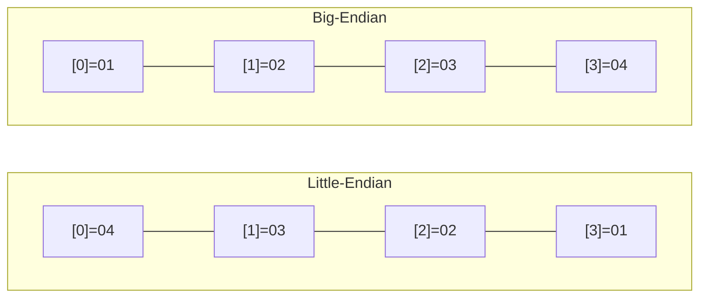

# sc_machine - Machine Environment Detection

## Overview

`sc_machine.h` is responsible for detecting the hardware characteristics of the compilation target platform, primarily including endianness and the size of the `long` data type. This information is used by SystemC's data type modules to correctly perform bit operations.

**Source file**: `sysc/utils/sc_machine.h` (header only)

## Analogy

Imagine you receive an international package:
- **Little-endian**: The address is written as "lane -> road -> district -> city -> country" (smallest unit first)
- **Big-endian**: The address is written as "country -> city -> district -> road -> lane" (largest unit first)

Different CPUs arrange bytes in different orders. If you don't know the other side's "writing direction", the data will be read backwards. `sc_machine.h` is used to determine "this computer's writing direction".

## Endianness Detection

```cpp
#if defined(_MSC_VER) && !defined(__BYTE_ORDER__)
    // MSVC target platforms are all little-endian
    #define SC_LITTLE_ENDIAN
#elif __BYTE_ORDER__ == __ORDER_LITTLE_ENDIAN__
    #define SC_LITTLE_ENDIAN
#elif __BYTE_ORDER__ == __ORDER_BIG_ENDIAN__
    #define SC_BIG_ENDIAN
#else
    #error "Could not detect the endianness of the CPU."
#endif
```

Detection logic:
1. MSVC (Microsoft Visual C++): All supported platforms (x86, x64, ARM, ARM64) are little-endian
2. GCC/Clang: Uses the compiler-predefined `__BYTE_ORDER__` macro
3. Otherwise: Compilation error

### Little-endian vs Big-endian

Using the 32-bit integer `0x01020304` as an example:

| Endianness | Address 0 | Address 1 | Address 2 | Address 3 |
|------------|-----------|-----------|-----------|-----------|
| Little-endian | 04 | 03 | 02 | 01 |
| Big-endian | 01 | 02 | 03 | 04 |



## long Data Type Size Detection

```cpp
#if ULONG_MAX > 0xffffffffUL
    #define SC_LONG_64
#endif
```

If the maximum value of `unsigned long` exceeds the 32-bit range, `SC_LONG_64` is defined. This yields different results on different platforms:

| Platform | sizeof(long) | SC_LONG_64 |
|----------|-------------|------------|
| Linux x86_64 | 8 bytes | Defined |
| Windows x64 (MSVC) | 4 bytes | Not defined |
| macOS ARM64 | 8 bytes | Defined |

This difference is important for SystemC's fixed-point and bit vector types.

## Related Files

- [sc_ptr_flag.md](sc_ptr_flag.md) -- Utilizes pointer alignment properties to store flags
