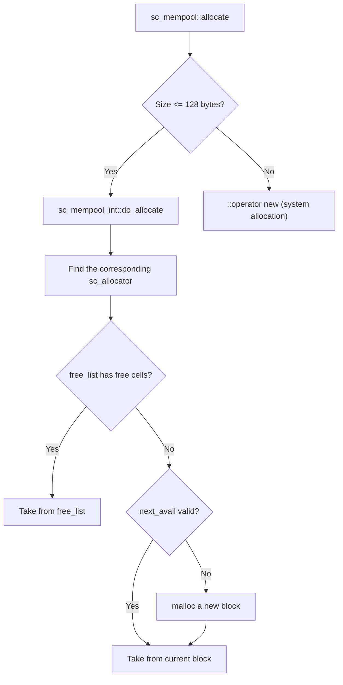

# sc_mempool - Small Object Memory Pool

## Overview

`sc_mempool` provides a memory pool management mechanism designed specifically for small objects. It is faster than calling `malloc/new` directly, and is particularly well-suited for scenarios in the simulator where large numbers of small objects are frequently created and destroyed.

**Source files**: `sysc/utils/sc_mempool.h` + `sc_mempool.cpp`

## Analogy

Imagine a parts organizer at a hardware store:

- Different-sized parts (screws, nuts, washers) are stored in different compartments
- When you need a part of a certain size, you grab it directly from the corresponding compartment (much faster than going to the hardware store to buy one)
- When you are done, you put it back in the corresponding compartment (instead of throwing it away and buying a new one)
- Only when a compartment is empty do you order a whole new box (allocate a new memory block)

`sc_mempool` is such a "parts organizer system": it routes memory requests of different sizes to different allocators, each managing fixed-size memory cells.

## Public Interface

```cpp
class sc_mempool {
public:
    static void* allocate(std::size_t sz);      // allocate memory
    static void  release(void* p, std::size_t sz); // release memory
    static void  display_statistics();           // display statistics
};
```

### sc_mpobject -- Base Class with Automatic Memory Pool Usage

```cpp
class sc_mpobject {
public:
    static void* operator new(std::size_t sz);
    static void  operator delete(void* p, std::size_t sz);
    static void* operator new[](std::size_t sz);
    static void  operator delete[](void* p, std::size_t sz);
};
```

Any class inheriting from `sc_mpobject` will have its `new` and `delete` automatically use the memory pool.

## Internal Architecture



## sc_allocator -- Single-size Allocator

Each `sc_allocator` manages a single fixed-size memory cell:

```cpp
class sc_allocator {
    int block_size;       // size of each block (including link)
    int cell_size;        // size of each cell
    char* block_list;     // linked list of allocated blocks
    link* free_list;      // linked list of free cells
    char* next_avail;     // next available cell in the current block
};
```

Allocation strategy (in order of priority):
1. **free_list**: If there are previously released cells, reuse them directly
2. **next_avail**: If the current block still has space, use the next available cell
3. **New block**: If none of the above, use `malloc` to allocate an entire new block

## Size Mapping Table

```
Size (bytes)     Allocator
───────────────────────
  1 -  8          #1 ( 8 bytes)
  9 - 16          #2 (16 bytes)
 17 - 24          #3 (24 bytes)
 25 - 32          #4 (32 bytes)
 33 - 48          #5 (48 bytes)
 49 - 64          #6 (64 bytes)
 65 - 80          #7 (80 bytes)
 81 - 96          #8 (96 bytes)
 97 - 128         #9 (128 bytes)
```

Requests larger than 128 bytes fall through directly to the system's `::operator new`.

## Environment Variable Control

```
SYSTEMC_MEMPOOL_DONT_USE=1
```

Setting this environment variable completely disables the memory pool, causing all allocations to use the system `::operator new`. This is useful when using memory checking tools like Valgrind or AddressSanitizer.

## Design Considerations

1. **Memory is never freed**: Allocated blocks are not returned to the system until the program exits. This is an intentional design choice because global objects may have destruction order dependencies.
2. **Alignment guarantee**: Relies on `malloc` returning properly aligned memory.
3. **Thread safety**: Not thread-safe (consistent with SystemC's single-threaded model).
4. **Singleton pattern**: `the_mempool` is a global static pointer with lazy initialization.

## Related Files

- [sc_list.md](sc_list.md) -- Linked list nodes are allocated using `sc_mempool`
- [sc_temporary.md](sc_temporary.md) -- Another memory management strategy (circular pool)
