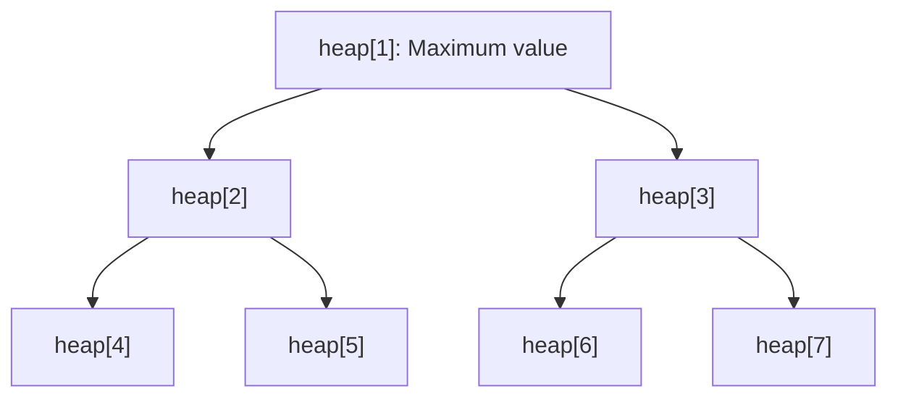

# sc_pq - Priority Queue

## Overview

`sc_pq` implements a priority queue based on a binary heap. It can be used to model multiple clocks -- it always quickly retrieves the "next earliest event to occur".

**Source files**: `sysc/utils/sc_pq.h` + `sc_pq.cpp`

## Analogy

Imagine a hospital emergency room triage system:

- When patients arrive, the triage nurse assigns a severity score
- The most critical patient is always at the front of the queue
- Even if they arrived later, a higher score gets them treated first
- Each time a doctor finishes with a patient, the next most critical one automatically moves to the front

This is a priority queue: regardless of insertion order, `top()` always returns the element with the highest priority.

## Binary Heap Principle

A binary heap is a complete binary tree implemented with an array:



Array index relationships (starting from 1):
- Parent node: `i >> 1` (equivalent to `i / 2`)
- Left child: `i << 1` (equivalent to `i * 2`)
- Right child: `(i << 1) + 1` (equivalent to `i * 2 + 1`)

## sc_ppq_base -- Base Class

```cpp
class sc_ppq_base {
public:
    typedef int (*compare_fn_t)(const void*, const void*);

    sc_ppq_base(int sz, compare_fn_t cmp);
    ~sc_ppq_base();

    void* top() const;         // get the highest-priority element (without removing)
    void* extract_top();       // extract the highest-priority element
    void  insert(void* elem);  // insert a new element
    int   size() const;        // number of elements
    bool  empty() const;       // whether it is empty
};
```

### Comparison Function

```cpp
typedef int (*compare_fn_t)(const void*, const void*);
```

Return value of the comparison function:
- Positive: first argument has higher priority
- Zero: same priority
- Negative: second argument has higher priority

### Automatic Expansion

When the heap is full, `insert()` automatically expands:
```
new_size = old_size + old_size / 2  (1.5x)
```

### Operation Time Complexity

| Operation | Time Complexity |
|-----------|----------------|
| `top()` | O(1) |
| `extract_top()` | O(log n) |
| `insert()` | O(log n) |
| `size()` | O(1) |
| `empty()` | O(1) |

## sc_ppq\<T\> -- Type-safe Template

```cpp
template <class T>
class sc_ppq : public sc_ppq_base {
public:
    sc_ppq(int sz, compare_fn_t cmp);
    T top() const;
    T extract_top();
    void insert(T elem);
};
```

The template version simply adds type casts on top of the base class, requiring no additional storage.

## Application in SystemC

The priority queue is primarily used in the SystemC simulator core for:
- **Event scheduling**: The next event to occur is always at the top of the queue
- **Multi-clock management**: Clocks of different frequencies each generate events, and the priority queue handles the ordering

## Related Files

- [sc_list.md](sc_list.md) -- Another internal data structure
- [sc_hash.md](sc_hash.md) -- Another internal data structure
