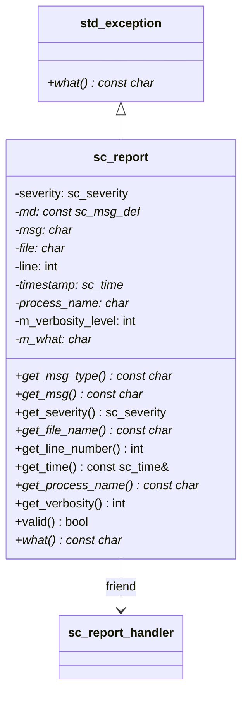

# sc_report - Runtime Error Report Object

## Overview

`sc_report` is the core class of the SystemC error reporting system, representing a report message generated at runtime. It inherits from `std::exception`, so it can be `throw`n and `catch`ed just like a regular C++ exception.

**Source files**: `sysc/utils/sc_report.h` + `sc_report.cpp`

## Analogy

Imagine you work in a large factory. The factory has an "incident reporting system":

- **SC_INFO**: A general notice on the bulletin board -- "Lunch group order today"
- **SC_WARNING**: A yellow warning light turns on -- "A production line temperature is running high, please monitor"
- **SC_ERROR**: A red alert -- "A production line has failed, must stop and address"
- **SC_FATAL**: A full-factory emergency alert -- "Gas leak detected, evacuate immediately"

Each incident report (`sc_report`) records: the severity level, what happened, the file and line number where it occurred, the simulation time at that point, and which process was executing.

## Core Enumerations

### sc_severity -- Severity Level

```cpp
enum sc_severity {
    SC_INFO = 0,        // informational only
    SC_WARNING,         // potential problem warning
    SC_ERROR,           // confirmed error
    SC_FATAL,           // unrecoverable fatal error
    SC_MAX_SEVERITY
};
```

### sc_verbosity -- Verbosity Level

```cpp
enum sc_verbosity {
    SC_NONE = 0,
    SC_LOW = 100,
    SC_MEDIUM = 200,    // default
    SC_HIGH = 300,
    SC_FULL = 400,
    SC_DEBUG = 500
};
```

Verbosity is like the level of detail in a news report: `SC_LOW` only reports the headline, while `SC_DEBUG` includes even the reporter's interview notes. A message is only processed when its verbosity level is <= the system's configured maximum verbosity.

### sc_actions -- Action Flags

```cpp
typedef unsigned sc_actions;
enum {
    SC_UNSPECIFIED  = 0x0000, // look up lower-priority rules
    SC_DO_NOTHING   = 0x0001, // do nothing
    SC_THROW        = 0x0002, // throw exception
    SC_LOG          = 0x0004, // write to log
    SC_DISPLAY      = 0x0008, // display to screen
    SC_CACHE_REPORT = 0x0010, // cache the report
    SC_INTERRUPT    = 0x0020, // call interrupt function
    SC_STOP         = 0x0040, // stop simulation
    SC_ABORT        = 0x0080, // call abort()
};
```

These actions can be combined with bitwise OR, e.g., `SC_LOG | SC_DISPLAY` means "both write to log and display to screen".

Default action mapping:

| Severity | Default Actions |
|----------|----------------|
| SC_INFO | SC_LOG \| SC_DISPLAY |
| SC_WARNING | SC_LOG \| SC_DISPLAY |
| SC_ERROR | SC_LOG \| SC_CACHE_REPORT \| SC_THROW |
| SC_FATAL | SC_LOG \| SC_DISPLAY \| SC_CACHE_REPORT \| SC_ABORT |

## sc_report Class

```cpp
class sc_report : public std::exception {
public:
    const char* get_msg_type() const;      // message type string
    const char* get_msg() const;           // message content
    sc_severity get_severity() const;      // severity level
    const char* get_file_name() const;     // source file name where it occurred
    int get_line_number() const;           // line number
    const sc_time& get_time() const;       // simulation time when it occurred
    const char* get_process_name() const;  // current executing process name
    int get_verbosity() const;             // verbosity level
    bool valid() const;                    // whether it is valid
    virtual const char* what() const noexcept; // std::exception interface
};
```

### Member Data

| Member | Type | Description |
|--------|------|-------------|
| `severity` | `sc_severity` | Severity level |
| `md` | `const sc_msg_def*` | Pointer to message definition structure |
| `msg` | `char*` | Message content (dynamically allocated copy) |
| `file` | `char*` | Source file name |
| `line` | `int` | Line number |
| `timestamp` | `sc_time*` | Simulation timestamp |
| `process_name` | `char*` | Process name |
| `m_verbosity_level` | `int` | Verbosity level |
| `m_what` | `char*` | Composed full message string |

### Memory Management

`sc_report` internally uses the `empty_dup()` function to copy strings. If a null pointer or empty string is passed, a global `empty_str` static variable is returned, avoiding unnecessary memory allocation. During destruction, only non-`empty_str` strings are `delete[]`d.

## Report Macros

```cpp
SC_REPORT_INFO(msg_type, msg)            // informational report
SC_REPORT_INFO_VERB(msg_type, msg, verb) // informational report with verbosity
SC_REPORT_WARNING(msg_type, msg)         // warning report
SC_REPORT_ERROR(msg_type, msg)           // error report
SC_REPORT_FATAL(msg_type, msg)           // fatal error report
```

`SC_REPORT_INFO_VERB` first checks whether the verbosity level is within the allowed range; messages below the threshold are ignored. `__FILE__` and `__LINE__` are automatically filled in.

## sc_assert Macro

```cpp
sc_assert(expr)
```

Similar to the standard `assert()`, but additionally prints the current process name and simulation time. If `NDEBUG` is defined and `SC_ENABLE_ASSERTIONS` is not defined, `sc_assert` compiles to a no-op.

## sc_abort Function

```cpp
[[noreturn]] void sc_abort();
```

Similar to `abort()`, but first generates an `SC_ID_ABORT_` report before terminating the program.

## Backward-compatible API (Deprecated)

The following static methods use integer IDs and belong to the legacy SystemC 2.0 era API, now deprecated:

- `register_id(int, const char*)` -- register an integer ID
- `get_message(int)` -- get the message for an ID
- `is_suppressed(int)` -- query whether an ID is suppressed
- `suppress_id(int, bool)` -- suppress a specific ID
- `suppress_infos(bool)` / `suppress_warnings(bool)` -- globally suppress info/warnings

These methods all internally call `sc_deprecated_report_ids()` to print a deprecation warning.

## Class Relationship Diagram



## Related Files

- [sc_report_handler.md](sc_report_handler.md) -- Report handler that decides how reports are processed
- [sc_utils_ids.md](sc_utils_ids.md) -- Predefined report IDs
- [sc_stop_here.md](sc_stop_here.md) -- Debug breakpoint/stop functions
