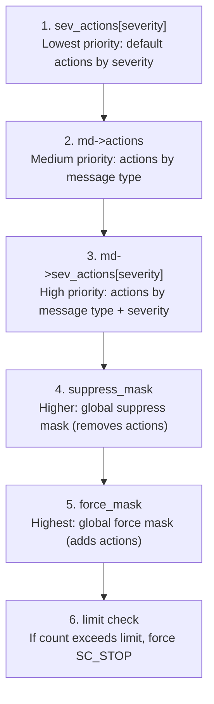

# sc_report_handler - Error Report Handler

## Overview

`sc_report_handler` is the "central command center" of the SystemC reporting system, responsible for receiving all reports, determining what actions to take for each report (display, log, throw exception, abort, etc.), and managing message type definitions, counters, log files, and more.

**Source files**: `sysc/utils/sc_report_handler.h` + `sc_report_handler.cpp`

## Analogy

Imagine a city's 911 emergency dispatch center:

- All incoming calls (`report()`) go here first
- The dispatch center has a "standard operating procedure" (`sev_actions`) that decides how many trucks to send based on incident severity
- There is also a "special address handbook" (`sc_msg_def` linked list) where certain specific addresses may have special handling rules
- The dispatch center can set "maximum N dispatches per event type" (`stop_after`); once exceeded, the simulation stops
- It can also globally suppress certain actions (`suppress`) or force certain actions (`force`)

## sc_msg_def Structure

```cpp
struct sc_msg_def {
    const char*  msg_type;                    // message type string
    sc_actions   actions;                     // actions for this type
    sc_actions   sev_actions[SC_MAX_SEVERITY]; // actions per severity level
    unsigned     limit;                       // count limit
    unsigned     sev_limit[SC_MAX_SEVERITY];  // count limit per severity level
    unsigned     limit_mask;                  // bitmask indicating which limits are active
    unsigned     call_count;                  // call count
    unsigned     sev_call_count[SC_MAX_SEVERITY]; // call count per severity level
    char*        msg_type_data;               // storage for the message type string
    int          id;                          // backward-compatible integer ID
};
```

Each `sc_msg_def` is like an "incident handling card", recording how this type of event should be handled, how many times it has occurred, and how many times it is allowed.

## sc_report_handler Class

### Report Methods

```cpp
// Primary report interface
static void report(sc_severity, const char* msg_type,
                   const char* msg, const char* file, int line);

// Report interface with verbosity
static void report(sc_severity, const char* msg_type,
                   const char* msg, int verbosity,
                   const char* file, int line);
```

### Action Configuration

```cpp
// Set actions by severity
static sc_actions set_actions(sc_severity, sc_actions = SC_UNSPECIFIED);

// Set actions by message type
static sc_actions set_actions(const char* msg_type, sc_actions = SC_UNSPECIFIED);

// Set actions by message type + severity (highest priority)
static sc_actions set_actions(const char* msg_type, sc_severity, sc_actions = SC_UNSPECIFIED);
```

### Count Limits

```cpp
static int stop_after(sc_severity, int limit = -1);
static int stop_after(const char* msg_type, int limit = -1);
static int stop_after(const char* msg_type, sc_severity, int limit = -1);
```

`limit = -1` means the limit is disabled, and `limit = 0` also means disabled (will not trigger a stop).

### Global Masks

```cpp
static sc_actions suppress(sc_actions);  // globally suppress certain actions
static sc_actions force(sc_actions);     // globally force certain actions
```

## Action Priority Mechanism

This is one of the most important designs in `sc_report_handler`. When determining the final actions, the following priority levels are checked from lowest to highest:



If a layer's value is `SC_UNSPECIFIED`, the lookup falls through to the next layer.

## Default Handler

```cpp
static void default_handler(const sc_report& rep, const sc_actions& actions);
```

The default handler executes actions in order based on the action flags:
1. `SC_DISPLAY`: Output to `std::cout`
2. `SC_LOG`: Write to log file
3. `SC_STOP`: Call `sc_stop_here()` then `sc_stop()`
4. `SC_INTERRUPT`: Call `sc_interrupt_here()`
5. `SC_ABORT`: Call `sc_abort()`
6. `SC_THROW`: Throw `sc_report` exception

Users can replace the handler with a custom one via `set_handler()`.

## Message Definition Management

### Static Registration

```cpp
struct msg_def_items {
    sc_msg_def*     md;        // message definition array
    int             count;     // number of items in the array
    bool            allocated; // whether dynamically allocated
    msg_def_items*  next;      // next in the linked list
};

static void add_static_msg_types(msg_def_items*);
```

Message definitions are managed as a linked list. Each module (kernel, communication, datatypes, etc.) registers its own message definitions via `add_static_msg_types()` during program initialization.

### Dynamic Addition

```cpp
static sc_msg_def* add_msg_type(const char* msg_type);
```

If a message type referenced by `set_actions()` or `stop_after()` is not yet registered, `add_msg_type()` is automatically called to create a new definition.

## Log File

```cpp
static bool set_log_file_name(const char* filename);
static const char* get_log_file_name();
```

The log file is managed by the internal class `sc_log_file_handle`, implemented using `std::ofstream`. Whenever a report with the `SC_LOG` action is generated, it is automatically written to the log.

## Initialization and Cleanup

```cpp
static void initialize(); // reset counters
static void release();    // release all dynamically allocated message definitions
```

`initialize()` checks the environment variable `SC_DEPRECATION_WARNINGS`; if set to `"DISABLE"`, deprecation warnings are turned off.

## Message Composition

```cpp
const std::string sc_report_compose_message(const sc_report& rep);
```

This function combines the various fields of an `sc_report` into a human-readable string, formatted as:
```
Error: (E3) msg_type: message
In file: filename.cpp:42
In process: top.module.process @ 100 ns
```

## Static Variables Overview

| Variable | Description |
|----------|-------------|
| `suppress_mask` | Global suppress mask |
| `force_mask` | Global force mask |
| `sev_actions[]` | Default actions per severity level |
| `sev_limit[]` | Count limit per severity level |
| `sev_call_count[]` | Cumulative count per severity level |
| `last_global_report` | Cache of the last global report |
| `available_actions` | Action bits that have been used |
| `handler` | Current handler function pointer |
| `log_file_name` | Log file name |
| `verbosity_level` | Verbosity threshold |
| `messages` | Head of the message definition linked list |
| `catch_actions` | Default actions when catching exceptions |

## Related Files

- [sc_report.md](sc_report.md) -- Report object
- [sc_utils_ids.md](sc_utils_ids.md) -- Report ID definitions
- [sc_stop_here.md](sc_stop_here.md) -- Debug breakpoint functions
