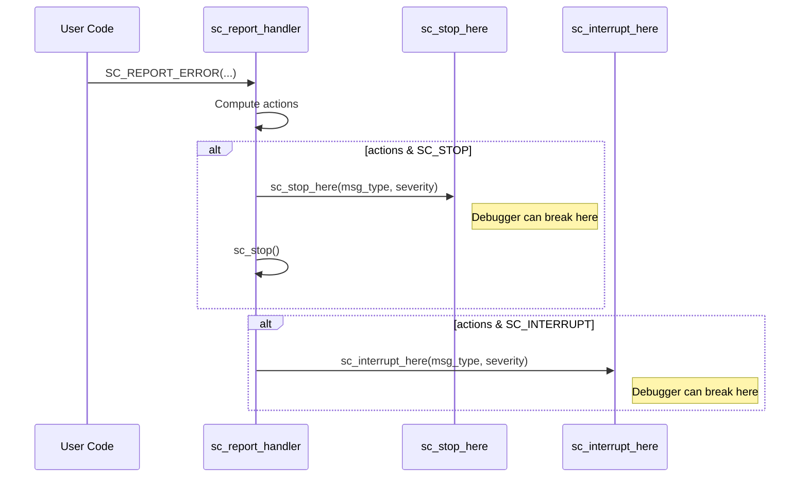

# sc_stop_here - Debug Helper Functions

## Overview

`sc_stop_here` provides two functions designed specifically for debugging: `sc_stop_here()` and `sc_interrupt_here()`. These functions do almost nothing by themselves; their sole purpose is to give developers a well-known location to set breakpoints in debuggers like GDB.

**Source files**: `sysc/utils/sc_stop_here.h` + `sc_stop_here.cpp`

## Analogy

Imagine a "rest stop" on a highway. The rest stop itself doesn't provide much, but it gives you a well-defined place to pull over, catch your breath, and check your car's condition. `sc_stop_here()` is a "rest stop" inside the simulator -- when an error occurs, you can stop here and use the debugger to inspect the program's state.

## Function Interface

```cpp
void sc_interrupt_here(const char* id, sc_severity severity);
void sc_stop_here(const char* id, sc_severity severity);
```

Neither function can be inlined -- this is intentional. If they were inlined, you would not be able to set a breakpoint at a fixed address.

## Implementation Details

```cpp
static const char* info_id    = 0;
static const char* warning_id = 0;
static const char* error_id   = 0;
static const char* fatal_id   = 0;

void sc_interrupt_here(const char* id, sc_severity severity) {
    switch(severity) {
      case SC_INFO:    info_id = id;    break;
      case SC_WARNING: warning_id = id; break;
      case SC_ERROR:   error_id = id;   break;
      default:
      case SC_FATAL:   fatal_id = id;   break;
    }
}
```

Each function internally just stores the `id` into the corresponding static variable. The debugger usage pattern:

1. Set a breakpoint on `sc_stop_here` or `sc_interrupt_here`
2. When the breakpoint triggers, inspect the `id` and `severity` parameters
3. You can also set breakpoints on specific `case` branches, e.g., break only on `SC_ERROR`

## Relationship with the Reporting System



- `SC_STOP` action: calls `sc_stop_here()` first, then calls `sc_stop()` to stop the simulation
- `SC_INTERRUPT` action: only calls `sc_interrupt_here()`, does not stop the simulation

## Usage

In GDB:
```
(gdb) break sc_core::sc_stop_here
(gdb) break sc_core::sc_interrupt_here
```

Or more precisely, break only at a specific severity level:
```
(gdb) break sc_stop_here.cpp:42   # corresponds to the SC_ERROR case
```

## Related Files

- [sc_report_handler.md](sc_report_handler.md) -- Calls these functions in `default_handler()`
- [sc_report.md](sc_report.md) -- Report object
