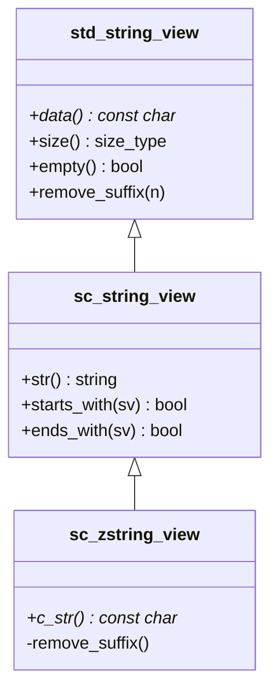

# sc_string_view - String View

## Overview

`sc_string_view` and `sc_zstring_view` are non-owning constant string reference classes provided by SystemC, similar to C++17's `std::string_view`. They allow functions to accept various string types (`const char*`, `std::string`, `std::string_view`) without copying.

**Source file**: `sysc/utils/sc_string_view.h` (header only)

## Analogy

Imagine you are looking up a book in a library:
- **std::string** is like photocopying the entire book and taking it home -- you own your own copy
- **sc_string_view** is like browsing the book in the library -- you are just "looking" without owning the book
- **sc_zstring_view** is like browsing a book that you know always ends with a period -- guaranteed to be null-terminated

The benefit of using string views is avoiding unnecessary memory allocation and copying, especially when you only need to "glance at" a string without modifying it.

## sc_string_view Class

```cpp
class sc_string_view : public std::string_view {
public:
    using base_type::base_type; // inherit all constructors

    // Construct from a convertible type
    template<typename T>
    sc_string_view(const T& s);

    // Create an explicit string copy
    std::string str() const;

    // starts_with / ends_with support before C++20
    bool starts_with(base_type sv) const;
    bool starts_with(char c) const;
    bool starts_with(const char* s) const;

    bool ends_with(base_type sv) const;
    bool ends_with(char c) const;
    bool ends_with(const char* s) const;
};
```

### Why Not Use std::string_view Directly?

1. **Cross-version compatibility**: SystemC needs to support C++17 and earlier compilers
2. **C++20 feature backport**: Provides `starts_with()` and `ends_with()` before C++20
3. **Unified conversion interface**: The template constructor ensures implicit conversion from various string types

## sc_zstring_view Class

```cpp
class sc_zstring_view : public sc_string_view {
public:
    sc_zstring_view();                   // defaults to empty string ""
    sc_zstring_view(const char* s);      // null pointer is converted to ""
    sc_zstring_view(const std::string& s);

    const char* c_str() const;           // guaranteed to return a null-terminated string

private:
    using sc_string_view::remove_suffix; // hide method that would break the null-terminated invariant
};
```

### Invariant Guarantee

`sc_zstring_view` guarantees that the underlying string always ends with a null character (`\0`):

- Null pointers are converted to the empty string `""`
- `remove_suffix` is made `private`, because removing a suffix could break the null-terminated guarantee
- `c_str()` can be safely used wherever a C-style string is needed



## Use Cases

`sc_string_view` is primarily used in SystemC for:
- Function parameters: accepting various string types without copying
- Name comparison: fast comparison of object names
- String queries: `starts_with` / `ends_with` for hierarchical name resolution

## Related Files

- [sc_string.md](sc_string.md) -- Number representation enum and I/O helpers
- [sc_iostream.md](sc_iostream.md) -- I/O stream header wrapper
