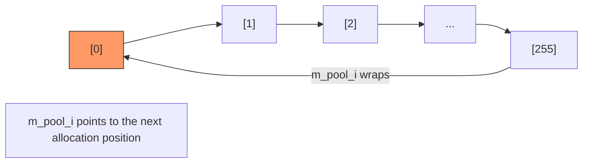

# sc_temporary - Temporary Value Pool

## Overview

`sc_vpool` is a template class that manages a fixed-size pool of temporary objects. Objects are allocated in a circular fashion: after going through the entire pool, it automatically wraps around and starts overwriting from the beginning. This is suitable for scenarios that require large numbers of short-lived temporary objects.

**Source file**: `sysc/utils/sc_temporary.h` (header only)

## Analogy

Imagine a conveyor belt at a sushi restaurant:

- The belt has a fixed number of plates (e.g., 256)
- The chef continuously places new sushi on the plates (`allocate`)
- After the last plate, it starts over from the first one (circular overwrite)
- You must eat the sushi before the belt completes a full rotation, otherwise it will be overwritten by new sushi

This is how `sc_vpool` works: it assumes each temporary value has a very short lifetime and will no longer be needed before the pool completes one full cycle.

## Class Interface

```cpp
template<class T>
class sc_vpool {
protected:
    std::size_t m_pool_i;   // index of the next allocation
    T*          m_pool_p;   // object array
    std::size_t m_wrap;     // circular mask

public:
    sc_vpool(int log2, T* pool_p = 0);
    ~sc_vpool();
    T* allocate();     // allocate the next temporary object
    void reset();      // reset index to the beginning
    std::size_t size(); // return pool size
};
```

## Key Design

### Power-of-two Size

The pool size must be a power of two (determined by the `log2` parameter):

```cpp
sc_vpool(int log2, T* pool_p = 0)
  : m_pool_i(0)
  , m_pool_p(pool_p ? pool_p : new T[1 << log2])
  , m_wrap(~(static_cast<std::size_t>(-1) << log2))
{}
```

For example, `log2 = 8` creates a pool of 256 elements, with `m_wrap = 0xFF`.

### Circular Allocation

```cpp
T* allocate() {
    T* result_p = &m_pool_p[m_pool_i];
    m_pool_i = (m_pool_i + 1) & m_wrap;  // bitwise AND for circular wrapping
    return result_p;
}
```

Using bitwise AND (`& m_wrap`) instead of modulo (`% size`), because bitwise operations are much faster than division. This is why the size must be a power of two.



### No Reclamation

Note that `sc_vpool` has no `release()` or `free()` method. Objects are never "returned"; they are simply overwritten by new allocations. This is an intentional design choice because temporary values are assumed to have very short lifetimes.

### Destructor Pitfall

```cpp
~sc_vpool() {
    // delete [] m_pool_p;  // commented out!
}
```

The destructor does not free the memory. This is because `sc_vpool` is typically used as a global static object, and the destruction order of global objects is unpredictable -- other global objects may still be using temporary values in the pool.

## Use Cases

In SystemC, `sc_vpool` is mainly used for:
- Temporary computation results of data types (e.g., intermediate values in `sc_int`, `sc_bv` operations)
- Temporary buffers for string formatting
- Anywhere that requires large numbers of short-lived temporary objects

## Related Files

- [sc_mempool.md](sc_mempool.md) -- Another memory management mechanism (for objects of different sizes)
