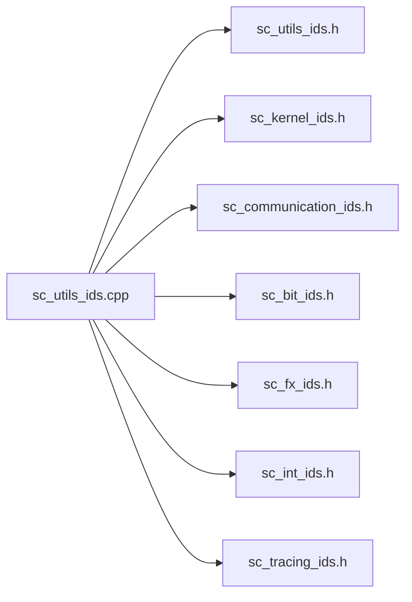

# sc_utils_ids - Report Message ID Definitions

## Overview

`sc_utils_ids` defines the report message IDs for the SystemC utils module as well as all other modules. It is the "message dictionary" for the entire error reporting system -- every possible error or warning is registered here with a unique string ID and descriptive text.

**Source files**: `sysc/utils/sc_utils_ids.h` + `sc_utils_ids.cpp`

## Analogy

Imagine a hospital's "disease code table" (ICD codes). Every disease has a unique code and description, so that any doctor who sees the code knows what the problem is. `sc_utils_ids` is SystemC's "error code table".

## SC_DEFINE_MESSAGE Macro

This is the core macro for defining message IDs, and it has a dual identity:

### In .h files (declaration mode)

```cpp
#define SC_DEFINE_MESSAGE(id, unused1, unused2) \
    namespace sc_core { extern SC_API const char id[]; }
```

In header files, the macro only declares an external string constant. The second and third parameters (integer ID and text description) are ignored here.

### In .cpp files (definition mode)

```cpp
#define SC_DEFINE_MESSAGE(id, unused, text) \
    extern SC_API const char id[] = text;
```

In the implementation file, the macro assigns the text description string to the constant.

This technique of "same macro, different definitions" is called an **X-Macro**, allowing the same list to generate different code in different contexts.

## Message IDs Defined by the Utils Module

| ID Constant | Integer ID | Text Description |
|-------------|-----------|------------------|
| `SC_ID_STRING_TOO_LONG_` | 801 | "string is too long" |
| `SC_ID_FRONT_ON_EMPTY_LIST_` | 802 | "attempt to take front() on an empty list" |
| `SC_ID_BACK_ON_EMPTY_LIST_` | 803 | "attempt to take back() on an empty list" |
| `SC_ID_IEEE_1666_DEPRECATION_` | 804 | "/IEEE_Std_1666/deprecated" |
| `SC_ID_VECTOR_INIT_CALLED_TWICE_` | 805 | "sc_vector::init called for non-empty vector" |
| `SC_ID_VECTOR_BIND_EMPTY_` | 807 | "sc_vector::bind called with empty range" |
| `SC_ID_VECTOR_NONOBJECT_ELEMENTS_` | 808 | "sc_vector::get_elements called for element type not derived from sc_object" |
| `SC_ID_VECTOR_EMPLACE_LOCKED_` | 809 | "attempt to insert into locked sc_vector" |

Among these, `SC_ID_IEEE_1666_DEPRECATION_` is particularly commonly used -- all deprecated feature warnings use this ID.

## Initialization Mechanism

The `.cpp` file's initialization process is quite ingenious:

```cpp
// First include: define string constants
#define SC_DEFINE_MESSAGE(id, unused, text) \
    extern SC_API const char id[] = text;
#include "sysc/utils/sc_utils_ids.h"
#include "sysc/kernel/sc_kernel_ids.h"
// ... other module ids.h ...
#undef SC_DEFINE_MESSAGE

// Second include: build sc_msg_def array
static sc_msg_def texts[] = {
#define SC_DEFINE_MESSAGE(id, n, unused) \
    { (id), 0u, {0u}, 0u, {0u}, 0u, 0u, {0u}, 0, n },
#undef SC_UTILS_IDS_H
#include "sysc/utils/sc_utils_ids.h"
// ... other module ids.h ...
#undef SC_DEFINE_MESSAGE
};
```

The same set of header files is included twice, each time with a different macro definition to produce different data.

### Automatic Initialization

```cpp
static int initialize();
static int forty_two = initialize();
```

Using static variable initialization to guarantee that `initialize()` is called before `main()`. This function:
1. Registers all message definitions via `add_static_msg_types()`
2. Checks the environment variable `SC_DEPRECATION_WARNINGS`; if set to `"DISABLE"`, deprecation warnings are turned off

## Covered Modules

`sc_utils_ids.cpp` doesn't just handle utils messages -- it is the centralized registration point for all module messages:



## Related Files

- [sc_report.md](sc_report.md) -- Report object that uses these IDs
- [sc_report_handler.md](sc_report_handler.md) -- Handler that manages message definitions
