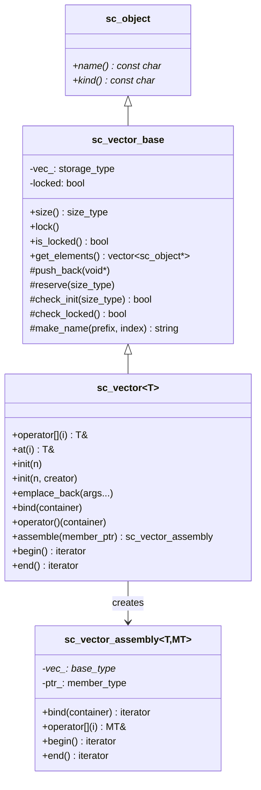

# sc_vector - Named Object Vector

## Overview

`sc_vector` is a container class defined by the IEEE 1666 standard, specifically designed to manage a group of named SystemC objects (modules, ports, channels, etc.). It automatically generates sequentially numbered names for each element (e.g., `signal_0`, `signal_1`) and provides batch binding functionality.

**Source files**: `sysc/utils/sc_vector.h` + `sc_vector.cpp`

## Analogy

Imagine you are managing an apartment building:

- Each apartment has an automatically numbered door plate (`apt_0`, `apt_1`, `apt_2`...)
- You can build all apartments at once (`init(n)`), or add them one by one (`emplace_back`)
- After all apartments are built, they are "locked" (`lock`) and no more can be added
- Each apartment has an electricity meter and a water meter; you can use `assemble` to collect all electricity meters into a list for unified management

## Class Hierarchy



## Initialization Methods

### Method 1: Default Constructor

```cpp
sc_vector<sc_signal<int>> sigs("sig", 8);
// produces sig_0, sig_1, ..., sig_7
```

### Method 2: Custom Creator

```cpp
sc_vector<MyModule> mods("mod", 4, [](const char* name, size_t i) {
    return new MyModule(name, some_config[i]);
});
```

### Method 3: Deferred Initialization

```cpp
sc_vector<sc_signal<bool>> flags("flag");
flags.init(16); // initialize later
```

### Method 4: Incremental Addition

```cpp
sc_vector<MyModule> mods("mod");
mods.emplace_back(/* constructor args */);  // automatic naming
mods.emplace_back_with_name("custom_name"); // custom name
```

## Locking Mechanism

```cpp
enum sc_vector_init_policy {
    SC_VECTOR_LOCK_AFTER_INIT,        // lock immediately after init() (default)
    SC_VECTOR_LOCK_AFTER_ELABORATION  // lock after elaboration completes
};
```

Calling `emplace_back` after locking triggers the `SC_ID_VECTOR_EMPLACE_LOCKED_` error. The `SC_VECTOR_LOCK_AFTER_ELABORATION` mode automatically locks via `sc_stage_callback_if` when elaboration completes.

## Batch Binding

```cpp
sc_vector<sc_in<int>>     ports("port", 4);
sc_vector<sc_signal<int>> sigs("sig", 4);

ports.bind(sigs);           // bind all in one line
ports(sigs);                // equivalent syntax
ports.bind(sigs.begin()+1, sigs.end()); // partial binding
```

## Member Assembly

The `assemble()` method can extract a specific member from each element to form a virtual vector:

```cpp
struct MyModule : sc_module {
    sc_in<int>  in_port;
    sc_out<int> out_port;
};

sc_vector<MyModule> mods("mod", 4);
auto in_ports = mods.assemble(&MyModule::in_port);
in_ports.bind(signals); // bind only the in_port members
```

## Iterator System

`sc_vector_iter` is a random-access iterator supporting:
- Direct access policy (`sc_direct_access`): directly access elements
- Member access policy (`sc_member_access`): access a specific member of elements via a member pointer

Iterators support const conversion, e.g., `iterator` can be implicitly converted to `const_iterator`.

## Design Details

### void* Foundation

`sc_vector_base` internally uses a `void*` array to store elements. This is done to:
1. Support virtual inheritance from `sc_object`
2. Avoid template bloat
3. Hide implementation details in the `.cpp` file

### Name Generation

```cpp
static std::string make_name(const char* prefix, size_type index);
```

Generates names in the `"prefix_index"` format, e.g., `"sig_0"`, `"sig_1"`.

### Hierarchy Scope

`init()` and `emplace_back()` internally create an `sc_hierarchy_scope` to ensure that newly created elements are correctly placed within the module hierarchy where the `sc_vector` resides.

## Related Files

- [sc_pvector.md](sc_pvector.md) -- Legacy internal pointer vector (different class)
- [sc_utils_ids.md](sc_utils_ids.md) -- Defines `sc_vector`-related error messages
